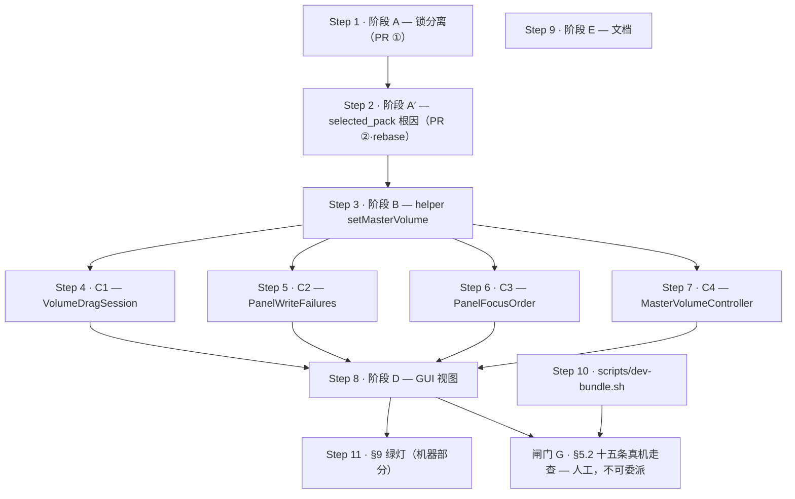

# Plan-Orchestrate Result —— 主音量滑块

**Plan**: `PLAN-MASTER-VOLUME.md`（只编排 §4 实现 / §8 并行化 / §9 绿灯）
**Lang**: `swift`（`helper/Package.swift` + `gui/Package.swift`；无 py_sub）
**Steps**: 11 + 1 个**不可委派的人工闸门**
**Scope**: all
**基线**: `f00521e`（**不是计划里写的 `df843b8`** —— 见下方「基线漂移」）

---

## ⚠️ 基线漂移 —— 编排前必读（本轮实测，计划没有见过）

编排期间 `feat/t17-onboarding-cta` 合进了 main（`f00521e`）。它动到了主音量计划引用的三个地方：

| # | 漂移 | 对计划的影响 | 谁来裁决 |
|---|---|---|---|
| **X1** | **锁的默认值点从 10 个变成 11 个。** 新增 `gui/Sources/ClaudioGUICore/OnboardingActions.swift` 的 `OnboardingActionEnvironment.lockFile = ClaudioPaths.lockFile`，而它**同时写 settings.json（装 hooks）与 config.json（选包）** | D20 的「10 个默认值点」实测已是 **11**。第 11 个与 `Setup.SetupEnvironment` 是**同一类问题**（一把锁喂给两个不同文件的写者）→ 必须同款拆成 `configLockFile` + `settingsLockFile`。**阶段 A 的文件清单少了一个文件。** | 已写进 Step 1 的 prompt，要求 agent 在 HANDOFF 里显式报告处置 |
| **X2** | **`PanelFocusCoordinator` 已经有 `hideCount` + `notePanelHidden()`（T17d）**，且 `MenuBarController.popoverDidClose` 的**第一条语句已经是** `focusCoordinator.notePanelHidden()`，注释逐字写着「必须是这个方法的第一行 …… 挪到 guard 之后 = 复活那个 bug」 | **D22 的 `closeCount` 与 D37 的「第一条语句」已经有现成载体。** 阶段 D 的「`PanelFocusCoordinator.swift`：加 `closeCount`」很可能是**多余的第二个平行计数器**；D37 从「插入新第一行」降级为「验证既有第一行仍在，并把冲刷挂到 `hideCount` 上」 | Step 8 的 prompt 要求 agent **先核实再决定**，并在 HANDOFF 里说明复用还是新增（**不许静默新增平行计数器**） |
| **X3** | **`Setup.swift:71-75` 的 private 三态裁决已被 T17e 重构掉。** 今天 `Setup.swift` 里是 `packSelectionPlan(status:usablePackIDs:)` + `PackIntegrityStatus`，且其注释逐字写着「用户点一下静音钮 → `setEventEnabled` 写出 `selected_pack: ""` 的 config（**那是对的**）」 | A′2 要「升成 public」的那段代码**已不在原位**；且 T17e 的这句注释与 **D23 定稿正面冲突**（A′1 一落地，它就变成新的假话注释）→ **A′ 的文件清单必须加上它** | Step 2 的链首挂了 `code-explorer` 先侦察；prompt 要求同批改掉这句注释 |
| **X4** | **D18 引用的那条「零 `.animation()`」绊线注释已经被 T17c 踩响并改写。** `PanelView` 今天已经声明 `@Environment(\.accessibilityReduceMotion)`，且有两处**已 gate 的**动画 | D18 的**结论**仍然成立（滑块行零动画、回滚瞬跳），但计划给的**理由**（「全树没人读 reduceMotion，所以加动画要同批接门控」）已经过期 —— 照抄那句话的 agent 会去找一条不存在的注释 | Step 8 的 prompt ③ 已改写：结论保留、理由更新，要加动画必须同批 gate `reduceMotion` 并说明理由 |
| **X5** | **`gui/Tests/ClaudioGUICoreTests/ViewWiringSuite.swift` 已经存在**（T17 期间建立）：它用 `#filePath` 推仓库根、读 `ClaudioGUI/*.swift` 的**源码文本**、断言视图层的接线行还在（现役断言逐字是 `panel.contains(".onChange(of: onboardingViewModel.state)")`，注释里明写「删掉这一行，652 项测试全绿」） | **这是 §9 变异验证第 ② 条（去掉 `rebase` 调用 → 必须 RED）唯一可能成立的机制** —— `ClaudioGUI` 是 executableTarget，测试 import 不进来，没有文本绊线的话那条变异**永远不会 RED**，测试就是恒真空测试（正是 D30 批判的病） | Step 8 要求给三条接线（rebase / popover 冲刷 / willTerminate 冲刷）各加一条文本绊线；Step 11 的变异 ② 已指名它 |

**另一处「计划的前提已被源码证伪」**：D25 ① 要给 `ContrastSuite` 加的「`clayDark` vs `panelDark` ≥3:1」**今天已经存在** —— `ClaudioColorHex.swift` 里 `notificationDark = clayDark` 是别名，而 `nonTextPairs` 已有「Notification dark glyph vs panel」这一对。所以**没有任何 step 认领 D25① 是对的，不是漏了**（D25 自己已经证明亮色那一对是逐字重复，暗色这一对同理）。滑块 `.tint(clay)` 是否退回系统强调色这件事，`ContrastSuite` 结构上永远测不到 —— 守门人是闸门 G 的第 ⑨ 条。

**行号一律不可信**：计划里的 `PanelView.swift:96` 今天是 `:112`，`MenuBarController.swift:184` 今天是 `:198`，`PanelFocusOrder.swift:115-120` 今天是 `:145/:162`。所有 prompt 都改用**符号名 grep**定位，不用行号。

**工作树当前不干净**（`TODOS.md` 有未提交修改，另一个会话可能仍在跑）。开工前先 `git status` 确认，再从 `f00521e` 拉分支。

---

## Steps overview

| # | 阶段 | Title | Tags | Chain |
|---|---|---|---|---|
| 1 | **A** | 锁分离：`lockFile` → `playLockFile` 改名 + 11 个默认值点逐个显式选择 | impl, refactor, build | `tdd-guide → swift-build-resolver → swift-reviewer` |
| 2 | **A′** | `selected_pack: ""` 根因：fail-closed `.configMissing` + 两轴判据 + 面板路由 | impl, debug | `code-explorer → tdd-guide → silent-failure-hunter → swift-reviewer` |
| 3 | **B** | helper 写者 `setMasterVolume`（无 `freshSelectedPack`，缺 config 拒写） | impl | `tdd-guide → swift-reviewer` |
| 4 | **C1** | `VolumeDragSession` 纯状态机（D45 `snap()` = `(v/0.05).rounded()/20`） | impl, test | `tdd-guide → swift-reviewer` |
| 5 | **C2** | `PanelWriteFailures` 纯函数（D3 三写者错误 → 有序去重列表） | impl, test | `tdd-guide → swift-reviewer` |
| 6 | **C3** | `PanelFocusOrder`：只加 `.masterVolume` case，**不改签名**（D41） | impl, test | `tdd-guide → swift-reviewer` |
| 7 | **C4** | `MasterVolumeController` 壳 + `previewVolume(for:)` 纯函数（D29） | impl, test | `tdd-guide → swift-reviewer` |
| 8 | **D** | GUI 视图：`MasterVolumeRow` + PanelView + MenuBarController + 试听 + gallery | impl, a11y | `tdd-guide → a11y-architect → swift-reviewer` |
| 9 | **E** | 文档：ENGINEERING.md 线框 / 状态表 / 锁决议 + TODOS.md | docs | `doc-updater` |
| 10 | **§5.2 Part 0** | `scripts/dev-bundle.sh`（真机走查的前置，仓库今天没有本地打包脚本） | build | `swift-build-resolver` |
| 11 | **§9** | 绿灯（机器可测部分）：两包测试 + 零 warning + **5 条变异验证复跑** | test, build | `tdd-guide → swift-build-resolver` |
| **G** | **§5.2** | **15 条真机走查 —— 人工闸门，零 agent，不可委派** | — | **（无）** |

> **Step 10 与 Step 11 不是 §4 的阶段** —— 它们是 §9 绿灯的两个可机器执行的前提（`§5.2 Part 0` 的 bundle 脚本、§9 的变异复跑）。不要的话删掉，不影响 1–9 的编排。
> **Step 7 里的 `previewVolume(for:)` 在 §4 的 C 清单里没有**（D29 的修法只写在 §5）。它是 `ClaudioGUICore` 纯函数、且 Step 8 的视图转发要用它，所以挂在 C4。要严格照 §4，就把它挪进 Step 8。

---

## Parallel execution graph



**Parallel waves** —— 同一 wave 内的 step 可以在**各自独立的 Claude 会话**里并发跑；跑完整个 wave 再进下一个。

| Wave | Steps | 备注 |
|---|---|---|
| 1 | **step-1（A）** ∥ step-9（E） ∥ step-10（dev-bundle） | A 是 Lane 1 的头。E = §8 Lane 3，全程独立。dev-bundle 只用现有源码，不依赖任何阶段 |
| 2 | **step-2（A′）** | **严格在 A 之后**（两者都改 `EventEnabled.swift`；A 改锁、A′ 改契约 → **A 先合，A′ 在其上 rebase**，§8:506） |
| 3 | **step-3（B）** | §8：B 依赖 A（要 `configLockFile`）＋ A′（要 `.configMissing` 契约） |
| 4 | **step-4 ∥ step-5 ∥ step-6 ∥ step-7（C1–C4）** | §8:502「`VolumeDragSession` / `PanelWriteFailures` / `PanelFocusOrder` 三者互不依赖，C 内部可三路并行」+ `MasterVolumeController` 第四路 |
| 5 | **step-8（D）** | §8：D 依赖 C ＋ A′ |
| 6 | **step-11（§9 绿灯 · 机器部分）** | 两包测试 + 零 warning + 5 条变异验证复跑 |
| **闸门 G** | **§5.2 十五条真机走查** | **人工。不排 agent wave，不可委派。** 需要 `open dist/Claudio.app`、改系统强调色 / 文字大小、用耳朵听音量、⌘F5 开 VoiceOver。第 ⑨ 条（`.tint(clay)` 未退回系统强调色）是用户已拍板接受的「CI 结构上测不到」的缺口 —— **守门人是人不是 CI** |

⚠️ **Wave 4 的唯一共享文件是 `gui/Tests/ClaudioGUICoreTests/main.swift`**（四个 suite 都要在那里注册）。四路并行 → 四个分支各追加一行 → 合并时是一个 4 行的 append 冲突，**不是逻辑冲突**，手工合 30 秒。要完全避开就把 C1–C4 串行跑在同一分支上（代价：失去 §8 明写的并行）。

**PR 边界**（§8:504-506）：**PR ① = Step 1（A）**；**PR ② = Step 2（A′，rebase 在 ① 上）**；**PR ③ = Steps 3–8 + 11（滑块本体）**；**PR ④ = Step 9（E，文档）**，可随时。

### Dependency sources

- step-2 → deps: [step-1] —— explicit: 「两者都改 `EventEnabled.swift`（A 改它的锁，A′ 改它的 fail-closed 契约）→ **A 先落，A′ 在其上 rebase**」（§8:506）。**§8 的依赖表把 A′ 写成「—」，但同节的散文与 §11 的 VERDICT 都要求串行 —— 以散文为准。**
- step-3 → deps: [step-2]（透传 step-1）—— explicit: §8 表「B 依赖 A（要 `configLockFile`）＋ A′（要 `.configMissing` 契约）」
- step-4 / step-5 / step-6 / step-7 → deps: [step-3] —— explicit: §8 表「C 依赖 B（`MasterVolumeController` 调 `setMasterVolume`）」
- step-8 → deps: [step-4, step-5, step-6, step-7]（透传 step-2）—— explicit: §8 表「D 依赖 C ＋ A′（空包态不渲染滑块 → 焦点序）」
- step-9 → deps: ∅ —— explicit: §8 表「E 文档 | `*.md` | —」+ 「Lane 3：E（独立，可并行）」
- step-10 → deps: ∅ —— heuristic: `§5.2 Part 0` 的脚本只调用 `swift build`，不依赖任何阶段的产物
- step-11 → deps: [step-8] —— explicit: §9 的绿灯条目全部指向已实现的代码（5 条变异验证分别落在 A / A′ / C / D）
- 闸门 G → deps: [step-8, step-10] —— explicit: §9「真机走查按 §5.2 的 15 条清单走完（ad-hoc 签名 app bundle）」

**无环。**

---

## ☠️ 已作废决议清单 —— 一条都不许进实现

任何 agent 只要在产出里出现下面任意一条，**就是引入一个已知 bug**：

| 死决议 | 它会造成什么 | 替代 |
|---|---|---|
| ~~D5~~ `Slider(step: 0.05)` | 轨道下方画出 **21 个刻度点**（`numberOfTickMarks=21`），撑破 28pt 行高 | **D24**：吸附型 `Binding` 转发，`snap()` 放进 `VolumeDragSession` |
| ~~D10~~ `onDisappear` 冲刷 | 本仓库**已明文否定**该回调（`PanelFocusCoordinator.swift:10`），全仓 `onDisappear` 零命中 | **D22 + D37**：走 `popoverDidClose` 的**第一条语句**（今天已是 `notePanelHidden()`，见 X2）。⚠️ 被作废的**只是 `onDisappear` 那一半** —— `willTerminate` 那一半 D22 明写「**保留**，降级为兜底」（只覆盖 ⌘Q / 注销 / 关机，force quit 与 `killall` 不覆盖）。**计划的阶段 D 文件清单自己漏抄了它**，而走查第 ④ 条正是测它的 → 已补进 Step 8 的 ⑤-bis |
| ~~D13~~ `freshSelectedPack` 参数 | 空转 —— 调用方手里本来就只有空串，签名管不住坏数据 | **D23 定稿**：config 缺失 → `.configMissing` **拒写**，新写者**没有这个参数** |
| ~~D19~~ 空包时禁用滑块 | 封错了门（真正会写毒的是**静音钮**）；且与焦点不变式撞车 | **D23 定稿**：空包态**整个面板换态**，根本不渲染滑块 |
| ~~D31 的修法半句~~ 给 `panelFirstFocusTarget` 加参数 | 加一个永远只传 `true` 的参数 = 计划自己批过的「写了没人调」式漂移 | **D41**：**只加 `.masterVolume` case，不改签名**；`.operational` scope 里滑块恒可操作，在过滤器的 `return true` 分支旁加注释写明这个前提 |
| ~~D34①~~ 「Dynamic Type 档位错一级」 | **假修正**（D17 从头到尾是对的） | **D44**：「较大」= `.larger` = **只隐波形不折行**；「更大」= `.largest` = **开始折行**；「极大」= `.maximum` = 加宽 360pt |

`snap()` 的公式：**`(v / 0.05).rounded() / 20`** —— **不是** `* 0.05`（D45：`* 0.05` 会把 21 档里的 **7 档**写成 `0.35000000000000003` 落进用户的 config.json）。

---

## 本仓库的验证命令（不要用默认猜测）

```bash
swift run --package-path helper claudio-tests      # 不是 swift test
swift run --package-path gui  claudio-gui-tests    # 不是 swift test
swift build --package-path helper                  # 须零 warning
swift build --package-path gui                     # 须零 warning
```

（`swift test` 在这台机器上解析不了 XCTest —— 只有 CommandLineTools，无 Xcode。测试是自建 harness，新 suite 必须在 `Tests/*/main.swift` 里注册才会跑。）

---

## Step 1 — 阶段 A：锁分离（PR ①）

**Intent**: 把 `ClaudioPaths.lockFile` **改名**成 `playLockFile`，新增 `configLockFile` / `settingsLockFile`；改名后全部默认值点编译不过，逐个做出显式选择。这是 D9 的**唯一**兑现方式 —— 只改默认值对显式传参的 GUI 完全无效（D20）。
**Tags**: impl, refactor, build
**Chain rationale**: 改名 → 11 处编译错误是**目的**，不是意外，所以 `swift-build-resolver` 排在中间收编译；`tdd-guide` 先按 D30 写「接线断言」（唯一有牙的测法）；`swift-reviewer` 收尾（reviewer-class tail）。

### Agents（顺序执行；把前一个 agent 的 HANDOFF 原样喂给下一个）

1.
```
Agent(
  subagent_type="tdd-guide",
  prompt="[Plan: PLAN-MASTER-VOLUME.md#step-1] 阶段 A · 锁分离（独立 PR，与滑块无关，修的是今天就在吞提示音的 bug）。基线 f00521e，先读计划 §4 阶段 A（:151-188）与 D9/D20/D30；计划里的行号已因 T17 落地而漂移，一律用符号名 grep 定位。做三件事：① Paths.swift 把 lockFile 改名为 playLockFile（改名，不是加注释），新增 configLockFile（~/.claudio/config.lock）与 settingsLockFile（~/.claudio/settings.lock）；② 改名后每一个 = ClaudioPaths.lockFile 默认值点都会编译不过，逐个显式选择：Play 拿 play；Use / EventEnabled 拿 config；SettingsInstaller 的四个签名拿 settings；Setup 的 SetupEnvironment.lockFile 拆成 configLockFile + settingsLockFile（source-breaking）—— ⚠️ 计划说「SetupSuite 的五个构造点」，那是 T17 之前的旧快照：实测今天 SetupSuite 有 6 个 SetupEnvironment 构造点、QuarantineSuite 另有 3 个，还有一处读 environment.lockFile。**别信任何数字，以编译器报错为准**：改完 grep 一次 ClaudioPaths.lockFile 确认零残留；GUI 侧 PanelView 与 EventMuteController 的默认值拿 config（这条链是整个 D9 的兑现点：MenuBarController 构造 PanelView 时不传 lock）；③ ⚠️ 计划说 10 个默认值点，实测基线上是 11 个 —— 新增的 gui/Sources/ClaudioGUICore/OnboardingActions.swift 里 OnboardingActionEnvironment 的 lockFile 同时服务 settings.json 写入与 config.json 写入，与 SetupEnvironment 是同一类问题，请同款拆成两个字段，并在 HANDOFF 里显式报告你的处置。测试按 D30 只写接线断言：默认构造后 EventMuteController().lockFile == ClaudioPaths.configLockFile、PanelView 默认同理、PlayEnvironment 默认 == playLockFile；不要写显式注入 lockFile 的锁争用测试（那种测试与默认值无关，恒真）。行为回归保留：持有 config.lock 时 playSoundEvent 仍发声。新 suite 必须在 Tests 的 main.swift 里注册。验证命令：swift run --package-path helper claudio-tests、swift run --package-path gui claudio-gui-tests（不是 swift test），两包 swift build 零 warning。Acceptance: 两包测试退出 0 且零 warning；接线断言覆盖 EventMuteController / PanelView / PlayEnvironment 三个默认值；变异验证 —— 把 GUI 的默认值改回 playLockFile 时接线断言必须 RED。Out of scope: 主音量滑块本身；config 写路径的乐观并发重读（计划已另开 TODO）。End with a literal <handoff>{...}</handoff> block — a single JSON object with keys scope, risks (array of strings), test-plan, next-agent-input. The <handoff></handoff> tags are mandatory; do NOT use markdown headings or a pipe list."
)
```

2.
```
Agent(
  subagent_type="swift-build-resolver",
  prompt="[Plan: PLAN-MASTER-VOLUME.md#step-1] [Prior HANDOFF from tdd-guide: <pass through>] 把阶段 A 改名后的两个包收干净：swift build --package-path helper 与 swift build --package-path gui 必须零 error 零 warning，swift run --package-path helper claudio-tests 与 swift run --package-path gui claudio-gui-tests 必须退出 0（不是 swift test）。只做最小修复，不改架构、不改任何锁的语义选择 —— 每一个默认值点该拿哪把锁由上一个 agent 定，你只负责让它编译并保持零 warning。若发现还有编译不过的 ClaudioPaths.lockFile 引用（包括 Tests 里的 PathsSuite），补齐并在 HANDOFF 里列出来。Acceptance: 两包 build 零 warning；两包测试退出 0；没有任何一处用 try! / 强制解包 绕过编译错误。End with an updated <handoff>{...}</handoff> block (same JSON keys: scope, risks, test-plan, next-agent-input; literal tags mandatory)."
)
```

3.
```
Agent(
  subagent_type="swift-reviewer",
  prompt="[Plan: PLAN-MASTER-VOLUME.md#step-1] [Prior HANDOFF from swift-build-resolver: <pass through>] 评审阶段 A 的锁分离改动。重点四条：① 每一个默认值点拿的锁与它真正写的文件一致（play → play.lock；config 三写者 → config.lock；settings 写者 → settings.lock；同时写两个文件的 SetupEnvironment 与 OnboardingActionEnvironment 必须持有两把锁，不能共用一把）；② 改名是真改名，没有留 typealias / 兼容别名把旧名字放回去（那会让 10+ 个编译错误消失，也就让这次改名的全部效力消失）；③ 接线断言确实钉住的是默认构造后的 lockFile 值，而不是显式注入；④ 锁的非阻塞语义未被改动（play 拿不到锁时静默跳过是故意设计，不许改成阻塞）。Acceptance: 无 P0/P1；任何「换个锁但没人测到」的点都要指名；HANDOFF 里列出 GUI 两处默认值的最终值。End with a final <handoff>{...}</handoff> block (same JSON keys; literal tags mandatory)."
)
```

---

## Step 2 — 阶段 A′：`selected_pack: ""` 根因（PR ②，rebase 在 PR ① 之上）

**Intent**: 消灭磁盘上 `selected_pack: ""` 的唯一产地（`EventEnabled.swift` 的 `freshSelectedPack: ""`），把面板的判据改成「读 + 写」两条正交轴，并把不可用的 config 路由到已经存在的自救路径。这是**今天就活着**的 bug（静音钮可触发），与滑块无关。
**Tags**: impl, debug
**Chain rationale**: 计划引用的 `Setup.swift:71-75` 已被 T17e 重构掉（X3），所以链首挂 `code-explorer` 先做**只读侦察**，避免 agent 照着不存在的行号重造轮子；`silent-failure-hunter` 是这一步的天然评审角色（D23 的病灶正是「面板顶着绿点撒谎 + 静默造毒」）；`swift-reviewer` 收尾。

### Agents（顺序执行；把前一个 agent 的 HANDOFF 原样喂给下一个）

1.
```
Agent(
  subagent_type="code-explorer",
  prompt="[Plan: PLAN-MASTER-VOLUME.md#step-2] 阶段 A′ 的只读侦察（不要改任何文件）。计划的 D23 定稿要求把 Setup.swift:71-75 的 private 三态裁决升成 ClaudioCore 的 public packSelection(configFile:)，但基线 f00521e 上 T17e 已经重构过 Setup.swift —— 那段代码不在原位。请回答四个问题并给出精确的符号名与当前行号：① 今天 helper 里判断「有没有人选过包」的代码在哪（看 packSelectionPlan / PackIntegrityStatus / checkPackIntegrity），它是不是 D23 要的三态判据（不存在 ∨ 空串 = 没人选过包；畸形 = 坏文件，不猜不重建）？能复用就复用，不能就说清差在哪；② public probeConfigRewritable 的四态（absent / rewritable / malformed / unwritable）在 ConfigMutation.swift 的什么位置，它今天的调用方是谁；③ EventEnabled 里 freshSelectedPack: 空串 的那个调用点、以及那句「In practice this branch is unreachable from the real panel」的假话注释各在哪一行；④ Setup.swift 里 packSelectionPlan 的注释逐字写着「用户点静音钮写出 selected_pack 空串的 config —— 那是对的」，这句话在 A′1 落地后会变成新的假话注释，请把它的位置也报出来。Acceptance: 四问全部有精确 file:line；明确结论「读判据能否复用现有代码」；不修改任何文件。End with a literal <handoff>{...}</handoff> block — a single JSON object with keys scope, risks (array of strings), test-plan, next-agent-input. The <handoff></handoff> tags are mandatory; do NOT use markdown headings or a pipe list."
)
```

2.
```
Agent(
  subagent_type="tdd-guide",
  prompt="[Plan: PLAN-MASTER-VOLUME.md#step-2] [Prior HANDOFF from code-explorer: <pass through>] 阶段 A′ · 实现（独立 PR，rebase 在阶段 A 之上）。先读计划 §4 阶段 A′（:190-231）与 D23 定稿。四层：① helper —— setEventEnabled 在 config 缺失时 fail-closed，新增 .configMissing 错误，不再新建；删掉 freshSelectedPack: 空串 那个调用点（磁盘上 selected_pack 空串的唯一产地），并把那句「In practice this branch is unreachable from the real panel」的假话注释换成实话：它可达，所以我们拒写。⚠️ freshSelectedPack 参数本身保留（selectPack 仍在用，它有写前两道 pack 校验），但新写者不得再带它 —— 计划的 D13 已作废。同批修掉 Setup.swift 里 packSelectionPlan 那句「写出 selected_pack 空串是对的」的注释（它在本步之后即成假话）。② 判据是两条正交轴，缺一不可：读 = packSelection(configFile:)（三态：不存在 ∨ 空串 = 没人选过包；畸形 = 坏文件，不猜不重建，能复用 T17e 的既有代码就复用）；写 = 复用已存在的 public probeConfigRewritable（四态，已是 doctor 的单一真相源，绝不重造）。少了「写」这一问，{master_volume: 字符串} 这种读得动写不动的 config 会被判成可用 → 面板渲染全套活控件 → 每次点击必败。③ GUI —— PanelConfig.swift 的 loadPanelConfig 去掉 ?? ClaudioConfig(selectedPack: 空串) 的回落。④ 面板路由 —— .needsPack 走画廊空态「先选包」（副文案：还没有选中任何声音包。点一张卡片，Claudio 会建好配置。）；.malformed / .unwritable 走诚实失败态 + doctor 的可执行修复指令 + 在访达中显示。☠️ 禁止：不要禁用滑块或任何控件来「防」空包（D19 已作废，封错了门 —— 空包态根本不渲染滑块，写者本来就全部 fail-closed）。测试：helper PackSelectionSuite（读三态 × probeConfigRewritable 四态的合成矩阵，重点钉「读得动、写不动」必须不是可用）；helper EventEnabledSuite 新增（config 缺失 → .configMissing，且磁盘上不得出现新文件）；gui PanelConfigSuite（loadPanelConfig 对缺失 config 不再吐出 selectedPack 空串）。新 suite 要在 Tests 的 main.swift 注册。命令：swift run --package-path helper claudio-tests / swift run --package-path gui claudio-gui-tests（不是 swift test），两包零 warning。Acceptance: 两包测试退出 0 零 warning；变异验证 —— 把 freshSelectedPack: 空串 加回 setEventEnabled 时，「不得新建 config」必须 RED；路由态的焦点 scope 不含 .masterVolume（结构保证：不渲染即不进序）。Out of scope: config 缺失且用户包目录为空时的逃生口（D36，已登记 P2 TODO）；OnboardingViewModel.onPrimaryAction 接线（D35，独立 PR）。End with an updated <handoff>{...}</handoff> block (same JSON keys: scope, risks, test-plan, next-agent-input; literal tags mandatory)."
)
```

3.
```
Agent(
  subagent_type="silent-failure-hunter",
  prompt="[Plan: PLAN-MASTER-VOLUME.md#step-2] [Prior HANDOFF from tdd-guide: <pass through>] 审 A′ 的静默失败面。这一步修的病是「面板顶着绿点撒谎」，所以专查三类：① 还有没有别的地方在 config 不可用时凭空造数据 / 回落到一个磁盘上不存在的值（grep 全仓 selectedPack: 空串、?? ClaudioConfig、freshSelectedPack 的所有调用方）；② 新增的 .configMissing 是不是每一条路径都被真正处理了 —— 计划的 D43 明写它不面向用户：GUI 侧收到它时必须 commitFailed() 回滚 + 触发全量 refresh() 重路由到 .needsPack，绝不能吞掉，也绝不能编一句没人会 QA 的面板文案；③ 「读得动、写不动」的 config 是否真的走不到活控件（这类 config 的每一次点击都必然失败，是本步存在的核心理由）。Acceptance: 逐条给出 file:line 与失败场景；确认无「捕获后什么都不做」的分支；确认 .configMissing 不会静默丢失。End with an updated <handoff>{...}</handoff> block (same JSON keys: scope, risks, test-plan, next-agent-input; literal tags mandatory)."
)
```

4.
```
Agent(
  subagent_type="swift-reviewer",
  prompt="[Plan: PLAN-MASTER-VOLUME.md#step-2] [Prior HANDOFF from silent-failure-hunter: <pass through>] 评审 A′ 的 Swift 实现。重点：① 错误枚举 .configMissing 的英文 reason 照 SetEventEnabledError 的既有惯例写（给 CLI / doctor 看，不是面板文案）；② 没有重造 probeConfigRewritable（复用 public 的那份，它已是 doctor 的单一真相源）；③ 面板路由的三个新态没有引入新机制 —— 自救路径（点一张包卡 → selectPack 建出正确 config）本来就通，本步只是让面板走上去；④ 注释里不得再出现任何「this branch is unreachable」式的、被源码证伪的断言。Acceptance: 无 P0/P1；新 public API 有 doc comment；两包测试退出 0 零 warning。End with a final <handoff>{...}</handoff> block (same JSON keys; literal tags mandatory)."
)
```

---

## Step 3 — 阶段 B：helper 写者 `setMasterVolume`

**Intent**: 新建 `helper/Sources/ClaudioCore/MasterVolume.swift`，做 `updateConfigJSON` 的第三个调用方。config 缺失 → `.configMissing` 拒写（与 A′ 改造后的 `setEventEnabled` 同形状）；先钳制再写；`.updated(volume:)` 带回实际落盘值。
**Tags**: impl
**Chain rationale**: 纯 helper 逻辑、全部可单测 → `tdd-guide` 主刀，`swift-reviewer` 收尾（reviewer-class tail）。

### Agents（顺序执行；把前一个 agent 的 HANDOFF 原样喂给下一个）

1.
```
Agent(
  subagent_type="tdd-guide",
  prompt="[Plan: PLAN-MASTER-VOLUME.md#step-3] 阶段 B · helper 写者。新建 helper/Sources/ClaudioCore/MasterVolume.swift：setMasterVolume(_:configFile:lockFile:) -> Result<SetMasterVolumeOutcome, SetMasterVolumeError>。硬约束：① ☠️ 没有 freshSelectedPack 参数（D13 已作废 —— 它是空转的，调用方手里本来就只有空串）；config 缺失 → .configMissing 拒写，与 A′ 改造后的 setEventEnabled 逐字同形状，新写者绝不新建 config；② 先钳制再写 —— 复用 AfplayVolume.clamped（Volume.swift，绝不重写第二份），越界值绝不落盘、非有限值绝不到达编码器（否则进程 abort）；③ 复用 updateConfigJSON 做外科式读-改-写（只 set master_volume，未知顶层键 / events / selected_pack 逐字保留）；④ 锁用 ClaudioPaths.configLockFile（阶段 A 已建），不是 playLockFile；⑤ 错误枚举逐 case 镜像 SetEventEnabledError（含新增的 .configMissing）。测试 helper MasterVolumeSuite：成功写 / 钳制（大于 1、小于 0、负零）/ .lockBusy / .lockFailed / 损坏 config → .configReadFailure / 父目录不可写 → .configWriteFailure / ☠️ config 不存在 → .configMissing 且断言磁盘上不得出现新文件（计划 §5 里那条「config 不存在 → 新建」是已作废的写法，照做等于把毒源复制进新写者）/ 保真（未知顶层键、events、selected_pack 逐字保留）。另加 ConfigConcurrencySuite（D7）：concurrentPerform 混跑三个写者，落地 config 恒合法无损。新 suite 要在 helper/Tests/ClaudioCoreTests/main.swift 注册。命令：swift run --package-path helper claudio-tests（不是 swift test），swift build --package-path helper 零 warning。参考但不要照抄分支 feat/master-volume-slider @ cbc02f0 的 WIP：代码形状可参考，注释必重写，且它的 MasterVolume.swift 还带着已作废的 freshSelectedPack。Acceptance: helper 测试退出 0 零 warning；config 缺失时磁盘无新文件的断言存在且会 RED（把新建加回去验一次）；钳制走的是 AfplayVolume.clamped 而不是新写的第二份。End with a literal <handoff>{...}</handoff> block — a single JSON object with keys scope, risks (array of strings), test-plan, next-agent-input. The <handoff></handoff> tags are mandatory; do NOT use markdown headings or a pipe list."
)
```

2.
```
Agent(
  subagent_type="swift-reviewer",
  prompt="[Plan: PLAN-MASTER-VOLUME.md#step-3] [Prior HANDOFF from tdd-guide: <pass through>] 评审 setMasterVolume。重点：① 签名里没有 freshSelectedPack，且 config 缺失时 fail-closed（与 setEventEnabled 同契约）；② 钳制发生在写之前、且复用 AfplayVolume.clamped —— 非有限值不可能到达 JSON 编码器；③ 拿的是 configLockFile，非阻塞语义与既有写者一致；④ .updated(volume:) 带回的是实际落盘的（已钳制的）值，调用方据此吸附滑块，无需重读文件；⑤ 错误枚举与 SetEventEnabledError 逐 case 对齐，reason 用英文（给 CLI / doctor）。Acceptance: 无 P0/P1；新 public API 有 doc comment 且不写「精确」这类被浮点证伪的措辞；helper 测试退出 0 零 warning。End with a final <handoff>{...}</handoff> block (same JSON keys; literal tags mandatory)."
)
```

---

## Step 4 — 阶段 C1：`VolumeDragSession` 纯状态机

**Intent**: D6/D11/D12/D21/D24/D26 六条规则的唯一归宿。视图只剩转发，无可漂移分支。
**Tags**: impl, test
**Chain rationale**: 纯 Double 数学 + 状态机，100% 可单测；D45 的脏浮点是这一步唯一会被静态评审漏掉的坑 → `swift-reviewer` 收尾时专门盯它。

### Agents（顺序执行；把前一个 agent 的 HANDOFF 原样喂给下一个）

1.
```
Agent(
  subagent_type="tdd-guide",
  prompt="[Plan: PLAN-MASTER-VOLUME.md#step-4] 阶段 C1 · gui/Sources/ClaudioGUICore/VolumeDragSession.swift 纯状态机（无 SwiftUI 依赖）。规则：① 松手才写 —— began + N 次 dragged + ended 恰好产生 1 次 commit（D1/D6）；② 不变不写 —— draft 未偏离磁盘基线则 0 次 commit（D11）；③ 失败即回滚 —— commitFailed() 后 draft 弹回 baseline，UI 绝不显示磁盘上没有的值（D12）；④ flushPending() —— 只 dragged 没 ended 时必须吐出 commit（不是 0，那是把数据丢失写成规格）；⑤ rebase(to:) —— 非拖动时采纳外部新值，拖动中不抢手（D21，滑块与磁盘的下行同步）；⑥ adjust(to:) —— 非拖动的直接提交路径，isDragging 为 false 时必须 commit（D26，VoiceOver 与键盘方向键不走 onEditingChanged，被 isDragging 门掉 = WCAG 2.1.1 可操作性失败）。☠️ snap() 的公式必须是 (clamped(v) / 0.05).rounded() / 20 —— 不是 k * 0.05：后者在 binary64 下会让 21 档里的 7 档（15/30/35/60/70/85/95%）偏一个 ULP，把 0.35000000000000003 原样写进用户的 config.json（JSONSafeWrite 是最短往返渲染）。措辞纪律：注释里不许写「精确」（0.35 在二进制下本就不可精确表示），只许写「与源码字面量同位、渲染干净」。测试 gui VolumeDragSessionSuite：1 began + N dragged + 1 ended = 恰好 1 commit；只 dragged 无 ended → flushPending() 必须吐 commit；未拖动 → 0 commit；baseline 0.42 未拖动 → 0 commit；commitFailed 后 draft == baseline；snap(0.42) == 0.40 且 snap(0.8) 恒等；21 档逐个断言最短字符串渲染不超过 4 字符；adjust(to:) 在非拖动时必须 commit；rebase(to:) 非拖动采纳、拖动中不采纳。变异验证三条必须 RED：改回逐帧 commit；去掉 flush；snap 改回 k * 0.05（后者必须让 7 档 RED）。新 suite 要在 gui/Tests/ClaudioGUICoreTests/main.swift 注册。命令：swift run --package-path gui claudio-gui-tests（不是 swift test），swift build --package-path gui 零 warning。可参考分支 feat/master-volume-slider @ cbc02f0 的 VolumeDragSession.swift 的代码形状，但 ☠️ D42 的处置原则是「代码形状可参考、注释必重写」—— 它的 doc comment 里有四条已死的东西，逐条重写、绝不许原样搬运：(a) EPSILON 断言注释里那句「0.05 * 16 != 0.8 bit-for-bit」是假的（实测两者完全相等，16 是 2 的幂）—— 删掉，EPSILON 真正在挡的是 D45 那 7 档脏值；(b) rule 2 那句「Callers are obliged to call flushPending() … (MasterVolumeRow wires onDisappear + NSApplication.willTerminateNotification)」—— onDisappear 已被 D22 判死，且这个纯状态机不该点名任何具体视图回调：改写成「冲刷由 popover 关闭信号驱动，willTerminate 是兜底且 force quit / killall 不覆盖」；(c) static let step 的 doc 里「SwiftUI renders a step:ped Slider as a VoiceOver-adjustable element…」整句删掉（D5 已被 D24 作废，本方案不用 Slider(step:)，吸附发生在 snap() 里）—— 常量本身保留，但注释只许描述 21 档网格，不许推荐 step:；(d) 整节「## Why drag(to:) is gated on isDragging」重写 —— 它今天用 step: 滑块的 render-time 网格吸附论证门控，而 D24 之后那个机制根本不存在；新论证按 D26 写：门控只挡非人类拖动来源的 binding 回写，VoiceOver / 方向键这条非拖动路径必须走 adjust(to:) 真提交。另注：它的 rebase(to:) 写了但全仓零调用点。Acceptance: gui 测试退出 0 零 warning；三条变异验证逐条实测 RED 并在 HANDOFF 里写明；VolumeDragSession 不 import SwiftUI，且全文 grep 不到 onDisappear / willTerminate 冲刷契约 / Slider(step: 推荐 / render-time 网格论证（四条死注释的重写结果在 HANDOFF 里逐条列出：旧句 → 新句）。End with a literal <handoff>{...}</handoff> block — a single JSON object with keys scope, risks (array of strings), test-plan, next-agent-input. The <handoff></handoff> tags are mandatory; do NOT use markdown headings or a pipe list."
)
```

2.
```
Agent(
  subagent_type="swift-reviewer",
  prompt="[Plan: PLAN-MASTER-VOLUME.md#step-4] [Prior HANDOFF from tdd-guide: <pass through>] 评审 VolumeDragSession。重点：① snap() 是 (v / 0.05).rounded() / 20，不是 * 0.05；21 档的落盘渲染逐档干净（这条只有实跑能证，别只读代码）；② adjust(to:) 与 drag(to:) 的门控互斥关系正确 —— drag 在非拖动时被忽略，adjust 在非拖动时必须提交，两者不能互相吞；③ rebase(to:) 在拖动中不得改写 draft；④ 状态机是值语义 / 无隐藏共享状态，且不 import SwiftUI；⑤ 注释里没有任何未经实证的浮点断言；⑥ doc comment 里没有已作废决议的残留（D42②）—— 不出现 onDisappear / willTerminate 的冲刷契约、不推荐 Slider(step:)、isDragging 门控的论证不依赖 render-time 网格吸附（那个机制在 D24 之后不存在），而是按 D26 表述。这一条要真去读 doc comment，不能只读代码。Acceptance: 无 P0/P1；三条变异验证的 RED 结果被复核；四条死注释确认已重写；gui 测试退出 0 零 warning。End with a final <handoff>{...}</handoff> block (same JSON keys; literal tags mandatory)."
)
```

---

## Step 5 — 阶段 C2：`PanelWriteFailures` 纯函数

**Intent**: D3 —— 三个写者的错误合并成一个有序、去重的写失败列表。多条可同时存在、不互相顶替（这个性质今天零测试，只活在注释里）。
**Tags**: impl, test

### Agents（顺序执行；把前一个 agent 的 HANDOFF 原样喂给下一个）

1.
```
Agent(
  subagent_type="tdd-guide",
  prompt="[Plan: PLAN-MASTER-VOLUME.md#step-5] 阶段 C2 · gui/Sources/ClaudioGUICore/PanelWriteFailures.swift 纯函数（D3）。把三个写者的 lastError（静音 / 切包 / 主音量）合并成一个有序去重的写失败列表 —— 面板只渲染这一个列表，不再每个写者一个 @State 加一个 if。必须保住的性质：多条错误可同时存在且互不顶替；顺序稳定；同因去重。生命周期逐字镜像 EventMuteController.lastError（首次为 nil，下一次成功写清空）。☠️ .configMissing 不进这个列表（D43 —— 它不面向用户：GUI 唯一能收到它的路径是面板开着时 config 被外部删掉，处置是 commitFailed() 回滚 + 全量 refresh() 重路由到 .needsPack，面板换成诚实的态本身就是给用户的解释）。MasterVolumeRow 零错误 UI —— .writeFailed 的错误行归 PanelView（D39）。测试 gui PanelWriteFailuresSuite：多条同时存在时全部保留、顺序稳定、同因去重、空输入 → 空列表、.configMissing 被排除。新 suite 要在 gui/Tests/ClaudioGUICoreTests/main.swift 注册。命令：swift run --package-path gui claudio-gui-tests（不是 swift test），零 warning。Acceptance: gui 测试退出 0 零 warning；纯函数无副作用、不 import SwiftUI；.configMissing 的排除有测试钉住。End with a literal <handoff>{...}</handoff> block — a single JSON object with keys scope, risks (array of strings), test-plan, next-agent-input. The <handoff></handoff> tags are mandatory; do NOT use markdown headings or a pipe list."
)
```

2.
```
Agent(
  subagent_type="swift-reviewer",
  prompt="[Plan: PLAN-MASTER-VOLUME.md#step-5] [Prior HANDOFF from tdd-guide: <pass through>] 评审 PanelWriteFailures。重点：① 去重键是「原因」而不是「写者」（同一个原因来自两个写者时只留一条，但两个不同原因必须同时在列）；② 顺序是确定性的（不依赖字典遍历顺序）；③ .configMissing 被明确排除，且排除是显式的、有注释说明理由（D43），不是被顺手吞掉；④ 纯函数、无 SwiftUI 依赖、可在 ClaudioGUICore 单测。Acceptance: 无 P0/P1；gui 测试退出 0 零 warning。End with a final <handoff>{...}</handoff> block (same JSON keys; literal tags mandatory)."
)
```

---

## Step 6 — 阶段 C3：`PanelFocusOrder` 加 `.masterVolume`

**Intent**: 焦点纯模型加一个 case，插在最后一个 `.eventMute` 之后、`.dropZone` 之前（对齐线框：滑块在事件行与拖入区之间）。**不改 `panelFirstFocusTarget` 的签名**。
**Tags**: impl, test
**Chain rationale**: D31 的「加参数」修法**已被 D41 取代** —— 这一步最大的风险就是 agent 照着决议表里那半句没划掉的话去改签名。

### Agents（顺序执行；把前一个 agent 的 HANDOFF 原样喂给下一个）

1.
```
Agent(
  subagent_type="tdd-guide",
  prompt="[Plan: PLAN-MASTER-VOLUME.md#step-6] 阶段 C3 · gui/Sources/ClaudioGUICore/PanelFocusOrder.swift 加 PanelFocusTarget.masterVolume。位次：最后一个 .eventMute 之后、.dropZone 之前。☠️ 只加 case，不改 panelFirstFocusTarget 的签名（D41 取代了 D31 的加参修法 —— 给纯模型加一个永远只会传 true 的参数，正是本仓库批判过的「写了没人调」式漂移）。前提（必须在过滤器的 return true 默认分支旁加一行注释写明）：D23 定稿后滑块只存在于完全可运行的面板（.needsPack / .malformed / .unwritable 都不渲染它），所以在 .operational scope 里 .masterVolume 恒可操作，那个 return true 从此对它承重。☠️ 不要为「空包时滑块不可操作」建模 —— 那个态不存在（D19 已作废）。测试 gui PanelFocusOrderSuite 加两条：① 位次恒定（.masterVolume 在最后一个 .eventMute 之后、.dropZone 之前）；② 四行全静音时首焦点是首行 .eventMute —— 滑块永远轮不到抢首焦。另钉一条：路由态（.needsPack / .malformed / .unwritable）的焦点序不含 .masterVolume（结构保证：不渲染即不进序；该 scope 建模随阶段 A′ 落地，若 A′ 已合入就直接断言）。命令：swift run --package-path gui claudio-gui-tests（不是 swift test），零 warning。注：macOS 的键盘导航 / FKA 系统默认是关的，Tab 今天本就到不了滑块 —— 加这个 case 是为了让纯模型与视图同构（否则又是一处漂移），不要在任何地方声称它带来了键盘可达性。Acceptance: gui 测试退出 0 零 warning；panelFirstFocusTarget 的签名一个字符都没改；新断言覆盖位次 + 首焦点两条。End with a literal <handoff>{...}</handoff> block — a single JSON object with keys scope, risks (array of strings), test-plan, next-agent-input. The <handoff></handoff> tags are mandatory; do NOT use markdown headings or a pipe list."
)
```

2.
```
Agent(
  subagent_type="swift-reviewer",
  prompt="[Plan: PLAN-MASTER-VOLUME.md#step-6] [Prior HANDOFF from tdd-guide: <pass through>] 评审 PanelFocusOrder 的改动。重点：① panelFirstFocusTarget / panelFocusOrder 的签名未变（D41）；② .masterVolume 的位次与线框一致，且顺序断言不依赖实现细节；③ 过滤器 return true 分支旁的新注释准确写出了「空包态不渲染滑块 → 它在 .operational 里恒可操作」这个前提 —— 这条注释是承重的，不是装饰；④ 没有引入「不可操作的滑块」这个不存在的状态。Acceptance: 无 P0/P1；gui 测试退出 0 零 warning。End with a final <handoff>{...}</handoff> block (same JSON keys; literal tags mandatory)."
)
```

---

## Step 7 — 阶段 C4：`MasterVolumeController` + `previewVolume(for:)`

**Intent**: `@MainActor` 写回外壳，逐字镜像 `EventMuteController`（47 行）；外加 D29 的补救 —— 把试听音量解析下沉成 `ClaudioGUICore` 的纯函数（原计划的「预览 spy 测试」在当前包结构下写不出来）。
**Tags**: impl, test

### Agents（顺序执行；把前一个 agent 的 HANDOFF 原样喂给下一个）

1.
```
Agent(
  subagent_type="tdd-guide",
  prompt="[Plan: PLAN-MASTER-VOLUME.md#step-7] 阶段 C4 · gui/Sources/ClaudioGUICore/MasterVolumeController.swift：@MainActor 壳 + @Published lastError，逐字镜像 EventMuteController（47 行那份）：调用 helper 的 setMasterVolume，失败时记 lastError，下一次成功写清空。它自己不做任何 UI —— lastError 只是 PanelWriteFailures 纯函数的第三个输入（D39）。同一步再加 D29 的补救：ClaudioGUICore 新增纯函数 previewVolume(for config: ClaudioConfig) -> Double = AfplayVolume.clamped(config.masterVolume)，单测它（原计划想写的「gui 预览 spy」在当前包结构下写不出来 —— AudioPreviewPlaying 是 ClaudioGUI 这个 executableTarget 里的 internal 协议，而 claudio-gui-tests 只依赖 ClaudioGUICore；可测的那一半下沉进核心，够不着的那一半留在视图并如实进真机走查）。测试 gui MasterVolumeControllerSuite 镜像 EventMuteControllerSuite 的四条（成功清空 lastError / 失败记录 lastError / 连续失败不叠加 / 成功后清空）；previewVolume 单测覆盖越界、非有限值、默认 0.8。新 suite 要在 gui/Tests/ClaudioGUICoreTests/main.swift 注册。命令：swift run --package-path gui claudio-gui-tests（不是 swift test），零 warning。Acceptance: gui 测试退出 0 零 warning；MasterVolumeController 的 lastError 生命周期与 EventMuteController 逐字一致；previewVolume 复用 AfplayVolume.clamped，不新写第二份钳制。End with a literal <handoff>{...}</handoff> block — a single JSON object with keys scope, risks (array of strings), test-plan, next-agent-input. The <handoff></handoff> tags are mandatory; do NOT use markdown headings or a pipe list."
)
```

2.
```
Agent(
  subagent_type="swift-reviewer",
  prompt="[Plan: PLAN-MASTER-VOLUME.md#step-7] [Prior HANDOFF from tdd-guide: <pass through>] 评审 MasterVolumeController 与 previewVolume。重点：① @MainActor 隔离正确，写路径是同步阻塞 I/O（与既有写者同形状，不要偷偷改成 async 引入新并发面）；② lastError 的生命周期与 EventMuteController 逐字一致（首次 nil、下一次成功写清空），不自己渲染任何错误 UI；③ previewVolume 是纯函数、复用 AfplayVolume.clamped；④ 没有为了可测性引入 NSViewRepresentable 之类的新封装（用户已拍板不投）。Acceptance: 无 P0/P1；gui 测试退出 0 零 warning。End with a final <handoff>{...}</handoff> block (same JSON keys; literal tags mandatory)."
)
```

---

## Step 8 — 阶段 D：GUI 视图

**Intent**: `MasterVolumeRow`（新）+ `PanelView` 插入 + 错误行列表化 + `refreshMasterVolume()` + `MenuBarController` 冲刷信号 + 试听传 volume + `AudioDropZoneView` 闭包传 volume + state gallery 补帧。**本机只能编译，行为需真机。**
**Tags**: impl, a11y
**Chain rationale**: 这一步的坑几乎全是**视图层不可单测**的坑（D24 刻度点 / D26 VoiceOver / D17 Dynamic Type / D18 零动画）→ 中段挂 `a11y-architect` 专审 VoiceOver + Dynamic Type，`swift-reviewer` 收尾（reviewer-class tail）。

### Agents（顺序执行；把前一个 agent 的 HANDOFF 原样喂给下一个）

1.
```
Agent(
  subagent_type="tdd-guide",
  prompt="[Plan: PLAN-MASTER-VOLUME.md#step-8] 阶段 D · GUI 视图。先读计划 §4 阶段 D（:253-281）。新建 gui/Sources/ClaudioGUI/MasterVolumeRow.swift + 改 PanelView / MenuBarController / AudioPreviewPlayer / AudioDropZoneView / StateGalleryView / PreviewFixtures。硬约束（每一条都对应一个已实证的坑）：① ☠️ 不用 Slider(step:)（D5 已作废 —— step: 会让 macOS 画出 21 个刻度点，撑破 28pt 行高）：用吸附型 Binding 转发，snap() 在 VolumeDragSession 里（Step 4 已实现）；② 视觉照 DESIGN.md 的「控件行」：文字标签 主音量 + Spacer + Slider，无 tile、无喇叭图标、无百分比读数（D15）；Slider 加 .tint(ClaudioColor.clay(colorScheme))（D4 已实证生效）；③ 主音量行全行零 .animation()，回滚瞬跳（D18）。⚠️ 基线已变，别照抄计划的措辞：那条「本视图树零 .animation() 所以不读 accessibilityReduceMotion」的绊线注释**已被 T17c 踩响并改写** —— PanelView 今天已经声明 @Environment(.accessibilityReduceMotion) 且有两处已 gate 的动画。D18 对主音量行**仍然成立**（拖动跟手不加动画、失败回滚瞬跳），但理由不再是「全树没人读 reduceMotion」；你若要给滑块行加任何动画，必须同批 gate reduceMotion 并在 HANDOFF 里说明理由；④ .onChange(of: diskVolume) { session.rebase(to: $0) } —— 计划漏掉过这一行，没有它滑块会永久显示磁盘上没有的值（D21）；⑤ 冲刷信号 ☠️ 不用 onDisappear（D10 已作废，全仓零命中且本仓库已明文否定该回调）：走 popover 关闭信号。⚠️ 基线已变 —— PanelFocusCoordinator 今天已经有 hideCount + notePanelHidden()（T17d），且 MenuBarController.popoverDidClose 的第一条语句已经是 focusCoordinator.notePanelHidden()，注释逐字写着「必须是这个方法的第一行，挪到 guard NSApp.isActive 之后 = 复活那个 bug」—— 与 D22/D37 要的语义完全一致。请先核实：能复用 hideCount 就复用（.onChange(of: focusCoordinator.hideCount) { flush() }），不要静默新增一个平行的 closeCount 计数器；若你判断必须新增，在 HANDOFF 里写明理由。无论如何，冲刷必须挂在 guard NSApp.isActive 之上 —— 「用户点了别的 app」是关闭 popover 最常见的路径，guard 在那条路上直接 return（D37）；⑤-bis ☠️ 冲刷的**第二条线**按 D22 保留为兜底，一个字都不许省（计划的阶段 D 清单自己漏了它，但走查第 ④ 条就是测它的）：NSApplication.willTerminateNotification → **同步**调 flushPending() + 提交写盘。技术约束：它**不能**复用 hideCount / closeCount 那套「bump 计数器 → SwiftUI .onChange」机制 —— app 正在终止，SwiftUI 的更新 pass 不会在进程退出前跑完，bump 一个 @Published 等于什么都没做；要么在持有 session 的视图里用 .onReceive(NotificationCenter.default.publisher(for: NSApplication.willTerminateNotification)) 直接同步冲刷，要么在 app delegate 里加 applicationWillTerminate 同步调写路径。注释必须写实话（D32）：只覆盖 ⌘Q / 注销 / 关机；force quit 与 killall **完全不覆盖**；且冲刷走的是非阻塞锁，.lockBusy 时会写失败而此时错误行没有观众 → 可能静默丢一次拖动 —— 这是已知且已接受的，不许在任何注释或文档里再写成「值照常落盘 ✅」；⑥ a11y：label + accessibilityValue + adjustable，走 VolumeDragSession 的 adjust(to:) 非拖动提交路径（D26），不是 drag(to:)；⑦ Dynamic Type 复用 rowWrapsToTwoLines：折行触发档是 .largest（中文「更大」）及以上；.larger（中文「较大」）只隐波形、不折行（D44 撤销了 D34① 的假修正 —— 计划正文里凡是写「不是更大」的地方都是错的，D17 从头到尾是对的）；⑧ PanelView：插入 MasterVolumeRow（位置对齐线框：四行事件之后、拖入区之前）；错误行改用 Step 5 的列表纯函数渲染（.writeFailed 归 PanelView，MasterVolumeRow 零错误 UI —— D39）；写成功后调新增的 refreshMasterVolume()（镜像既有的 refreshEnabledFlags()，重读磁盘而不是内存 patch —— D27）；.configMissing 不进错误列表，改为回滚 + 全量 refresh() 重路由到 .needsPack（D43）；⑨ 试听：AudioPreviewPlaying 协议加 volume 参数，播放时 sound.volume = Float(previewVolume(for: config))（Step 7 的纯函数）；AudioDropZoneView 的 volume 必须用闭包传（currentVolume: () -> Double），☠️ 不是值快照 —— 它在 onAppear 里绑回调，传值会把音量定格在开面板那一刻（D28）；⑩ StateGalleryView + PreviewFixtures 补 MasterVolumeState 族六帧（含「行 + 错误行」组合帧）—— 范围按 D38，D23 的三个路由态不进 gallery。测试：视图层的**接线**是可以测的 —— 仓库已有先例 gui/Tests/ClaudioGUICoreTests/ViewWiringSuite.swift：它用 #filePath 推仓库根、读 gui/Sources/ClaudioGUI/*.swift 的**源码文本**（剥掉注释）、断言接线行还在（现役断言逐字是 panel.contains(.onChange(of: onboardingViewModel.state))，注释里明写「删掉这一行，652 项测试全绿」）。这是本仓库解决「ClaudioGUI 是 executableTarget，测试 import 不进来」的既定办法。**本步新增的三条接线必须各加一条文本绊线断言**：.onChange(of: diskVolume) 的 rebase、popover 关闭的冲刷、willTerminate 的冲刷 —— 没有它们，§9 的变异验证第 ② 条在结构上不可能 RED（那就成了恒真的空测试，正是 D30 批过的病）。PreviewFixtures 的新 fixture 也要有断言。命令：swift run --package-path gui claudio-gui-tests（不是 swift test），swift build --package-path gui 零 warning。Acceptance: gui 测试退出 0 零 warning；MasterVolumeRow 里 grep 不到 step: / onDisappear / .animation(；三条接线（rebase / popover 冲刷 / willTerminate 冲刷）都存在、都有 ViewWiringSuite 文本绊线断言、且在 HANDOFF 里指名 file:line。End with a literal <handoff>{...}</handoff> block — a single JSON object with keys scope, risks (array of strings), test-plan, next-agent-input. The <handoff></handoff> tags are mandatory; do NOT use markdown headings or a pipe list."
)
```

2.
```
Agent(
  subagent_type="a11y-architect",
  prompt="[Plan: PLAN-MASTER-VOLUME.md#step-8] [Prior HANDOFF from tdd-guide: <pass through>] 审主音量行的可访问性（macOS / SwiftUI，WCAG 2.2）。三条重点：① 可操作性（WCAG 2.1.1）—— VoiceOver 的 adjustable increment 与键盘方向键不走 onEditingChanged，因此 isDragging 门控绝不能挡住它们的写路径：确认 binding setter 在非拖动时路由到 adjust(to:) 并真正提交，而不是被忽略后显示值弹回（那是「控件根本推不动」，比丢值更严重）；② 播报 —— accessibilityLabel 是 主音量，accessibilityValue 是百分比（视觉上没有百分比读数是故意的，D15：读数交给 accessibilityValue，与 macOS 系统音量滑块同）；③ Dynamic Type —— 折行档位是 .largest 及以上（中文「更大」），.larger（「较大」）不折行；最大档下不裁切、不溢出。注：macOS 的键盘导航 / FKA 系统默认关闭，Tab 遍历今天本就是死的（仓库有独立 P3 追踪），不要把它算作本方案的回归，也不要声称本方案修好了它 —— VoiceOver 不受 FKA 影响，那一半才是真实收益。Acceptance: 逐条给出 file:line 与结论；确认无 WCAG 2.1.1 级别的可操作性失败；不引入新的封装层（用户已拍板不投 NSViewRepresentable）。End with an updated <handoff>{...}</handoff> block (same JSON keys: scope, risks, test-plan, next-agent-input; literal tags mandatory)."
)
```

3.
```
Agent(
  subagent_type="swift-reviewer",
  prompt="[Plan: PLAN-MASTER-VOLUME.md#step-8] [Prior HANDOFF from a11y-architect: <pass through>] 评审阶段 D 的 SwiftUI 实现。逐条核对这些「照做即坏」的点：① MasterVolumeRow 里没有 step:、没有 onDisappear、没有 .animation(；② .tint(ClaudioColor.clay(colorScheme)) 在 Slider 上（这条 CI 结构上测不到，评审是倒数第二道防线，最后一道是真机走查第 ⑨ 条）；③ .onChange(of: diskVolume) { session.rebase(to: $0) } 存在（缺它 = 滑块永久显示磁盘上没有的值）；④ 冲刷有**两条线**，缺任何一条都是 P1：(a) popover 关闭信号，挂在 guard NSApp.isActive **之上**（D37）；(b) willTerminateNotification 兜底，且是**同步**写、不经 .onChange / @Published bump（进程退出时 SwiftUI 的更新 pass 跑不完 —— D22 + D32）。若新增了平行计数器而没有复用既有的 hideCount，指出来并要求说明理由；三条接线（rebase / popover 冲刷 / willTerminate 冲刷）是否都有 ViewWiringSuite 文本绊线断言 —— 没有绊线的接线等于没测；⑤ AudioDropZoneView 的 volume 是闭包不是值快照；⑥ 写成功后走 refreshMasterVolume() 重读磁盘，不是内存 patch baseline（re-detect-don't-patch 纪律）；⑦ .configMissing 走回滚 + 全量 refresh()，不进错误列表；⑧ 子视图隔离确实成立（拖动只使这一行失效，不重算四个事件行与画廊）。Acceptance: 无 P0/P1；八条逐条给出 file:line 与判定；gui 测试退出 0 零 warning。End with a final <handoff>{...}</handoff> block (same JSON keys; literal tags mandatory)."
)
```

---

## Step 9 — 阶段 E：文档（Lane 3，全程可并行）

**Intent**: 把 spec 里三处会在实现完成之日立刻漂移的地方改掉。
**Tags**: docs

### Agents

1.
```
Agent(
  subagent_type="doc-updater",
  prompt="[Plan: PLAN-MASTER-VOLUME.md#step-9] 阶段 E · 文档（独立 PR，与代码无交集，可全程并行）。三个文件：① ENGINEERING.md 的面板线框（搜 主音量 那一行）去掉 🔊 —— 线框今天有喇叭，而 D15 明令不要（同一个 312pt 面板里已经有试听键与静音钮两套喇叭，第三套没人分得清）；同一处把拇指从最左（= 0%）移到约 4/5 处，因为默认值是 0.8（D40 —— 原线框画在最左，与默认值矛盾且无一处解释）。② ENGINEERING.md 的交互状态覆盖表「主音量」行逐格填（D32）：空/首次 = config 无 master_volume 键 → 默认 0.8；加载 = 无（本地读盘，瞬时）；错误 = 越界值 → 钳制 0.0–1.0，外加 写失败 → 滑块弹回磁盘值 + 错误行；成功 = 松手即时落盘（不是原来的「拖动即时改 config」）；部分 = 音量 0 = 全局静音，与逐事件静音正交。③ ENGINEERING.md 新增一条锁分离的决议记录（D9 + D20：play.lock 曾被 5 个互不相干的写者共用，任何一次 config/settings 写都是一个会吞掉提示音的窗口；修法是改名 + 三把锁）。④ TODOS.md：结掉主音量条与并发写条；更正那句「DESIGN.md 已定义其视觉」—— 它当时是假话，现在为真了，但要改成明确指向 DESIGN.md 的「控件行（Control Row）」节，而不是继续含糊其辞。注意：DESIGN.md 的滑块视觉与 Decisions Log 已于 2026-07-12 落地，不要重复补。Acceptance: 三处 ENGINEERING.md 改动 + TODOS.md 两条；改完后全文再 grep 一次 🔊 与「拖动即时改 config」确认无残留；不改任何 .swift 文件。End with a final <handoff>{...}</handoff> block (same JSON keys: scope, risks, test-plan, next-agent-input; literal tags mandatory)."
)
```

---

## Step 10 — `scripts/dev-bundle.sh`（人工走查的前置）

**Intent**: 仓库今天没有本地打包脚本。§5.2 Part 0 给了完整脚本（单架构 ad-hoc 签名 bundle，CommandLineTools 即可，不需要 Xcode）。**没有它，闸门 G 的 15 条一条都做不了。**
**Tags**: build

### Agents

1.
```
Agent(
  subagent_type="swift-build-resolver",
  prompt="[Plan: PLAN-MASTER-VOLUME.md#step-10] 按计划 §5.2 Part 0（:346-389）逐字建立 scripts/dev-bundle.sh 并 chmod +x，然后实跑它一次确认产出可启动的 dist/Claudio.app。要害两条，不许自作主张改掉：① swift build -c release --package-path gui --product ClaudioGUI 里的 --product 不是可省的修饰 —— 裸 swift build -c release 会连 claudio-gui-tests 一起建，而它引用 #if DEBUG 门控的 PreviewFixtures，Release 下编译不过；② Info.plist 里的 LSUIElement 是必需的 —— 没有它 app 会变成带 Dock 图标的普通 app，而 MenuBarController 的 NSApp.activate / popoverDidClose 归还前台那套逻辑是按 .accessory 设计的，用错 policy 走查出来的行为不算数。脚本里还要有 codesign --force --deep --sign - 与 codesign --verify。⚠️ 不要在这一步跑 claudio setup（它会真的改用户的 ~/.claude/settings.json）—— 那是人工走查的第一步，由人来做。Acceptance: scripts/dev-bundle.sh 存在且可执行；实跑一次成功产出 dist/Claudio.app 并通过 codesign --verify；HANDOFF 里给出 bundle 路径与实跑输出。Out of scope: 运行 app、跑 setup、任何真机走查步骤（那 15 条是人工闸门）。End with a final <handoff>{...}</handoff> block (same JSON keys: scope, risks, test-plan, next-agent-input; literal tags mandatory)."
)
```

---

## Step 11 — §9 绿灯（机器可测部分）

**Intent**: 在滑块本体（B → C → D）合入后，把 §9 的机器可测部分**一次性复跑**：两包测试 + 零 warning + **5 条变异验证**。变异验证是「测试不是恒真空测试」的唯一证明，必须在最终形态上再跑一次（各阶段各自跑过的那次只证明了当时）。
**Tags**: test, build

### Agents（顺序执行；把前一个 agent 的 HANDOFF 原样喂给下一个）

1.
```
Agent(
  subagent_type="tdd-guide",
  prompt="[Plan: PLAN-MASTER-VOLUME.md#step-11] §9 绿灯 · 机器可测部分。在最终形态（A + A′ + B + C + D 全部合入）上逐条复跑 5 条变异验证 —— 每一条都是：改一行 → 跑测试 → 断言指定的测试 RED → 改回来 → 确认 GREEN。五条：① 把 GUI 的默认锁改回 playLockFile → 接线断言必须 RED（D30）；② 去掉 MasterVolumeRow 里 .onChange(of: diskVolume) 的 rebase(to:) 调用 → 必须 RED（D21）。⚠️ 这条只有靠 ViewWiringSuite 那套**文本绊线**才可能 RED（ClaudioGUI 是 executableTarget，测试 import 不进来 —— 仓库已有先例，见 ViewWiringSuite.swift 现役的 onChange 断言）；若删掉调用后测试仍然全绿，那不是「变异验证不适用」，是阶段 D 的绊线没写，回去补；③ 把 freshSelectedPack 空串 加回 setEventEnabled → 「config 缺失时不得新建」必须 RED（D23）；④ 改回逐帧 commit、或去掉 flush → VolumeDragSessionSuite 必须 RED（D6/D22）；**外加**：flush 的两个调用点（popover 关闭 / willTerminate）各自删掉一次，必须各有一条接线断言 RED —— 只测纯状态机的 flushPending() 本身是恒真空测试（D30 的教训）；⑤ snap() 改回 k * 0.05 → 21 档渲染断言必须有 7 档 RED（D45）。任何一条不 RED，就说明对应的测试是恒真的空测试，必须当场修好测试（不是修实现）。命令：swift run --package-path helper claudio-tests / swift run --package-path gui claudio-gui-tests（不是 swift test）。⚠️ 不要用 HOME=fixture 的方式 smoke-test CLI —— Darwin 忽略 $HOME，它会打到真实的 ~/.claude/settings.json。Acceptance: 5 条变异验证逐条实测并在 HANDOFF 里报告 RED 的具体断言名；改回后两包测试退出 0；工作树最终无残留的变异改动（git status 干净）。End with a literal <handoff>{...}</handoff> block — a single JSON object with keys scope, risks (array of strings), test-plan, next-agent-input. The <handoff></handoff> tags are mandatory; do NOT use markdown headings or a pipe list."
)
```

2.
```
Agent(
  subagent_type="swift-build-resolver",
  prompt="[Plan: PLAN-MASTER-VOLUME.md#step-11] [Prior HANDOFF from tdd-guide: <pass through>] 收官构建门：swift build --package-path helper 与 swift build --package-path gui 都必须零 error 零 warning（warning 也算不过），swift run --package-path helper claudio-tests 与 swift run --package-path gui claudio-gui-tests 都退出 0。另外确认 Release 配置也建得起来：swift build -c release --package-path gui --product ClaudioGUI（注意 --product 不可省 —— 否则会连引用 #if DEBUG PreviewFixtures 的测试目标一起建，Release 下编译不过）。只做最小修复，不改语义。Acceptance: 四条命令全绿；HANDOFF 里贴出零 warning 的实际输出片段；确认 git status 无残留变异改动。End with a final <handoff>{...}</handoff> block (same JSON keys; literal tags mandatory)."
)
```

---

## 闸门 G — §5.2 十五条真机走查（**人工，零 agent，不可委派**）

**这一节没有 Agent 块，且不许有。** 15 条里每一条都需要人在本机：`open dist/Claudio.app`、改系统「强调色」/「文字大小」、用**耳朵**听音量、⌘F5 开 VoiceOver、在 Claude Code 里跑一个真会连续出声的任务。没有任何 agent 能代做，**假装做完 = 把这套方案唯一的守门人拆掉**。

前置：Step 10 产出的 `dist/Claudio.app` + `claudio setup`（⚠️ 它会真的改你的 `~/.claude/settings.json`，先备份，走查后 `claudio uninstall`）。

必测的五条（其余 10 条见计划 §5.2 Part 2 的表）：

| # | 决议 | 为什么它非人不可 |
|---|---|---|
| **①** | D9 + D20 | 一边拖滑块一边让 Claude Code 连续发声 —— **一声都不能少**。这是整个锁分离的验收点，CI 里没有「提示音」这个可观测量 |
| **②** | D21 | 关面板 → 外部改 config 成 0.30 → 重开 → 滑块必须显示 30%。**本方案第二严重的洞** |
| **⑨** | D4 + D25 | 系统强调色改成红色 → 滑块填充必须仍是黏土色。**用户已拍板接受：`ContrastSuite` 结构上测不到（纯 hex 数学，看不见 NSSlider）。守门人是人不是 CI —— 每次动控件行都必须重跑这一条** |
| **④** | D22（`willTerminate` 兜底） | 拖到新值 → **⌘Q** 退出 → config 里必须是新值。**这一条曾经是本编排的洞**：计划的阶段 D 清单漏抄了 `willTerminate` 冲刷，而这条走查正是测它的（已补进 Step 8 的 ⑤-bis）。注意 force quit / `killall` **不覆盖**，别拿它测 |
| **⑩** | D26 | VoiceOver 上下箭头**真的能推动**滑块且值落盘。②挂 = WCAG 2.1.1 可操作性失败 |

收尾：`chmod 700 ~/.claudio`（若跑过 ⑧）、`claudio uninstall`、把系统强调色与文字大小改回去。

---

> **How to execute this step**: paste the entire step block (header + all N Agent calls) into one Claude session. That session runs the Agent calls in the listed order. For each non-first call, parse the previous agent's HANDOFF block from its tool result and substitute it into the `<pass through>` slot of the next agent's prompt before invoking. Do not parallelize — the chain is sequential by design.
