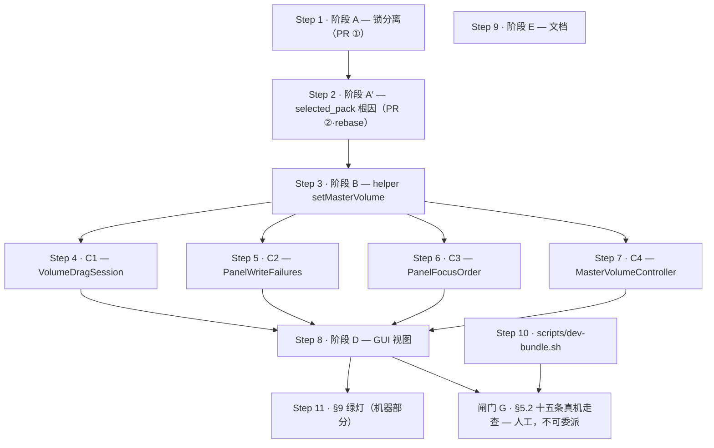

# Plan-Orchestrate Result —— 主音量滑块

**Plan**: `PLAN-MASTER-VOLUME.md`（只编排 §4 实现 / §8 并行化 / §9 绿灯）
**Lang**: `swift`（`helper/Package.swift` + `gui/Package.swift`；无 py_sub）
**Steps**: 11 + 1 个**不可委派的人工闸门**
**Scope**: all
**基线**: `2b759ca`（= 当前 `main`，PR #6 锁分离 merge 之后）。编排初稿写的 `9c33dac` 已过期；`2b759ca` 之下依次含 `9c33dac` → `0aab69a`（PanelView / ViewWiringSuite 假事实订正）→ `560c9f3`（台账修复），三者都已在 main 里。X1–X5 的快照是在 `0aab69a` 之上测的（锁分离**之前**），读时按下方「阶段 A 已落地」横幅校正。

---

## ✅ 阶段 A（Step 1）已落地 —— 2026-07-13 随 PR #6 合并进 main（`2b759ca`）

**锁分离已完成，不要再执行 Step 1。** `ClaudioPaths.lockFile` → `playLockFile` 改名 + 11 个默认值点逐个显式选择（`configLockFile` / `settingsLockFile` / `playLockFile`）全部落地并合并；顺带修了 `copySelfToFixedLocation` 的原子发布（不在原计划里，红队牵出）。本会话 `/review` + `/ship` 走完，helper 1228 + GUI 1706 测试全绿，0 critical。

**下一步是 Step 2（阶段 A′ —— `selected_pack: ""` 根因）。** 从 `2b759ca` 拉分支即可，阶段 A 已在基线里。

对下方漂移表的影响：
- **X1（第 11 个锁默认值点）已解决** —— PR #6 已把 `OnboardingActionEnvironment` 拆成 `configLockFile` + `settingsLockFile`（见下方 X1 行的 ✅ 批注）。
- **X6（WIP 分支 `cbc02f0`）的锁分离部分彻底作废** —— 正确的锁分离已经以完全不同的做法（改名，非加注释）落地。`cbc02f0` 只剩 Step 3/4/7 的三个新文件草稿还有参考价值（见下方 X6 行）。

---

## ⚠️ 基线漂移 —— 编排前必读（本轮实测，计划没有见过）

编排期间 `feat/t17-onboarding-cta` 合进了 main（`f00521e`）。它动到了主音量计划引用的三个地方：

| # | 漂移 | 对计划的影响 | 谁来裁决 |
|---|---|---|---|
| **X1** ✅**已解决（PR #6）** | **锁的默认值点从 10 个变成 11 个。** 新增 `gui/Sources/ClaudioGUICore/OnboardingActions.swift` 的 `OnboardingActionEnvironment.lockFile = ClaudioPaths.lockFile`，而它**同时写 settings.json（装 hooks）与 config.json（选包）** | D20 的「10 个默认值点」实测已是 **11**。第 11 个与 `Setup.SetupEnvironment` 是**同一类问题**（一把锁喂给两个不同文件的写者）→ 必须同款拆成 `configLockFile` + `settingsLockFile`。~~阶段 A 的文件清单少了一个文件。~~ **✅ PR #6 已把 `OnboardingActionEnvironment` 与 `SetupEnvironment` 都拆成 `configLockFile` + `settingsLockFile`，11 个点全部显式选择。** | ~~已写进 Step 1 的 prompt~~ —— Step 1 已完成，此条仅存档 |
| **X2** | **`PanelFocusCoordinator` 已经有 `hideCount` + `notePanelHidden()`（T17d）**，且 `MenuBarController.popoverDidClose` 的**第一条语句已经是** `focusCoordinator.notePanelHidden()`，注释逐字写着「必须是这个方法的第一行 …… 挪到 guard 之后 = 复活那个 bug」 | **D22 的 `closeCount` 与 D37 的「第一条语句」已经有现成载体。** 阶段 D 的「`PanelFocusCoordinator.swift`：加 `closeCount`」很可能是**多余的第二个平行计数器**；D37 从「插入新第一行」降级为「验证既有第一行仍在，并把冲刷挂到 `hideCount` 上」 | Step 8 的 prompt 要求 agent **先核实再决定**，并在 HANDOFF 里说明复用还是新增（**不许静默新增平行计数器**） |
| **X3** | **`Setup.swift:71-75` 的 private 三态裁决已被 T17e 重构掉。** 今天 `Setup.swift` 里是 `packSelectionPlan(status:usablePackIDs:)` + `PackIntegrityStatus`，且其注释逐字写着「用户点一下静音钮 → `setEventEnabled` 写出 `selected_pack: ""` 的 config（**那是对的**）」 | A′2 要「升成 public」的那段代码**已不在原位**；且 T17e 的这句注释与 **D23 定稿正面冲突**（A′1 一落地，它就变成新的假话注释）→ **A′ 的文件清单必须加上它** | Step 2 的链首挂了 `code-explorer` 先侦察；prompt 要求同批改掉这句注释 |
| **X4** | **D18 引用的那条「零 `.animation()`」绊线注释已经被 T17c 踩响并改写。** `PanelView` 今天已经声明 `@Environment(\.accessibilityReduceMotion)`，且有两处**已 gate 的**动画 | D18 的**结论**仍然成立（滑块行零动画、回滚瞬跳），但计划给的**理由**（「全树没人读 reduceMotion，所以加动画要同批接门控」）已经过期 —— 照抄那句话的 agent 会去找一条不存在的注释 | Step 8 的 prompt ③ 已改写：结论保留、理由更新，要加动画必须同批 gate `reduceMotion` 并说明理由 |
| **X5** | **`gui/Tests/ClaudioGUICoreTests/ViewWiringSuite.swift` 已经存在**（T17 期间建立）：它用 `#filePath` 推仓库根、读 `ClaudioGUI/*.swift` 的**源码文本**、断言视图层的接线行还在（现役断言逐字是 `panel.contains(".onChange(of: onboardingViewModel.state)")`，注释里明写「删掉这一行，652 项测试全绿」） | **这是 §9 变异验证第 ② 条（去掉 `rebase` 调用 → 必须 RED）唯一可能成立的机制** —— `ClaudioGUI` 是 executableTarget，测试 import 不进来，没有文本绊线的话那条变异**永远不会 RED**，测试就是恒真空测试（正是 D30 批判的病） | Step 8 要求给三条接线（rebase / popover 冲刷 / willTerminate 冲刷）各加一条文本绊线；Step 11 的变异 ② 已指名它 |
| **X6** ⚠️**锁分离部分已作废** | **WIP 参考分支 `cbc02f0`（`feat/master-volume-slider`）与本编排不同底。** 它基于 `9162266`（pre-T17），**不含 f00521e**。它写过一版阶段 A 的锁分离，但做法与已落地的 PR #6 **相反**：它**保留了 `lockFile` 旧名**、只新增 `configLockFile` / `settingsLockFile`，还漏了第 11 个默认值点（那棵树没有 `OnboardingActions.swift`）。**PR #6 用正确做法（改名）落地之后，它这半彻底作废。** | **`cbc02f0` 的 `Paths.swift` / 锁相关改动全部忽略 —— 以 main（`2b759ca`）为准。** 它唯一还有参考价值的是 Step 3/4/7 要「新建」的三个文件草稿（`MasterVolume.swift` 117 行、`VolumeDragSession.swift` 173 行、`MasterVolumeController.swift` 56 行）。分支本身落后 main 36、仅领先 1（那个作废的 WIP commit），**不要 rebase 它**——从 main 重新拉分支、只把三个草稿当参考。 |

**另一处「计划的前提已被源码证伪」**：D25 ① 要给 `ContrastSuite` 加的「`clayDark` vs `panelDark` ≥3:1」在**数值上**今天已被覆盖 —— `ClaudioColorHex.swift` 里 `notificationDark = clayDark` 是**字面别名**（同一个常量），而 `nonTextPairs` 已有「Notification dark glyph vs panel」这一对，算的是同两个 hex。所以当时的结论是「没有任何 step 认领 D25① 不是漏了」。

> ✅ **最终还是补了（`ee3af12`，2026-07-14）**，理由不是「数值没被覆盖」（上面那段推理仍然成立），而是另外两条：① **专名对称** —— 亮色那一对挂在 drop-zone 的决议下，暗色一直没有一条**以自己的名字**存在的守卫；② **解耦保险** —— 事件色与品牌色本是两个概念，只是今天恰好同值；哪天有人把 `notificationDark` 与 `clayDark` 解耦，那条别名断言就不再覆盖 clay，而这条会是唯一还钉着控件行填充色的断言。该 commit 的注释里逐字写明了它**不**更早也**不**更灵，别当成比实际更强的护栏。

滑块 `.tint(clay)` 是否退回系统强调色这件事，`ContrastSuite` **结构上永远测不到**（纯 hex 数学，`ClaudioGUICore` 连 SwiftUI 都不 link，看不见 NSSlider 实际填了什么色）—— 守门人是闸门 G 的第 ⑨ 条，**是人，不是 CI**。

**行号一律不可信**：计划里的 `PanelView.swift:96` 今天是 `:112`，`MenuBarController.swift:184` 今天是 `:198`，`PanelFocusOrder.swift:115-120` 今天是 `:145/:162`。所有 prompt 都改用**符号名 grep**定位，不用行号。

**工作树今日干净**（实测 `git status --short` 为空，HEAD = `2b759ca`）。开工前仍先 `git status` 确认，然后**从 `2b759ca`（即当前 main）拉分支 —— 不要从 `f00521e`**：f00521e 缺 `560c9f3` 与 `0aab69a`，从那里开分支会让 Step 9 的文档 PR **静默 revert 掉这两个 commit**（TODOS.md 242 行 + ENGINEERING.md / PanelView / ViewWiringSuite 的假事实订正）。这是本编排里唯一一处会真正丢工作的地方。

---

## Steps overview

| # | 阶段 | Title | Tags | Chain |
|---|---|---|---|---|
| 1 | **A** | 锁分离：`lockFile` → `playLockFile` 改名 + 11 个默认值点逐个显式选择 | impl, refactor, build | `tdd-guide → swift-build-resolver → swift-reviewer` |
| 2 | **A′** | `selected_pack: ""` 根因：fail-closed `.configMissing` + 两轴判据 + 面板路由 | impl, debug | `code-explorer → tdd-guide → silent-failure-hunter → swift-reviewer` |
| 3 | **B** | helper 写者 `setMasterVolume`（无 `freshSelectedPack`，缺 config 拒写） | impl | `tdd-guide → swift-reviewer` |
| 4 | **C1** | `VolumeDragSession` 纯状态机（D45 `snap()` = `(v/0.05).rounded()/20`） | impl, test | `tdd-guide → swift-reviewer` |
| 5 | **C2** | `PanelWriteFailures` 纯函数（D3 三写者错误 → 有序去重列表） | impl, test | `tdd-guide → swift-reviewer` |
| 6 | **C3** | `PanelFocusOrder`：只加 `.masterVolume` case，**不改签名**（D41） | impl, test | `tdd-guide → swift-reviewer` |
| 7 | **C4** | `MasterVolumeController` 壳 + `previewVolume(for:)` 纯函数（D29） | impl, test | `tdd-guide → swift-reviewer` |
| 8 | **D** | GUI 视图：`MasterVolumeRow` + PanelView + MenuBarController + 试听 + gallery | impl, a11y | `tdd-guide → a11y-architect → swift-reviewer` |
| 9 | **E** | 文档：ENGINEERING.md 线框 / 状态表 / 锁决议 + TODOS.md | docs | `doc-updater` |
| 10 | **§5.2 Part 0** | `scripts/dev-bundle.sh`（真机走查的前置，仓库今天没有本地打包脚本） | build | `swift-build-resolver` |
| 11 | **§9** | 绿灯（机器可测部分）：两包测试 + 零 warning + **5 条变异验证复跑** | test, build | `tdd-guide → swift-build-resolver` |
| **G** | **§5.2** | **15 条真机走查 —— 人工闸门，零 agent，不可委派** | — | **（无）** |

> **Step 10 与 Step 11 不是 §4 的阶段** —— 它们是 §9 绿灯的两个可机器执行的前提（`§5.2 Part 0` 的 bundle 脚本、§9 的变异复跑）。不要的话删掉，不影响 1–9 的编排。
> **Step 7 里的 `previewVolume(for:)` 在 §4 的 C 清单里没有**（D29 的修法只写在 §5）。它是 `ClaudioGUICore` 纯函数、且 Step 8 的视图转发要用它，所以挂在 C4。要严格照 §4，就把它挪进 Step 8。

---

## Parallel execution graph



**Parallel waves** —— 同一 wave 内的 step 可以在**各自独立的 Claude 会话**里并发跑；跑完整个 wave 再进下一个。

| Wave | Steps | 备注 |
|---|---|---|
| 1 | **step-1（A）** ∥ step-9（E） ∥ step-10（dev-bundle） | A 是 Lane 1 的头。E = §8 Lane 3，全程独立。dev-bundle 只用现有源码，不依赖任何阶段 |
| 2 | **step-2（A′）** | **严格在 A 之后**（两者都改 `EventEnabled.swift`；A 改锁、A′ 改契约 → **A 先合，A′ 在其上 rebase**，§8:506） |
| 3 | **step-3（B）** | §8：B 依赖 A（要 `configLockFile`）＋ A′（要 `.configMissing` 契约） |
| 4 | **step-4 ∥ step-5 ∥ step-6 ∥ step-7（C1–C4）** | §8:502「`VolumeDragSession` / `PanelWriteFailures` / `PanelFocusOrder` 三者互不依赖，C 内部可三路并行」+ `MasterVolumeController` 第四路 |
| 5 | **step-8（D）** | §8：D 依赖 C ＋ A′ |
| 6 | **step-11（§9 绿灯 · 机器部分）** | 两包测试 + 零 warning + 5 条变异验证复跑 |
| **闸门 G** | **§5.2 十五条真机走查** | **人工。不排 agent wave，不可委派。** 需要 `open dist/Claudio.app`、改系统强调色 / 文字大小、用耳朵听音量、⌘F5 开 VoiceOver。第 ⑨ 条（`.tint(clay)` 未退回系统强调色）是用户已拍板接受的「CI 结构上测不到」的缺口 —— **守门人是人不是 CI** |

⚠️ **Wave 4 的唯一共享文件是 `gui/Tests/ClaudioGUICoreTests/main.swift`**（四个 suite 都要在那里注册）。四路并行 → 四个分支各追加一行 → 合并时是一个 4 行的 append 冲突，**不是逻辑冲突**，手工合 30 秒。要完全避开就把 C1–C4 串行跑在同一分支上（代价：失去 §8 明写的并行）。

**PR 边界**（§8:504-506）：**PR ① = Step 1（A）**；**PR ② = Step 2（A′，rebase 在 ① 上）**；**PR ③ = Steps 3–8 + 11（滑块本体）**；**PR ④ = Step 9（E，文档）**，可随时。

### Dependency sources

- step-2 → deps: [step-1] —— explicit: 「两者都改 `EventEnabled.swift`（A 改它的锁，A′ 改它的 fail-closed 契约）→ **A 先落，A′ 在其上 rebase**」（§8:506）。**§8 的依赖表把 A′ 写成「—」，但同节的散文与 §11 的 VERDICT 都要求串行 —— 以散文为准。**
- step-3 → deps: [step-2]（透传 step-1）—— explicit: §8 表「B 依赖 A（要 `configLockFile`）＋ A′（要 `.configMissing` 契约）」
- step-4 / step-5 / step-6 / step-7 → deps: [step-3] —— explicit: §8 表「C 依赖 B（`MasterVolumeController` 调 `setMasterVolume`）」
- step-8 → deps: [step-4, step-5, step-6, step-7]（透传 step-2）—— explicit: §8 表「D 依赖 C ＋ A′（空包态不渲染滑块 → 焦点序）」
- step-9 → deps: ∅ —— explicit: §8 表「E 文档 | `*.md` | —」+ 「Lane 3：E（独立，可并行）」
- step-10 → deps: ∅ —— heuristic: `§5.2 Part 0` 的脚本只调用 `swift build`，不依赖任何阶段的产物
- step-11 → deps: [step-8] —— explicit: §9 的绿灯条目全部指向已实现的代码（5 条变异验证分别落在 A / A′ / C / D）
- 闸门 G → deps: [step-8, step-10] —— explicit: §9「真机走查按 §5.2 的 15 条清单走完（ad-hoc 签名 app bundle）」

**无环。**

---

## ☠️ 已作废决议清单 —— 一条都不许进实现

任何 agent 只要在产出里出现下面任意一条，**就是引入一个已知 bug**：

| 死决议 | 它会造成什么 | 替代 |
|---|---|---|
| ~~D5~~ `Slider(step: 0.05)` | 轨道下方画出 **21 个刻度点**（`numberOfTickMarks=21`），撑破 28pt 行高 | **D24**：吸附型 `Binding` 转发，`snap()` 放进 `VolumeDragSession` |
| ~~D10~~ `onDisappear` 冲刷 | 本仓库**已明文否定**该回调（`PanelFocusCoordinator.swift:10`），全仓 `onDisappear` 零命中 | **D22 + D37**：走 `popoverDidClose` 的**第一条语句**（今天已是 `notePanelHidden()`，见 X2）。⚠️ 被作废的**只是 `onDisappear` 那一半** —— `willTerminate` 那一半 D22 明写「**保留**，降级为兜底」（只覆盖 ⌘Q / 注销 / 关机，force quit 与 `killall` 不覆盖）。**计划的阶段 D 文件清单自己漏抄了它**，而走查第 ④ 条正是测它的 → 已补进 Step 8 的 ⑤-bis |
| ~~D13~~ `freshSelectedPack` 参数 | 空转 —— 调用方手里本来就只有空串，签名管不住坏数据 | **D23 定稿**：config 缺失 → `.configMissing` **拒写**，新写者**没有这个参数** |
| ~~D19~~ 空包时禁用滑块 | 封错了门（真正会写毒的是**静音钮**）；且与焦点不变式撞车 | **D23 定稿**：空包态**整个面板换态**，根本不渲染滑块 |
| ~~D31 的修法半句~~ 给 `panelFirstFocusTarget` 加参数 | 加一个永远只传 `true` 的参数 = 计划自己批过的「写了没人调」式漂移 | **D41**：**只加 `.masterVolume` case，不改签名**；`.operational` scope 里滑块恒可操作，在过滤器的 `return true` 分支旁加注释写明这个前提 |
| ~~D34①~~ 「Dynamic Type 档位错一级」 | **假修正**（D17 从头到尾是对的） | **D44**：「较大」= `.larger` = **只隐波形不折行**；「更大」= `.largest` = **开始折行**；「极大」= `.maximum` = 加宽 360pt |

`snap()` 的公式：**`(v / 0.05).rounded() / 20`** —— **不是** `* 0.05`（D45：`* 0.05` 会把 21 档里的 **7 档**写成 `0.35000000000000003` 落进用户的 config.json）。

---

## 本仓库的验证命令（不要用默认猜测）

```bash
swift run --package-path helper claudio-tests      # 不是 swift test
swift run --package-path gui  claudio-gui-tests    # 不是 swift test
swift build --package-path helper                  # 须零 warning
swift build --package-path gui                     # 须零 warning
```

（`swift test` 在这台机器上解析不了 XCTest —— 只有 CommandLineTools，无 Xcode。测试是自建 harness，新 suite 必须在 `Tests/*/main.swift` 里注册才会跑。）

**今日基线实测（`2b759ca`）** —— 每一步拿它做前后 diff，别拿文档里的历史数字（如 T17 时期的「652 项」）当自校验目标：

| 项 | 实测 |
|---|---|
| `helper` 测试 | `✓ all 1228 checks passed`（exit 0） |
| `gui` 测试 | `✓ all 1706 checks passed`（exit 0） |
| 两包 `swift build` | **全量重编零 warning** |
| Release | `swift build -c release --package-path gui --product ClaudioGUI` exit 0（`--product` 不可省） |
| 工具链 | Swift 6.3.1，**Swift 6 语言模式**（tools-version 6.0，无 swiftSettings 覆盖） |

⚠️ **「零 warning」必须用全量重编证明**（`swift build --scratch-path <临时目录>`，或先 clean）—— 增量构建命中缓存时不会重放 warning，直接跑 `swift build` 看到空输出**不构成**零 warning 的证据。
⚠️ Swift 6 语言模式下，新增 `ClaudioGUICore` 类型的 `Sendable` / `@MainActor` 隔离问题是**硬 error，不是 warning**。

---

## 开工前的机械前置（文档原先没写，但每一步都默认它做过了）

**没有任何一个 step 的 prompt 里有 `git checkout -b`。** 直接粘 = agent 在 `main` 上就地改。四条 PR 边界（下方 §Parallel execution graph）要求你**先手工建分支**：

```bash
git status --short          # 必须为空
# PR ①（Step 1 · 锁分离）✅ 已合并进 main（2b759ca），不用再建这条分支。
# 下一步是 Step 2（PR ②·阶段 A′），从 2b759ca 直接拉：
git checkout -b feat/master-volume-selected-pack 2b759ca   # PR ②（Step 2）
```

**Wave 1 的三路并行（step-1 ∥ step-9 ∥ step-10）需要三个 `git worktree`**，否则三个会话在同一棵树的 `main` 上互相踩：

```bash
git worktree add ../Claudio-e   -b docs/master-volume-eng   2b759ca   # Step 9
git worktree add ../Claudio-bundle -b build/dev-bundle      2b759ca   # Step 10
```

**`dist/` 不在 `.gitignore` 里**（已在本轮补进）。Step 10 的 Acceptance 强制「实跑一次」，必然产出 `dist/Claudio.app`（几十 MB 的 bundle，含二进制 + mp3）。没有这条忽略规则，跑完工作树立刻变脏，后续 Step 11 / 闸门 G / `/ship` 都会看到它，最坏情况是某个 agent `git add -A` 把整个 app bundle 提交进仓库。

---

## Step 1 — 阶段 A：锁分离（PR ①）— ✅ 已完成，2026-07-13 随 PR #6 合并进 main

> **本节仅存档。** 下方三条 agent 链已由 PR #6 兑现（做法与此处 prompt 一致：改名 `lockFile`→`playLockFile` + 11 个默认值点显式选择 + ViewWiringSuite 文本绊线）。不要再跑这一步。直接看 Step 2。

**Intent**: 把 `ClaudioPaths.lockFile` **改名**成 `playLockFile`，新增 `configLockFile` / `settingsLockFile`；改名后全部默认值点编译不过，逐个做出显式选择。这是 D9 的**唯一**兑现方式 —— `PanelView` 是**向下显式传参**的（`PanelView.swift:145` → `OnboardingActionEnvironment`、`:151` → `EventMuteController`、`:774` → `selectPack`），所以只改 helper 侧函数的默认参数对它一点作用都没有（D20）。
**Tags**: impl, refactor, build
**Chain rationale**: 改名 → 11 处编译错误是**目的**，不是意外，所以 `swift-build-resolver` 排在中间收编译；`tdd-guide` 先按 D30 写「接线断言」（唯一有牙的测法）；`swift-reviewer` 收尾（reviewer-class tail）。

### Agents（顺序执行；把前一个 agent 的 HANDOFF 原样喂给下一个）

1.
```
Agent(
  subagent_type="tdd-guide",
  prompt="[Plan: PLAN-MASTER-VOLUME.md#step-1] 阶段 A · 锁分离（独立 PR，与滑块无关，修的是今天就在吞提示音的 bug）。基线 2b759ca（当前 main），先读计划 §4 阶段 A（:151-188）与 D9/D20/D30；计划里的行号已因 T17 落地而漂移，一律用符号名 grep 定位。做三件事：① Paths.swift 把 lockFile 改名为 playLockFile（改名，不是加注释），新增 configLockFile（~/.claudio/config.lock）与 settingsLockFile（~/.claudio/settings.lock）；② 改名后每一个 = ClaudioPaths.lockFile 默认值点都会编译不过，逐个显式选择：Play 拿 play；Use / EventEnabled 拿 config；SettingsInstaller 的四个签名拿 settings；Setup 的 SetupEnvironment.lockFile 拆成 configLockFile + settingsLockFile（source-breaking）—— ⚠️ 计划说「SetupSuite 的五个构造点」，那是 T17 之前的旧快照：实测今天 SetupSuite 有 6 个 SetupEnvironment 构造点、QuarantineSuite 另有 3 个，还有一处读 environment.lockFile。**别信任何数字，以编译器报错为准**：改完 grep 一次 ClaudioPaths.lockFile 确认零残留。⚠️ 但有**一处编译器不会报**：helper/Sources/claudio/Subcommands.swift:112 的 SetupEnvironment(executablePath: currentExecutablePath()) 一个可选参数都不传、全吃默认值 —— SetupEnvironment 拆成两个字段后它照样编得过。**手工去看这一行**，确认它拿到的两把新锁语义正确，并在 HANDOFF 里报告。GUI 侧 PanelView 与 EventMuteController 的默认值拿 config（这条链是整个 D9 的兑现点：MenuBarController.swift:58 构造 PanelView 时不传 lock）；③ ⚠️ 计划说 10 个默认值点，实测基线上是 11 个 —— 新增的 gui/Sources/ClaudioGUICore/OnboardingActions.swift 里 OnboardingActionEnvironment 的 lockFile（字段 :485 / 默认值 :492）同时服务 settings.json 写入与 config.json 写入，与 SetupEnvironment 是同一类问题，请同款拆成两个字段，并在 HANDOFF 里显式报告你的处置。它有**两个使用点，语义不同、别一把锁灌到底**：:586 把它传给 SetupEnvironment（→ performFirstRunSetup，那条路径既写 config.json —— selectPack，Setup.swift:496/:506 —— 又写 settings.json —— installClaudioHooks，Setup.swift:541），所以这里两把锁都要传；:597 把它传给 uninstallClaudioHooks（SettingsInstaller.swift:186），那条路径**只写 settings.json**，一个字节都不碰 config.json，只传 settingsLockFile。测试按 D30 只写接线断言，但**两种载体，别混**：(a) 类型级断言（可直接构造）—— gui 侧 EventMuteController().lockFile == ClaudioPaths.configLockFile；helper 侧 PlayEnvironment().lockFile == ClaudioPaths.playLockFile。(b) **PanelView 只能用源码文本绊线，不许试图 import**：PanelView 住在 ClaudioGUI，那是 .executableTarget（gui/Package.swift:45-51），claudio-gui-tests 的依赖里根本没有它（gui/Package.swift:61-68），Swift 也 import 不了带 @main 的 target；且 PanelView.lockFile 是 private let（PanelView.swift:89）。**载体已经存在、已经注册**：往 gui/Tests/ClaudioGUICoreTests/ViewWiringSuite.swift 里加一条断言，复用它现成的 codeOnly(_:)（:51-60）读 gui/Sources/ClaudioGUI/PanelView.swift 的**剥注释源码文本**，断言该文本 contains 子串 lockFile: URL = ClaudioPaths.configLockFile（形状照抄它 :134 那条现役断言 panel.contains(.onChange(of: onboardingViewModel.state))）。**不要新建第二个读源码的 suite。** 不要写显式注入 lockFile 的锁争用测试（那种测试与默认值无关，恒真）。行为回归保留：持有 config.lock 时 playSoundEvent 仍发声。注册点 —— 本仓库有**两个** harness，别只注册一边：helper 侧进 helper/Tests/ClaudioCoreTests/main.swift（注册区 :44-61），gui 侧进 gui/Tests/ClaudioGUICoreTests/main.swift（注册区 :55-84）。PanelView 那条绊线加进已注册的 runViewWiringSuites()（gui main.swift:68），**不需要新注册**。一个没被调用的 suite 函数 = 0 次 check、永远绿。验证命令：swift run --package-path helper claudio-tests、swift run --package-path gui claudio-gui-tests（不是 swift test），两包 swift build 零 warning。Acceptance: 两包测试退出 0 且零 warning；接线断言覆盖 EventMuteController / PanelView / PlayEnvironment 三个默认值，其中 PanelView 走 ViewWiringSuite 文本绊线（理由见上）。变异验证要跑**两次**、两次都必须 RED：① 把 EventMuteController.swift:26 的默认值改回 playLockFile → gui 类型级断言 RED；② 把 PanelView.swift:112 的默认值改回 playLockFile → ViewWiringSuite 那条文本绊线 RED。**② 尤其不能跳过**：MenuBarController.swift:58 是全仓唯一的 PanelView( 构造点且不传 lockFile，所以 PanelView 的默认值是 GUI 生产路径上唯一活着的锁值 —— 只测 ① 就等于 D9 的兑现点零守护。Out of scope: 主音量滑块本身；config 写路径的乐观并发重读（计划已另开 TODO）。End with a literal <handoff>{...}</handoff> block — a single JSON object with keys scope, risks (array of strings), test-plan, next-agent-input. The <handoff></handoff> tags are mandatory; do NOT use markdown headings or a pipe list."
)
```

2.
```
Agent(
  subagent_type="swift-build-resolver",
  prompt="[Plan: PLAN-MASTER-VOLUME.md#step-1] [Prior HANDOFF from tdd-guide: <pass through>] 把阶段 A 改名后的两个包收干净：swift build --package-path helper 与 swift build --package-path gui 必须零 error 零 warning，swift run --package-path helper claudio-tests 与 swift run --package-path gui claudio-gui-tests 必须退出 0（不是 swift test）。只做最小修复，不改架构、不改任何锁的语义选择 —— 每一个默认值点该拿哪把锁由上一个 agent 定，你只负责让它编译并保持零 warning。若发现还有编译不过的 ClaudioPaths.lockFile 引用，补齐并在 HANDOFF 里列出来 —— 包括 helper/Tests/ClaudioCoreTests/PathsSuite.swift 的**两处**（:50 与 :85，分属「路径不含空格」与「都住在 ~/.claudio 下」两张**穷举表**）。改名之外还要**给两张表各补上 configLockFile / settingsLockFile 两行** —— 只改名不补行，等于这两条既有不变式对新增的两把锁完全失效。Acceptance: 两包 build 零 warning；两包测试退出 0；没有任何一处用 try! / 强制解包 绕过编译错误。End with an updated <handoff>{...}</handoff> block (same JSON keys: scope, risks, test-plan, next-agent-input; literal tags mandatory)."
)
```

3.
```
Agent(
  subagent_type="swift-reviewer",
  prompt="[Plan: PLAN-MASTER-VOLUME.md#step-1] [Prior HANDOFF from swift-build-resolver: <pass through>] 评审阶段 A 的锁分离改动。重点四条：① 每一个默认值点拿的锁与它真正写的文件一致（play → play.lock；config **两**写者 → config.lock —— selectPack（Use.swift:61 的默认值 / :94 的写点）与 setEventEnabled（EventEnabled.swift:61 / :88），这是今天 updateConfigJSON 仅有的两个调用点，ENGINEERING.md:183 逐字写着「写入者只有两个……不允许出现第三条写路径」；**第三个写者 setMasterVolume 要到阶段 B（Step 3）才存在，PR ① 里找不到它，别去找**；settings 写者 → settings.lock；同时写两个文件的 SetupEnvironment 与 OnboardingActionEnvironment 必须持有两把锁，不能共用一把）；② 改名是真改名，没有留 typealias / 兼容别名把旧名字放回去（那会让 10+ 个编译错误消失，也就让这次改名的全部效力消失）；③ 接线断言确实钉住的是默认构造后的 lockFile 值，而不是显式注入（PanelView 那一条是 ViewWiringSuite 的源码文本绊线，不是类型级断言 —— 它 import 不进来）；④ 锁的非阻塞语义未被改动（play 拿不到锁时静默跳过是故意设计，不许改成阻塞）。Acceptance: 无 P0/P1；任何「换个锁但没人测到」的点都要指名；HANDOFF 里列出 GUI 两处默认值的最终值。End with a final <handoff>{...}</handoff> block (same JSON keys; literal tags mandatory)."
)
```

---

## Step 2 — 阶段 A′：`selected_pack: ""` 根因（PR ②）← **下一步从这里开始**

> **基线已更新：** PR ① 已在 main（`2b759ca`），所以 Step 2 **不再需要 rebase 在 PR ① 之上** —— 直接从 `2b759ca` 拉分支即可，阶段 A 已在基线里。

**Intent**: 消灭磁盘上 `selected_pack: ""` 的唯一产地（`EventEnabled.swift` 的 `freshSelectedPack: ""`），把面板的判据改成「读 + 写」两条正交轴，并把不可用的 config 路由到已经存在的自救路径。这是**今天就活着**的 bug（静音钮可触发），与滑块无关。
**Tags**: impl, debug
**Chain rationale**: 计划引用的 `Setup.swift:71-75` 已被 T17e 重构掉（X3），所以链首挂 `code-explorer` 先做**只读侦察**，避免 agent 照着不存在的行号重造轮子；`silent-failure-hunter` 是这一步的天然评审角色（D23 的病灶正是「面板顶着绿点撒谎 + 静默造毒」）；`swift-reviewer` 收尾。

### Agents（顺序执行；把前一个 agent 的 HANDOFF 原样喂给下一个）

1.
```
Agent(
  subagent_type="code-explorer",
  prompt="[Plan: PLAN-MASTER-VOLUME.md#step-2] 阶段 A′ 的只读侦察（不要改任何文件）。计划的 D23 定稿要求把 Setup.swift:71-75 的 private 三态裁决升成 ClaudioCore 的 public packSelection(configFile:)，但基线 2b759ca（当前 main）上 T17e 已经重构过 Setup.swift —— 那段代码不在原位。请回答四个问题并给出精确的符号名与当前行号：① 今天 helper 里判断「有没有人选过包」的代码在哪（看 packSelectionPlan / PackIntegrityStatus / checkPackIntegrity），它是不是 D23 要的三态判据（不存在 ∨ 空串 = 没人选过包；畸形 = 坏文件，不猜不重建）？能复用就复用，不能就说清差在哪；② public probeConfigRewritable 的四态（absent / rewritable / malformed / unwritable）在 ConfigMutation.swift 的什么位置，它今天的调用方是谁；③ EventEnabled 里 freshSelectedPack: 空串 的那个调用点、以及那句「In practice this branch is unreachable from the real panel」的假话注释各在哪一行；④ Setup.swift 里 packSelectionPlan 的注释逐字写着「用户点静音钮写出 selected_pack 空串的 config —— 那是对的」，这句话在 A′1 落地后会变成新的假话注释，请把它的位置也报出来。⚠️ 今日坐标（2b759ca 实测，直接用，不要盲搜；但每一条都自己复核一遍再报，对不上就在 HANDOFF 里指出）：① packSelectionPlan **今天已经是 public**（Setup.swift:94），且它**不是三态、是六格**（PackSelectionPlan 的六个 case 在 Setup.swift:53 / :55 / :69 / :71 / :74 / :77；「没人选过包」那一格是 :111 —— .noConfig 与 .packNotFound 空串合并的那一支；测试在 SetupSuite.swift:659，suite 名逐字写着「packSelectionPlan —— 六个格子逐格钉死」）。它吃的 PackIntegrityStatus 在 Doctor.swift:84，产它的 checkPackIntegrity 在 Doctor.swift:101 —— 你要回答的是：这六格里能不能**读出** D23 要的那个读判据，还是得在它之上另包一层。② probeConfigRewritable 在 ConfigMutation.swift:98；四态枚举 ConfigRewritability 在 :78-93（absent :80 / rewritable :82 / malformed :86 / unwritable :92）。**今天生产代码里它唯一的调用方是 Doctor.swift:379，GUI 侧零调用** —— 所以 ConfigMutation.swift:76-77 那句「`claudio doctor` 的 config 检查……与 `gui` 的诊断都读这一个判定」里的 gui 那半句**今天是假注释**（gui 从没读过它），请在 ② 的回答里一并点名。③ freshSelectedPack 空串的调用点 = EventEnabled.swift:88；那句英文假话注释 = EventEnabled.swift:48-52，**它还有一个中文复述版在 EventEnabled.swift:83-84**（「文件不存在时仍然新建一份最小 config，且刻意用空的 selected_pack」）—— 两处都要报，A′ 落地时同批改。顺带看一眼 GUI 侧的对应回落：loadPanelConfig 的 ?? ClaudioConfig(selectedPack: 空串) 在 PanelConfig.swift:24-25。④ 那句注释 = Setup.swift:107-110（就压在 :111 那一格的头上）。Acceptance: 四问全部有精确 file:line；明确结论「读判据能否复用现有代码」；不修改任何文件。End with a literal <handoff>{...}</handoff> block — a single JSON object with keys scope, risks (array of strings), test-plan, next-agent-input. The <handoff></handoff> tags are mandatory; do NOT use markdown headings or a pipe list."
)
```

2.
```
Agent(
  subagent_type="tdd-guide",
  prompt="[Plan: PLAN-MASTER-VOLUME.md#step-2] [Prior HANDOFF from code-explorer: <pass through>] 阶段 A′ · 实现（独立 PR，rebase 在阶段 A 之上）。先读计划 §4 阶段 A′（:190-231）与 D23 定稿。四层：① helper —— setEventEnabled 在 config 缺失时 fail-closed，新增 .configMissing 错误，不再新建；删掉 freshSelectedPack: 空串 那个调用点（EventEnabled.swift:88，磁盘上 selected_pack 空串的唯一产地），并把那句「In practice this branch is unreachable from the real panel」的假话注释（EventEnabled.swift:48-52，另有中文复述版 :83-84，同批改）换成实话：它可达，所以我们拒写。⚠️ freshSelectedPack 参数本身保留（selectPack 仍在用，它有写前两道 pack 校验），但新写者不得再带它 —— 计划的 D13 已作废。同批修掉 Setup.swift:107-110 里 packSelectionPlan 那句「写出 selected_pack 空串是对的」的注释（它在本步之后即成假话）。② 判据是两条正交轴，缺一不可：读 = packSelection(configFile:)（三态：不存在 ∨ 空串 = 没人选过包；畸形 = 坏文件，不猜不重建，能复用 T17e 的既有代码就复用）；写 = 复用已存在的 public probeConfigRewritable（ConfigMutation.swift:98，四态，已是 doctor 的单一真相源，绝不重造）。少了「写」这一问，{master_volume: 字符串} 这种读得动写不动的 config 会被判成可用 → 面板渲染全套活控件 → 每次点击必败。③ GUI —— PanelConfig.swift:24-25 的 loadPanelConfig 去掉 ?? ClaudioConfig(selectedPack: 空串) 的回落。④ 面板路由 —— .needsPack 走画廊空态「先选包」（副文案：还没有选中任何声音包。点一张卡片，Claudio 会建好配置。）；.malformed / .unwritable 走诚实失败态 + doctor 的可执行修复指令 + 在访达中显示。☠️ 禁止：不要禁用滑块或任何控件来「防」空包（D19 已作废，封错了门 —— 空包态根本不渲染滑块，写者本来就全部 fail-closed）。测试：helper PackSelectionSuite（**唯一的新文件**：读三态 × probeConfigRewritable 四态的合成矩阵，重点钉「读得动、写不动」必须不是可用；须在 helper/Tests/ClaudioCoreTests/main.swift 的注册区尾部加一行 runPackSelectionSuites() —— 那份清单是逐条手写调用（:44-61），没有自动发现，没注册的 suite 一次都不会跑）；helper EventEnabledSuite（**已存在**，加用例：config 缺失 → .configMissing，且磁盘上不得出现新文件）；gui PanelConfigSuite（**已存在**，PanelConfigSuite.swift:10 与 :20 那两条钉「缺失 / 损坏 config 回落成空包默认值」的 suite 必须重写，不是新增）。☠️ 另外两处必须同批处理：gui ViewWiringSuite —— 它是唯一能看见 PanelView 接线的源码文本绊线（ViewWiringSuite.swift:1-25 自陈：ClaudioGUI 是带 @main 的 executableTarget，测试 import 不进来），本步重写 PanelView 路由，它的断言、以及 :275 那段以「config.json 还不存在 → loadPanelConfig 回落成 selectedPack 空串」为前提的论证都要跟着改，**不许靠删断言变绿**；gui CoverageStateSuite:344 / :357 同样拿 ClaudioConfig(selectedPack: 空串) 当作「缺失 config」的形状。命令：swift run --package-path helper claudio-tests / swift run --package-path gui claudio-gui-tests（不是 swift test），两包零 warning。Acceptance: 两包测试退出 0 零 warning；变异验证 —— 把 freshSelectedPack: 空串 加回 setEventEnabled 时，「不得新建 config」必须 RED；本步**不新增任何** PanelFocusTarget case（.masterVolume 要到阶段 C3 / Step 6 才加；今天 PanelFocusOrder.swift:20-41 的 PanelFocusTarget 里没有它）—— 路由态只做减法：不渲染的控件不进序。Out of scope: config 缺失且用户包目录为空时的逃生口（D36，已登记 P2 TODO）。⚠️ 计划 D35 / D23 里「onboarding CTA 是死钮、onPrimaryAction 从未被赋值」**已经过期**：onPrimaryAction 在 354d0b4（T17b）就被删掉了，今天是构造注入的 actionRunner（OnboardingViewModel.swift:95-98，非可选、忘了接线就是编译错误）+ performPrimaryAction()（:160），而 PanelView.swift:147-149 已经注入了 DiskOnboardingActionRunner —— CTA 早已端到端接线。读 D23 时**忽略这条否决理由**，不要去重开那条已经拍死的设计分支，也不要把它写进 Out of scope。End with an updated <handoff>{...}</handoff> block (same JSON keys: scope, risks, test-plan, next-agent-input; literal tags mandatory)."
)
```

3.
```
Agent(
  subagent_type="silent-failure-hunter",
  prompt="[Plan: PLAN-MASTER-VOLUME.md#step-2] [Prior HANDOFF from tdd-guide: <pass through>] 审 A′ 的静默失败面。这一步修的病是「面板顶着绿点撒谎」，所以专查三类：① 还有没有别的地方在 config 不可用时凭空造数据 / 回落到一个磁盘上不存在的值（grep 全仓 selectedPack: 空串、?? ClaudioConfig、freshSelectedPack 的所有调用方）；② 新增的 .configMissing 是不是每一条路径都被真正处理了 —— 计划的 D43 明写它不面向用户。本步 GUI 里 .configMissing 的**唯一接收者**是 EventMuteController.setEnabled（gui/Sources/ClaudioGUICore/EventMuteController.swift:37-45 —— 它的 :38 是 gui/Sources 里 setEventEnabled 的唯一调用点）：它必须记下 lastError 并返回 false，且 PanelView 必须触发全量 refresh()（PanelView.swift:815；注意静音钮今天走的是 refreshEnabledFlags()，PanelView.swift:798 —— 那条只重读 config + 重算四行开关，不重路由）重路由到 .needsPack，绝不能吞掉，也绝不能编一句没人会 QA 的面板文案。☠️ commitFailed() 是阶段 C1（Step 4）VolumeDragSession 的 API，**本步尚不存在**（全仓零命中）—— 不要去找它，更不要为它提前造 API；③ 「读得动、写不动」的 config 是否真的走不到活控件（这类 config 的每一次点击都必然失败，是本步存在的核心理由）。Acceptance: 逐条给出 file:line 与失败场景；确认无「捕获后什么都不做」的分支；确认 .configMissing 不会静默丢失。End with an updated <handoff>{...}</handoff> block (same JSON keys: scope, risks, test-plan, next-agent-input; literal tags mandatory)."
)
```

4.
```
Agent(
  subagent_type="swift-reviewer",
  prompt="[Plan: PLAN-MASTER-VOLUME.md#step-2] [Prior HANDOFF from silent-failure-hunter: <pass through>] 评审 A′ 的 Swift 实现。重点：① 错误枚举 .configMissing 的 reason / description 照 SetEventEnabledError（EventEnabled.swift:21-38）与 UseError（Use.swift:16-40）的既有惯例写 —— **中文、可执行**，与 ConfigMutation.swift:201-259 那批修复指令（哪个键、必须是什么、当前是什么、怎么修）同族；给 CLI / doctor 看，不是面板文案。⚠️ 全仓**没有任何英文 reason 的先例**，计划 D43 那句「英文」是假事实，不要照它开 P1，也不要逼实现改成英文（reason 载荷本来就是从 ConfigMutationFailure 机械透传的中文串，改英文只会得到一个半中半英的枚举）；② 没有重造 probeConfigRewritable（复用 ConfigMutation.swift:98 那份 public 的，它已是 doctor 的单一真相源）；③ .needsPack 的**自救写路径**零新机制（点一张包卡 → selectPack 在 config 缺失时建出正确 config，Use.swift:94）—— 本步只是让面板走上去。但两样东西今天在代码里**根本不存在**、必然是新代码，允许但要盯住边界：(a)「在访达中显示」—— 全仓零 activateFileViewerSelecting，NSWorkspace 在 Sources 里只被 MenuBarController.swift:119 用过，所以它只许是 ClaudioGUI 层的一行调用，**不得下沉进 Core**；(b) 画廊空态 —— PackGalleryView.swift 今天零 isEmpty 分支，这个空态今天只活在 ENGINEERING.md:219 的规格里；④ 注释里不得再出现任何「this branch is unreachable」式的、被源码证伪的断言（EventEnabled.swift:48-52 的英文原句与 :83-84 的中文复述版都必须已经改掉，只改一处 = 隔壁留一句新的假事实）。Acceptance: 无 P0/P1；新 public API 有 doc comment；两包测试退出 0 零 warning。End with a final <handoff>{...}</handoff> block (same JSON keys; literal tags mandatory)."
)
```

---

## Step 3 — 阶段 B：helper 写者 `setMasterVolume`

**Intent**: 新建 `helper/Sources/ClaudioCore/MasterVolume.swift`，做 `updateConfigJSON` 的第三个调用方。config 缺失 → `.configMissing` 拒写（与 A′ 改造后的 `setEventEnabled` 同形状）；先钳制再写；`.updated(volume:)` 带回实际落盘值。
**Tags**: impl
**Chain rationale**: 纯 helper 逻辑、全部可单测 → `tdd-guide` 主刀，`swift-reviewer` 收尾（reviewer-class tail）。

### Agents（顺序执行；把前一个 agent 的 HANDOFF 原样喂给下一个）

1.
```
Agent(
  subagent_type="tdd-guide",
  prompt="[Plan: PLAN-MASTER-VOLUME.md#step-3] 阶段 B · helper 写者。基线 2b759ca（当前 main）+ 阶段 A（Step 1）。新建 helper/Sources/ClaudioCore/MasterVolume.swift：setMasterVolume(_:configFile:lockFile:) -> Result<SetMasterVolumeOutcome, SetMasterVolumeError>。硬约束：① ☠️ setMasterVolume 自己的签名里没有 freshSelectedPack（D13 已作废）—— 作废的**只是新写者签名里的那个参数**：updateConfigJSON 的 freshSelectedPack 参数**保留**（selectPack 仍在用，Use.swift:94 传的是真 packID，不是空串），它「文件不存在 → 新建最小 config」的那个分支（ConfigMutation.swift:152-160）也**保留** —— 那是 selectPack 建出正确 config 的唯一入口，是 D23 自救路径依赖的东西。**不许去改 ConfigMutation.swift。** config 缺失 → **.configMissing 拒写**：这个守卫由 setMasterVolume 自己在锁内做，形状照 A′ 改造后的 setEventEnabled，新写者绝不新建 config；② 先钳制再写 —— 复用 AfplayVolume.clamped（Volume.swift:24，绝不重写第二份），越界值绝不落盘；非有限值绝不到达编码器 —— clamped 的第一行就是 guard masterVolume.isFinite else return ClaudioConfig.defaultMasterVolume（Volume.swift:25，NaN/±inf 换成默认 0.8），即便漏过去，JSONSafeWrite 也会在 JSONSerialization 之前 fail-closed 拒写（firstUnwritableJSONValue 在 JSONSafeWrite.swift:39，isValidJSONObject 兜底在 :53）。☠️ **不要写「期望进程崩溃 / exit 134」的测试** —— 那条 abort 路径已经在 JSONSafeWrite.swift:16-17 被显式消灭了，今天不存在；③ 复用 updateConfigJSON 做外科式读-改-写（只 set master_volume，未知顶层键 / events / selected_pack 逐字保留）；④ 锁用 ClaudioPaths.configLockFile，**不是 playLockFile**（更不是今天那个即将被改名掉的 ClaudioPaths.lockFile）—— ⚠️ 它与 playLockFile 在 main(2b759ca) 上**还不存在**（Paths.swift:73 今天只有 lockFile = ~/.claudio/play.lock）：本步必须 rebase 在 Step 1（阶段 A 锁分离）之上再跑。若 grep 不到 configLockFile，**先停下来报告，不要自己去 Paths.swift 里加符号**（那是 Step 1 的范围，会撞 PR）；⑤ 错误枚举逐 case 镜像 SetEventEnabledError（EventEnabled.swift:21-38，含 A′ 新增的 .configMissing）。测试 helper MasterVolumeSuite：成功写 / 钳制（大于 1、小于 0、负零）/ .lockBusy / .lockFailed / 损坏 config → .configReadFailure / 父目录不可写 → .configWriteFailure / ☠️ config 不存在 → .configMissing 且断言磁盘上不得出现新文件（计划 §5 里那条「config 不存在 → 新建」是已作废的写法，照做等于把毒源复制进新写者）/ 保真（未知顶层键、events、selected_pack 逐字保留）。另加 ConfigConcurrencySuite（D7）：concurrentPerform 混跑三个写者，落地 config 恒合法无损 —— 现成写法直接镜像 EventEnabledSuite.swift:281-305（那里已有一条单写者版 DispatchQueue.concurrentPerform(iterations: 50) 压力测试，断言「文件永远不撕裂、旧键永远不丢、每次调用要么真成功要么 .lockBusy」），本步把它扩成三写者混跑。新 suite 要在 helper/Tests/ClaudioCoreTests/main.swift 的注册区（:44-61）加一行 —— 那份清单是逐条手写调用，没有自动发现，没注册的 suite 一次都不会跑（= 恒真空绿）。命令：swift run --package-path helper claudio-tests（不是 swift test），swift build --package-path helper 零 warning。参考但不要照抄分支 feat/master-volume-slider @ cbc02f0 的 WIP（117 行、零测试；它的整条调用链是死代码 —— 见下 (c)）。⚠️ cbc02f0 的父是 9162266，**不含 f00521e（T17 onboarding）** —— 你 git show 到的是一棵 pre-T17 的树，只看它的单文件代码形状，不要拿它的包结构 / 调用链 / diff 与今天的基线做任何对照。三个具体陷阱：(a) 它的 setMasterVolume 带着已作废的 freshSelectedPack（:82-87 必填无默认），且 :69-77 有 9 行**论证它为何必须保留**的散文 —— 那是 D13 判死的东西的辩护词，不要被说服；(b) 它的 SetMasterVolumeError（:41-59）只有 4 个 case、**没有 .configMissing** —— 它镜像的是 A′ 改造前的旧枚举，照抄会直接违反本步硬约束 ⑤；(c) 它 :3-4 的「The panel's volume slider is its only caller.」是假的 —— cbc02f0 那棵树上根本没有面板滑块（无 MasterVolumeRow 文件）；setMasterVolume 在那里唯一的调用者是 gui/Sources/ClaudioGUICore/MasterVolumeController.swift:45（commit(_:freshSelectedPack:) 内），而那个 controller 自己零外部引用 —— 整条链是死代码。⚠️ 你 grep 时必然撞见它：MasterVolumeController.swift:36-39 还带着**第二份** freshSelectedPack 辩护词（「The panel always knows this … rather than letting a 空串 selection be fabricated」），与 (a) 同源、同样不许采信。注释必重写。Acceptance: helper 测试退出 0 零 warning；config 缺失时磁盘无新文件的断言存在且会 RED（把新建加回去验一次）；钳制走的是 AfplayVolume.clamped 而不是新写的第二份。End with a literal <handoff>{...}</handoff> block — a single JSON object with keys scope, risks (array of strings), test-plan, next-agent-input. The <handoff></handoff> tags are mandatory; do NOT use markdown headings or a pipe list."
)
```

2.
```
Agent(
  subagent_type="swift-reviewer",
  prompt="[Plan: PLAN-MASTER-VOLUME.md#step-3] [Prior HANDOFF from tdd-guide: <pass through>] 评审 setMasterVolume。重点：① setMasterVolume 的签名里没有 freshSelectedPack，且 config 缺失时 fail-closed（与 setEventEnabled 同契约）；同时确认它**没有去动 ConfigMutation.swift** —— updateConfigJSON 的 freshSelectedPack 参数与它的「新建最小 config」分支（ConfigMutation.swift:152-160）必须原封不动，那是 selectPack 的自救路径；② 钳制发生在写之前、且复用 AfplayVolume.clamped（Volume.swift:24）—— 非有限值不可能到达 JSON 编码器；③ 拿的是 configLockFile，非阻塞语义与既有写者一致；④ .updated(volume:) 带回的是实际落盘的（已钳制的）值，调用方据此吸附滑块，无需重读文件；⑤ 错误枚举与 SetEventEnabledError 逐 case 对齐（EventEnabled.swift:21-38），reason / description 用**中文** —— 与 SetEventEnabledError（:27-38）、UseError（Use.swift:24-39）逐字同惯例；reason 载荷本来就是从 ConfigMutationFailure 透传的中文串（ConfigMutation.swift:201-278），不要自造英文文案，否则会得到一个半中半英的枚举。⚠️ 计划 D43（PLAN-MASTER-VOLUME.md:144）那句「reason 用英文」是**假事实** —— 全仓零条英文 error reason（doctor / CLI / JSONWriteRejection 全中文，连 WIP 分支自己的 SetMasterVolumeError.description 也是中文）：不要照它开 P1，也不要逼实现改成英文。Acceptance: 无 P0/P1；新 public API 有 doc comment 且不写「精确」这类被浮点证伪的措辞；helper 测试退出 0 零 warning。End with a final <handoff>{...}</handoff> block (same JSON keys; literal tags mandatory)."
)
```

---

## Step 4 — 阶段 C1：`VolumeDragSession` 纯状态机

**Intent**: D6/D11/D12/D21/D24/D26 六条规则的唯一归宿。视图只剩转发，无可漂移分支。
**Tags**: impl, test
**Chain rationale**: 纯 Double 数学 + 状态机，100% 可单测；D45 的脏浮点是这一步唯一会被静态评审漏掉的坑 → `swift-reviewer` 收尾时专门盯它。

### Agents（顺序执行；把前一个 agent 的 HANDOFF 原样喂给下一个）

1.
```
Agent(
  subagent_type="tdd-guide",
  prompt="[Plan: PLAN-MASTER-VOLUME.md §4 阶段 C（:244-252）] 阶段 C1 · gui/Sources/ClaudioGUICore/VolumeDragSession.swift 纯状态机（无 SwiftUI 依赖）。⚠️ 反漂移钉子：计划 :245 仍写「D6/D10/D11/D12 四条规则」是过期的 —— D10 已被 D22 取代（计划 :93 自己划掉了它）。以本 step 的六条（D6/D11/D12/D21/D24/D26）为准，不要照计划退回 onDisappear 冲刷。规则：① 松手才写 —— began + N 次 dragged + ended 恰好产生 1 次 commit（D1/D6）；② 不变不写 —— draft 未偏离磁盘基线则 0 次 commit（D11）；③ 失败即回滚 —— commitFailed() 后 draft 弹回 baseline，UI 绝不显示磁盘上没有的值（D12）；④ flushPending() —— 只 dragged 没 ended 时必须吐出 commit（不是 0，那是把数据丢失写成规格）；⑤ rebase(to:) —— 非拖动时采纳外部新值，拖动中不抢手（D21，滑块与磁盘的下行同步）；⑥ adjust(to:) —— 非拖动的直接提交路径，isDragging 为 false 时必须 commit（D26，VoiceOver 与键盘方向键不走 onEditingChanged，被 isDragging 门掉 = WCAG 2.1.1 可操作性失败）。☠️ snap() 的公式必须是 (clamped(v) / 0.05).rounded() / 20 —— 不是 k * 0.05：后者在 binary64 下会让 21 档里的 7 档（15/30/35/60/70/85/95%）偏一个 ULP，把 0.35000000000000003 原样写进用户的 config.json（JSONSafeWrite 是最短往返渲染）。措辞纪律：注释里不许写「精确」（0.35 在二进制下本就不可精确表示），只许写「与源码字面量同位、渲染干净」。测试 gui VolumeDragSessionSuite：1 began + N dragged + 1 ended = 恰好 1 commit；只 dragged 无 ended → flushPending() 必须吐 commit；未拖动 → 0 commit；baseline 0.42 未拖动 → 0 commit；commitFailed 后 draft == baseline；snap(0.42) == 0.40 且 snap(0.8) 恒等；21 档逐个断言最短字符串渲染不超过 4 字符；adjust(to:) 在非拖动时必须 commit；rebase(to:) 非拖动采纳、拖动中不采纳。变异验证三条必须 RED：改回逐帧 commit；去掉 flush；snap 改回 k * 0.05（后者必须让 7 档 RED）。新 suite 要在 gui/Tests/ClaudioGUICoreTests/main.swift 注册 —— 在 :55-84 那份逐条手写的顶层调用列表里加一行 runVolumeDragSessionSuites()（没有自动发现，没注册的 suite 一次都不会跑，那就是一个恒真空绿的 suite）；若该 suite 写成 async（@MainActor 壳的测试通常是），注册行必须写成 await runVolumeDragSessionSuites()，并使用 main.swift:49-53 那个 async 的 suite(_:_:) async 重载 —— 同步重载在 :39-42，调用点有没有 await 决定选哪个。命令：swift run --package-path gui claudio-gui-tests（不是 swift test），swift build --package-path gui 零 warning。可参考分支 feat/master-volume-slider @ cbc02f0 的 VolumeDragSession.swift 的代码形状。⚠️ 但先做三件消歧：① 参考文件里这个吸附方法叫 quantized(_:)（cbc02f0:164），本步要求的符号名是 snap(_:) —— 请改名，不要保留 quantized；swift-reviewer 会按 snap() 这个名字验收。② ☠️ 它的量化函数本身就是禁令：cbc02f0:166 逐字写的是 (safe / step).rounded() * step，即 k * 0.05 —— 这一行绝不可参考，是本步唯一必须与 WIP 相反的地方。③ ⚠️ cbc02f0 的父是 9162266，不包含 f00521e（T17 onboarding）—— 你 git show 到的是一棵 pre-T17 的树，它连 gui/Sources/ClaudioGUICore/OnboardingActions.swift 都没有。只看它的单文件代码形状，不要拿它的包结构 / 调用链 / diff 与今天的基线做任何对照。而 ☠️ D42 的处置原则是「代码形状可参考、注释必重写」—— 它的 doc comment 里有五条已死的东西，逐条重写、绝不许原样搬运：(a) epsilon（源码是小写 private static let epsilon: Double = 1e-9，cbc02f0:67，不是 EPSILON）的注释是一整句里两处假话，整句删除重写、不要只摘括号：原句是「Two orders of magnitude below half a ``step``, so it can only ever absorb float noise (`0.05 * 16 != 0.8` bit-for-bit), never a real user adjustment.」（cbc02f0:64-66）—— ① `0.05 * 16 != 0.8` 是假的（实测 bit-for-bit 完全相等，16 是 2 的幂）；② 「Two orders of magnitude below half a step」也是假的（half step = 0.025，epsilon = 1e-9，实际相差 7.4 个数量级）。epsilon 真正在挡的是 D45 那 7 档脏值；(b) rule 2 那句「Callers are obliged to call flushPending() … (MasterVolumeRow wires onDisappear + NSApplication.willTerminateNotification)」（cbc02f0:28）—— onDisappear 已被 D22 判死，且这个纯状态机不该点名任何具体视图回调：改写成「冲刷由 popover 关闭信号驱动，willTerminate 是兜底且 force quit / killall 不覆盖」。☠️ 顺带注意 MasterVolumeRow 这个类型在 cbc02f0 上根本不存在（无该文件），却被三处注释点名：VolumeDragSession.swift:13、:28（rule 2）、MasterVolumeController.swift:12。本步只造状态机、不造 MasterVolumeRow，所以 :13 那句「``MasterVolumeRow`` only forwards SwiftUI's callbacks into this type」同样必须重写 —— 新文件里不许出现任何 ``MasterVolumeRow`` 的 DocC 引用；(c) static let step 的 doc 里「SwiftUI renders a step:ped Slider as a VoiceOver-adjustable element…」整句删掉（D5 已被 D24 作废，本方案不用 Slider(step:)，吸附发生在 snap() 里）—— 常量本身保留，但注释只许描述 21 档网格，不许推荐 step:；(d) 整节「## Why drag(to:) is gated on isDragging」重写 —— 它今天用 step: 滑块的 render-time 网格吸附论证门控，而 D24 之后那个机制根本不存在；新论证按 D26 写：门控只挡非人类拖动来源的 binding 回写，VoiceOver / 方向键这条非拖动路径必须走 adjust(to:) 真提交；(e) quantized() 的 doc（cbc02f0:160-163）里那句「the multiply can land a hair outside the range on the last stop (`0.05 * 20` is not bit-for-bit `1.0`)」同样是假的 —— 实测 0.05 * 20 == 1.0 逐位相等，与 (a) 是同一类错误。它是「所以要再 clamp 一次」的伪理由，而且正是 WIP 用来正当化 k * 0.05 + 补一次 clamp 这个被 D45 判死的形状的辩护词。整句删掉、不许采信，更不许搬进新 snap() 的注释。改用 / 20 公式后尾部 clamp 若仍保留，理由只许写 clamp 的输入域（v 可能越界 / 非有限），不许写「乘法会溢出网格」。另注：它的 rebase(to:) 写了但全仓零调用点。Acceptance: gui 测试退出 0 零 warning；三条变异验证逐条实测 RED 并在 HANDOFF 里写明；VolumeDragSession 不 import SwiftUI，且全文 grep 不到 onDisappear / willTerminate 冲刷契约 / Slider(step: 推荐 / render-time 网格论证 / MasterVolumeRow / `* step`（量化必须是 `/ 20`）（五条死注释的重写结果在 HANDOFF 里逐条列出：旧句 → 新句）。End with a literal <handoff>{...}</handoff> block — a single JSON object with keys scope, risks (array of strings), test-plan, next-agent-input. The <handoff></handoff> tags are mandatory; do NOT use markdown headings or a pipe list."
)
```

2.
```
Agent(
  subagent_type="swift-reviewer",
  prompt="[Plan: PLAN-MASTER-VOLUME.md §4 阶段 C（:244-252）] [Prior HANDOFF from tdd-guide: <pass through>] 评审 VolumeDragSession。⚠️ 反漂移钉子：计划 :245 仍写「D6/D10/D11/D12 四条规则」是过期的 —— D10 已被 D22 取代（计划 :93 自己划掉了它）。以本 step 的六条（D6/D11/D12/D21/D24/D26）为准，不要照计划去要求 onDisappear 冲刷。重点：① snap() 是 (v / 0.05).rounded() / 20，不是 * 0.05；21 档的落盘渲染逐档干净（这条只有实跑能证，别只读代码）；② adjust(to:) 与 drag(to:) 的门控互斥关系正确 —— drag 在非拖动时被忽略，adjust 在非拖动时必须提交，两者不能互相吞；③ rebase(to:) 在拖动中不得改写 draft；④ 状态机是值语义 / 无隐藏共享状态，且不 import SwiftUI；⑤ 注释里没有任何未经实证的浮点断言；⑥ doc comment 里没有已作废决议的残留（D42②）—— 不出现 onDisappear / willTerminate 的冲刷契约、不推荐 Slider(step:)、isDragging 门控的论证不依赖 render-time 网格吸附（那个机制在 D24 之后不存在），而是按 D26 表述、且 snap() 的 doc 里不得出现「0.05 * 20 不等于 1.0」这类伪浮点理由（实测逐位相等）。这一条要真去读 doc comment，不能只读代码。Acceptance: 无 P0/P1；三条变异验证的 RED 结果被复核；五条死注释确认已重写；gui 测试退出 0 零 warning。End with a final <handoff>{...}</handoff> block (same JSON keys; literal tags mandatory)."
)
```

---

## Step 5 — 阶段 C2：`PanelWriteFailures` 纯函数

**Intent**: D3 —— 三个写者的错误合并成一个有序、去重的写失败列表。多条可同时存在、不互相顶替（这个性质今天零测试，只活在注释里）。
**Tags**: impl, test

### Agents（顺序执行；把前一个 agent 的 HANDOFF 原样喂给下一个）

1.
```
Agent(
  subagent_type="tdd-guide",
  prompt="[Plan: PLAN-MASTER-VOLUME.md#step-5] ⚠️ 硬前置：本步必须在 Step 2 与 Step 3 已合入之后再跑。.configMissing / .needsPack 今天（HEAD=2b759ca）在全仓 .swift 里零命中 —— 它们分别由 Step 2（helper fail-closed + 面板路由）与 Step 3（setMasterVolume）创建，helper/Sources/ClaudioCore/MasterVolume.swift 今天也还不存在。若你 grep 不到 .configMissing，说明前置步骤没落地：☠️ 停下来报告，不要自己发明这个枚举 case（并行图里 S3→S5 让本步看着像可独立起跑的叶子，实际不是）。阶段 C2 · gui/Sources/ClaudioGUICore/PanelWriteFailures.swift 纯函数（D3）。把三个写者的错误合并成一个有序去重的写失败列表 —— 面板只渲染这一个列表，不再每个写者一条 if let + errorNotice（今天的 before 态：PanelView.swift:517-522 两个并列 if let —— 其中静音那条读的是 @StateObject（PanelView.swift:21）上的 @Published，只有切包那条是 @State（PanelView.swift:41）；errorNotice 在 PanelView.swift:636）。三个输入今天各不同形，先读清楚再定签名：① 静音 = EventMuteController.lastError，类型 SetEventEnabledError?（gui/Sources/ClaudioGUICore/EventMuteController.swift:22；枚举定义 helper/Sources/ClaudioCore/EventEnabled.swift:21-25）；② 切包 = 没有 lastError，今天是视图本地 @State：PanelView.swift:41 的 @State private var packSwitchError: UseError?（写入点 PanelView.swift:771-780 的 switchPack(to:)），类型 UseError（helper/Sources/ClaudioCore/Use.swift:16-22）—— ☠️ 不要为它新造一个 PackSwitchController，纯函数直接吃 UseError? 即可；③ 主音量 = Step 3 落地的 SetMasterVolumeError?（helper/Sources/ClaudioCore/MasterVolume.swift）。必须保住的性质：多条错误可同时存在且互不顶替（这条今天只活在 PanelView.swift:510-511 的注释里 —— packSwitchError / errorNotice 在 gui 与 helper 的全部测试里零命中，实测）；顺序稳定；同因去重。生命周期逐字镜像 EventMuteController.lastError（首次为 nil，下一次成功写清空）。☠️ .configMissing 不进这个列表（D43 —— 它不面向用户：GUI 唯一能收到它的路径是面板开着时 config 被外部删掉，处置是 commitFailed() 回滚 + 全量 refresh() 重路由到 .needsPack，面板换成诚实的态本身就是给用户的解释）。主音量写失败（Step 3 的 SetMasterVolumeError.writeFailed）的错误行归 PanelView，MasterVolumeRow 零错误 UI（D39）。☠️ 注意别撞名：仓库今天另有两个无关的 .writeFailed —— ManifestBindError.writeFailed（gui/Sources/ClaudioGUICore/ManifestBinding.swift:39，绑定写者，已由 EventRowView.swift:509 按行渲染）与 internal 的 ConfigMutationFailure.writeFailed（helper/Sources/ClaudioCore/ConfigMutation.swift:65）。绑定错误不进这个面板级列表，否则同一条错误会显示两遍。切包的 UseError 没有 .writeFailed（只有 configWriteFailure）。测试 gui PanelWriteFailuresSuite：多条同时存在时全部保留、顺序稳定、同因去重、空输入 → 空列表、.configMissing 被排除。新 suite 要在 gui/Tests/ClaudioGUICoreTests/main.swift:55-84 的顶层 run 列表里加一行 runPanelWriteFailuresSuites()（该文件 :12-20 那份 suite 文件清单注释已陈旧，同步与否不阻断）；纯函数 suite 通常是同步的，用 main.swift:39-43 的同步 suite(_:_:) 重载即可 —— 若你的 suite 体需要 await，注册行必须写成 await runPanelWriteFailuresSuites() 并走 :49-53 那个 async 重载（调用点有没有 await 决定选哪个）；没注册的 suite 一次都不会跑，那正是 D30 批的恒真空测试。命令：swift run --package-path gui claudio-gui-tests（不是 swift test），零 warning。Acceptance: gui 测试退出 0 零 warning；纯函数无副作用、不 import SwiftUI；.configMissing 的排除有测试钉住。End with a literal <handoff>{...}</handoff> block — a single JSON object with keys scope, risks (array of strings), test-plan, next-agent-input. The <handoff></handoff> tags are mandatory; do NOT use markdown headings or a pipe list."
)
```

2.
```
Agent(
  subagent_type="swift-reviewer",
  prompt="[Plan: PLAN-MASTER-VOLUME.md#step-5] [Prior HANDOFF from tdd-guide: <pass through>] 评审 PanelWriteFailures。重点：① 去重键是「原因」而不是「写者」（同一个原因来自两个写者时只留一条，但两个不同原因必须同时在列）—— 按因去重不是理论需求：SetEventEnabledError（EventEnabled.swift:21-25）与 UseError（Use.swift:16-22）的 configReadFailure / configWriteFailure / lockBusy / lockFailed(errno:) 四个 case 是重叠的，而 .lockBusy 同时来自静音与切包是真实可发生场景（PanelView.swift:513-516 的注释明写它「真会发生，不是理论值」）—— 用它做去重测试的主场景；② 顺序是确定性的（不依赖字典遍历顺序）；③ .configMissing 被明确排除，且排除是显式的、有注释说明理由（D43），不是被顺手吞掉；④ 纯函数、无 SwiftUI 依赖、可在 ClaudioGUICore 单测。Acceptance: 无 P0/P1；gui 测试退出 0 零 warning。End with a final <handoff>{...}</handoff> block (same JSON keys; literal tags mandatory)."
)
```

---

## Step 6 — 阶段 C3：`PanelFocusOrder` 加 `.masterVolume`

**Intent**: 焦点纯模型加一个 case，插在最后一个 `.eventMute` 之后、`.dropZone` 之前（对齐线框：滑块在事件行与拖入区之间）。**不改 `panelFirstFocusTarget` 的签名**。
**Tags**: impl, test
**Chain rationale**: D31 的「加参数」修法**已被 D41 取代** —— 这一步最大的风险就是 agent 照着决议表里那半句没划掉的话去改签名。

### Agents（顺序执行；把前一个 agent 的 HANDOFF 原样喂给下一个）

1.
```
Agent(
  subagent_type="tdd-guide",
  prompt="[Plan: PLAN-MASTER-VOLUME.md#step-6] 阶段 C3 · gui/Sources/ClaudioGUICore/PanelFocusOrder.swift 加 PanelFocusTarget.masterVolume。位次：最后一个 .eventMute 之后、.dropZone 之前。☠️ 不改 panelFirstFocusTarget 的签名（D41 取代了 D31 的加参修法 —— 给纯模型加一个永远只会传 true 的参数，正是本仓库批判过的「写了没人调」式漂移）。前提（必须写进注释）：加完 case 后编译器强制要改的地方有且只有一处 —— PanelFocusOrder.swift:161 那一支 case .eventMute, .dropZone, .packCard:（:162 return true），把 .masterVolume 加进这个 case 列表，并在旁边加一行注释写明前提：D23 定稿后滑块只存在于完全可运行的面板（.needsPack / .malformed / .unwritable 都不渲染它），所以在 .operational scope 里 .masterVolume 恒可操作，那个 return true 从此对它承重。☠️ 那里没有 default: 子句（计划 D41 写的「PanelFocusOrder.swift:115-120 的 return true 默认分支」行号是错的 —— :115-120 是文档注释正文）；☠️ 绝不允许为了让 switch 编过而新增 default: 分支，那会把未来每一个新 case 静默吞进「恒可操作」。全仓对 PanelFocusTarget 值做 exhaustive switch 的只有 :151 这一处，其余全是 @FocusState 绑定，不受影响。同批更新 PanelFocusOrder.swift:115-116 的文档注释 —— 那句「Every non-action target — mute toggles, the drop zone, gallery cards — is operable and never filtered」在加完 .masterVolume 之后就漏了一项；只在 :161 旁写新注释、放着 :115-116 不管 = 刚立起一条承重注释，隔壁 45 行就留下一句新的假事实（HEAD 前一个 commit 0aab69a 清的正是这类）。☠️ 不要为「空包时滑块不可操作」建模 —— 那个态不存在（D19 已作废）。☠️ 现役断言破坏面（本步最容易翻车的地方）：加这个 case 会让 gui/Tests/ClaudioGUICoreTests/PanelFocusOrderSuite.swift 里 8 条现役断言当场变 RED，且它们分布在两个 suite 函数里（别只看 runPanelFocusOrderSuites）。它们不是要删的旧账，是要改的钉子 —— 逐条改，并在 HANDOFF 里列出每条的新值：:36-41（精确全序 pin，expect 在 :40）、:50-58（dropZoneIndex == rowCount，8→9；同一 suite :59-65 那条「画廊卡跟在拖入区之后」的断言不受影响）、:67-74（总数 events*2 + 1 + 3 + 1，需 +1）、:87-92（空 operational 的 order == [.dropZone, .disconnect]）、:120-129（Half A 的第二份全序 pin，expect 在 :129）、:177-182（空 operational 的首焦点）、:266-270（panelOpeningFocus 零行）、:299-302（runPanelFocusInFlightSuites 里 rows: [] + ctaOperable: false 那条 —— 同属零行 fixture，住在另一个 suite 函数里，最容易漏）。☠️ 禁止把 :40 / :129 的精确序 pin 弱化成 contains / firstIndex 检查 —— :125 的注释写明「Pin the exact order so a shrink would fail here」，弱化它就是拆掉这个 suite 唯一的杀变异能力。零事件行的 .operational scope（:87-92 / :177-182 / :266-270 / :299-302 四处 fixture）：加完 case 后 order.first 变成 .masterVolume，不再是 .dropZone。生产不可达（packCoverage 的两个分支都是 Event.allCases.map，恒 4 行 —— CoverageState.swift:138-140 与 :162-167），所以直接把这几条断言改成 .masterVolume，并在注释里写明「零行只是 fixture，生产恒 4 行」。☠️ 不要发明『events 为空时不排 .masterVolume』这条谁都没定过的规则 —— 那正是本 prompt 已经用 ☠️ 禁止的『为不存在的态建模』；若你认为该保 .dropZone，必须在 HANDOFF 里作为产品问题上报，不得自行加分支。测试 gui PanelFocusOrderSuite 加两条：① 位次恒定（.masterVolume 在最后一个 .eventMute 之后、.dropZone 之前）；② 四行全静音时首焦点是首行 .eventMute 且 != .masterVolume（注意 :161-167 与 :256-264 已经钉了前半句，新断言的增量只在后半句；『滑块永远轮不到抢首焦』只在事件行非空时成立，零行 fixture 例外，见上）。另钉一条：路由态（.needsPack / .malformed / .unwritable）的焦点序不含 .masterVolume（结构保证：不渲染即不进序）—— 但今天（A′/Step 2 未合入时）.needsPack 在全仓 Sources 里零命中，PanelFocusScope 只有 .onboarding（PanelFocusOrder.swift:53）/ .operational（:59）两个 case；若 A′ 尚未合入：跳过这条断言并在 HANDOFF 的 risks 里写明；☠️ 不得自己造一个路由 scope —— 那是 A′ 的设计权。本步不新建 suite 文件、也不需要新注册：PanelFocusOrderSuite 的两个入口已在 gui/Tests/ClaudioGUICoreTests/main.swift:77（runPanelFocusOrderSuites）与 :78（runPanelFocusInFlightSuites）注册，两者都走 main.swift:39-42 那个同步的 suite(_:_:) 重载 —— 不要给它们加 await。命令：swift run --package-path gui claudio-gui-tests（不是 swift test），零 warning。注：macOS 的键盘导航 / FKA 系统默认是关的，Tab 今天本就到不了滑块 —— 加这个 case 是为了让纯模型与视图同构（否则又是一处漂移），不要在任何地方声称它带来了键盘可达性。Acceptance: gui 测试退出 0 零 warning；panelFirstFocusTarget 的签名一个字符都没改；:161 的 case 列表加了 .masterVolume 且没有新增 default: 分支；:115-116 的并列枚举已同步；新断言覆盖位次 + 首焦点两条；8 条被改动的现役断言在 HANDOFF 里逐条列出旧值 → 新值，且精确序 pin 仍是精确序。End with a literal <handoff>{...}</handoff> block — a single JSON object with keys scope, risks (array of strings), test-plan, next-agent-input. The <handoff></handoff> tags are mandatory; do NOT use markdown headings or a pipe list."
)
```

2.
```
Agent(
  subagent_type="swift-reviewer",
  prompt="[Plan: PLAN-MASTER-VOLUME.md#step-6] [Prior HANDOFF from tdd-guide: <pass through>] 评审 PanelFocusOrder 的改动。重点：① panelFirstFocusTarget / panelFocusOrder 的签名未变（D41）；② .masterVolume 的位次与线框一致，且顺序断言不依赖实现细节；③ 过滤器 :161-162 的新注释准确写出了「空包态不渲染滑块 → 它在 .operational 里恒可操作」这个前提（承重，不是装饰）；且没有为编译通过引入 default: 分支；且 :115-116 的并列枚举也已同步补上 .masterVolume；④ 没有引入「不可操作的滑块」这个不存在的状态；⑤ 8 条被改动的现役断言逐条复核 —— 精确序 pin（:40 / :129）必须仍是精确序，不得被弱化成 contains；零事件行首焦点的新值必须在注释里给出理由（零行只是 fixture，生产恒 4 行），而不是被 if !events.isEmpty 这类新发明的分支绕过去；别漏掉住在 runPanelFocusInFlightSuites 里的那一条（:299-302）。Acceptance: 无 P0/P1；gui 测试退出 0 零 warning。End with a final <handoff>{...}</handoff> block (same JSON keys; literal tags mandatory)."
)
```

---

## Step 7 — 阶段 C4：`MasterVolumeController` + `previewVolume(for:)`

**Intent**: `@MainActor` 写回外壳，逐字镜像 `gui/Sources/ClaudioGUICore/EventMuteController.swift`（编排时 47 行 —— ⚠️ 阶段 A（Step 1）会改写它 init 的锁默认值，执行本步时行数已变，**以文件当前内容为准，不要拿行数当校验口令**）；外加 D29 的补救 —— 把试听音量解析下沉成 `ClaudioGUICore` 的纯函数（原计划的「预览 spy 测试」在当前包结构下写不出来）。
**Tags**: impl, test

### Agents（顺序执行；把前一个 agent 的 HANDOFF 原样喂给下一个）

1.
```
Agent(
  subagent_type="tdd-guide",
  prompt="[Plan: PLAN-MASTER-VOLUME.md#step-7] 阶段 C4 · gui/Sources/ClaudioGUICore/MasterVolumeController.swift：@MainActor 壳 + @Published lastError，逐字镜像 gui/Sources/ClaudioGUICore/EventMuteController.swift（编排时 47 行 —— ⚠️ 阶段 A（Step 1）会改写它 init 的锁默认值，执行本步时行数已变，以文件当前内容为准，不要拿行数当校验口令）：调用 helper 的 setMasterVolume，失败时记 lastError，下一次成功写清空。它自己不做任何 UI —— lastError 只是 PanelWriteFailures 纯函数的第三个输入（D39）。☠️ 锁名：init 必须镜像阶段 A 之后的 EventMuteController —— configFile 默认 ClaudioPaths.configFile，锁参数的默认值必须是 ClaudioPaths.configLockFile（参数名照当时那份文件的形状，今天它叫 lockFile）。ClaudioPaths.lockFile 这个符号在 Step 1 已被改名成 playLockFile（改名后只服务 play 去抖），写回旧名、或把默认值写成 playLockFile = Step 1 的接线断言与 D9 的兑现同时失效。调用的是 Step 3 落地的 setMasterVolume(_:configFile:lockFile:) -> Result<SetMasterVolumeOutcome, SetMasterVolumeError>，☠️ 签名里没有 freshSelectedPack（D13 已作废）；成功分支把 .updated(volume:) 带回的实际落盘值原样返回给调用方（滑块据此吸附，无需重读文件）。同一步再加 D29 的补救：ClaudioGUICore 新增纯函数 previewVolume(for config: ClaudioConfig) -> Double = AfplayVolume.clamped(config.masterVolume)，单测它（原计划想写的「gui 预览 spy」在当前包结构下写不出来 —— AudioPreviewPlaying 是 ClaudioGUI 这个 executableTarget 里的 internal 协议，而 claudio-gui-tests 只依赖 ClaudioGUICore；可测的那一半下沉进核心，够不着的那一半留在视图并如实进真机走查）。测试 gui MasterVolumeControllerSuite 镜像 gui/Tests/ClaudioGUICoreTests/EventMuteControllerSuite.swift 今天实测的四条（该文件恰好 4 个 suite，逐条对照）：① 干净写入成功（返回非 nil 的落盘值）且 lastError 清空，回读 config.json 确认真落盘（:12）；② config.json 损坏 → 写失败且 lastError 记为读失败类错误（:28）；③ ☠️ 锁被占（测试里先用 FileLock 持有 config.lock；形状照那个 suite 的 :44-59：:46 建锁路径、:50-51 先 FileLock(path:) 并 tryLock() 抢占、:53-55 调 controller 并断言、:57 holder.unlock() 别漏 —— ⚠️ 但别照抄 :46 的锁名，那份现役 fixture 占的是 play.lock，是阶段 A 之前的旧锁名，你的新 suite 必须占 config.lock）→ 写失败且 lastError == .lockBusy；④ 一次失败之后的成功写清空先前记录的错误（:61）。⚠️ 仓库里不存在「连续失败不叠加」这条测试，不要照着它写。第 ③ 条最关键：阶段 A 拆锁后 setMasterVolume 与静音钮抢同一把 config.lock，.lockBusy 正是 D3/D39 面板错误列表要合并的错误之一。previewVolume 的单测只钉「把 config.masterVolume 原样转发给 AfplayVolume.clamped、自己不钳制」这条转发关系（含默认 0.8 直通）—— 越界 / 非有限值的钳制表格已由 helper/Tests/ClaudioCoreTests/VolumeSuite.swift:22-63 穷尽覆盖，不要在 gui 侧再抄一遍 helper 那张表。⚠️ 非有限值只能经 public memberwise init ClaudioConfig(selectedPack:masterVolume:eventsEnabled:)（ClaudioConfig.swift:20-28）构造 —— ClaudioConfig.init(from:) 的解码器对 master_volume 已回落到 defaultMasterVolume（ClaudioConfig.swift:51-53；Volume.swift:19-23 的注释逐字写明了这点），所以不要试图用 JSON fixture 造 NaN/±inf。新 suite 要在 gui/Tests/ClaudioGUICoreTests/main.swift 注册：在 :55-84 的 runXxxSuites() 调用列表里加一行 runMasterVolumeControllerSuites()（镜像的 runEventMuteControllerSuites() 在 :76 是同步注册；若你的 suite 体必须 await，注册行要写成 await runMasterVolumeControllerSuites() 并使用 main.swift:49-53 那个 async 的 suite(_:_:) async 重载 —— 同步重载在 :39-43，调用点有没有 await 决定选哪个），并同批把新 suite 文件名加进 main.swift:12-20 那段列举 suite 文件的注释，否则那段注释当场变成假事实。参考分支 feat/master-volume-slider @ cbc02f0 上已经有一版 MasterVolumeController.swift（56 行，零调用点零测试，commit 标题自称「未测试，勿信」）：它的 :11-15 已经论证过「为什么 draft 不能是 @Published」（会让 PanelView 每帧失效，连带四个事件行 / 拖放区 / 包画廊全部重渲染）—— 这个论证可参考；但它的 commit(_:freshSelectedPack:) 带着已作废的 freshSelectedPack，且它的 lastError 类型对应的是旧的 4-case SetMasterVolumeError（无 .configMissing），两者都必须按阶段 B 落地后的真实签名重写。⚠️ cbc02f0 的父是 9162266，不含 f00521e（T17 onboarding）—— 你 git show 到的是一棵 pre-T17 的树，只看它的单文件代码形状与那段论证，不要拿它的包结构 / 调用链 / diff 与今天的基线做任何对照。命令：swift run --package-path gui claudio-gui-tests（不是 swift test），零 warning。Acceptance: gui 测试退出 0 零 warning；MasterVolumeController 的 lastError 生命周期与 EventMuteController 逐字一致；锁默认值是 ClaudioPaths.configLockFile；previewVolume 复用 AfplayVolume.clamped，不新写第二份钳制。End with a literal <handoff>{...}</handoff> block — a single JSON object with keys scope, risks (array of strings), test-plan, next-agent-input. The <handoff></handoff> tags are mandatory; do NOT use markdown headings or a pipe list."
)
```

2.
```
Agent(
  subagent_type="swift-reviewer",
  prompt="[Plan: PLAN-MASTER-VOLUME.md#step-7] [Prior HANDOFF from tdd-guide: <pass through>] 评审 MasterVolumeController 与 previewVolume。重点：① @MainActor 隔离正确，写路径是同步阻塞 I/O（与既有写者同形状，不要偷偷改成 async 引入新并发面）；② lastError 的生命周期与 EventMuteController 逐字一致（首次 nil、下一次成功写清空），不自己渲染任何错误 UI；③ previewVolume 是纯函数、复用 AfplayVolume.clamped；④ 没有为了可测性引入 NSViewRepresentable 之类的新封装（用户已拍板不投）；⑤ MasterVolumeController 的锁默认值是 ClaudioPaths.configLockFile —— 不是 playLockFile，也不是已被 Step 1 改名删除的 ClaudioPaths.lockFile；同时确认它调用的 setMasterVolume 签名里没有 freshSelectedPack。Acceptance: 无 P0/P1；gui 测试退出 0 零 warning。End with a final <handoff>{...}</handoff> block (same JSON keys; literal tags mandatory)."
)
```

---

## Step 8 — 阶段 D：GUI 视图

**Intent**: `MasterVolumeRow`（新）+ `PanelView` 插入 + 错误行列表化 + `refreshMasterVolume()` + `MenuBarController` 冲刷信号 + 试听传 volume + `AudioDropZoneView` 闭包传 volume + state gallery 补帧。**本机只能编译，行为需真机。**
**Tags**: impl, a11y
**Chain rationale**: 这一步的坑几乎全是**视图层不可单测**的坑（D24 刻度点 / D26 VoiceOver / D17 Dynamic Type / D18 零动画）→ 中段挂 `a11y-architect` 专审 VoiceOver + Dynamic Type，`swift-reviewer` 收尾（reviewer-class tail）。

### Agents（顺序执行；把前一个 agent 的 HANDOFF 原样喂给下一个）

1.
```
Agent(
  subagent_type="tdd-guide",
  prompt="[Plan: PLAN-MASTER-VOLUME.md#step-8] 阶段 D · GUI 视图。先读计划 §4 阶段 D（:253-281）。新建 gui/Sources/ClaudioGUI/MasterVolumeRow.swift + 改 PanelView / MenuBarController / AudioPreviewPlayer / AudioDropZoneView / StateGalleryView / PreviewFixtures。硬约束（每一条都对应一个已实证的坑）：① ☠️ 不用 Slider(step:)（D5 已作废 —— step: 会让 macOS 画出 21 个刻度点，撑破 28pt 行高）：用吸附型 Binding 转发，snap() 在 VolumeDragSession 里（Step 4 已实现）；② 视觉照 DESIGN.md 的「控件行」：文字标签 主音量 + Spacer + Slider，无 tile、无喇叭图标、无百分比读数（D15）；Slider 加 .tint(ClaudioColor.clay(colorScheme))（D4 已实证生效）。⚠️ 但 DESIGN.md 自己有一处已过期：DESIGN.md:146 与 :221 仍写着「PanelView.swift:63-69 白纸黑字写着『本视图树零动画，所以不读 accessibilityReduceMotion，这条注释就是绊线』」—— **这句话今天是假的**（0aab69a 只修了 .swift，没修 DESIGN.md）。PanelView.swift:67-80 今天说的是反话：绊线已被 T17c 踩响并改写，树里有两颗已 gate 的 spinner，:80 已声明 @Environment(.accessibilityReduceMotion)。读 DESIGN.md 控件行节（:132-146）时**跳过这两处关于动画绊线的理由**，以下面第 ③ 条为准；**不要去改 DESIGN.md**（那是 Step 9 的地盘，且 Step 9 今天也没认领它 —— 在 HANDOFF 里报一句让编排者补）；③ 主音量行全行零 .animation()，回滚瞬跳（D18）。⚠️ 基线已变，别照抄计划的措辞：那条「本视图树零 .animation() 所以不读 accessibilityReduceMotion」的绊线注释**已被 T17c 踩响并改写** —— PanelView.swift:80 已声明 @Environment(.accessibilityReduceMotion)；这棵树上两处已 gate 的动画分别在 PanelView.swift:599-600（disconnectRow spinner）与 OnboardingView.swift:172-173（ctaButton spinner）—— 两颗 spinner 并非都在 PanelView.swift 里，只在 PanelView 里找会找不到第二处。D18 对主音量行**仍然成立**（拖动跟手不加动画、失败回滚瞬跳），但理由不再是「全树没人读 reduceMotion」；你若要给滑块行加任何动画，必须同批 gate reduceMotion 并在 HANDOFF 里说明理由；④ .onChange(of: diskVolume) { session.rebase(to: $0) } —— 计划漏掉过这一行，没有它滑块会永久显示磁盘上没有的值（D21）；⑤ 冲刷信号 ☠️ 不用 onDisappear（D10 已作废，全仓零命中且本仓库已明文否定该回调）：走 popover 关闭信号。⚠️ 基线已变 —— PanelFocusCoordinator 今天已经有 hideCount + notePanelHidden()（T17d），且 MenuBarController.popoverDidClose 的第一条语句已经是 focusCoordinator.notePanelHidden()，注释逐字写着「必须是这个方法的第一行，挪到 guard NSApp.isActive 之后 = 复活那个 bug」—— 与 D22/D37 要的语义完全一致。**已核实，答案是复用，范本就在现役代码里**：PanelView.swift:240 已有 .onChange(of: focusCoordinator.hideCount) { _ in … onboardingViewModel.panelDidHide() }，且这条接线已被 ViewWiringSuite.swift:196-202 的文本绊线守着。PanelFocusCoordinator 住在 **ClaudioGUICore**（gui/Sources/ClaudioGUICore/PanelFocusCoordinator.swift:35 hideCount / :49 notePanelHidden()），不是 ClaudioGUI。冲刷直接挂到同一个 hideCount 信号上（加进既有 handler 或并列新增一个 .onChange）。**不许新增 closeCount。** 另注：「冲刷必须挂在 guard NSApp.isActive 之上」这条要求（D37 —— 「用户点了别的 app」是关闭 popover 最常见的路径，guard 在那条路上直接 return），走 hideCount 就**自动满足** —— notePanelHidden() 在 MenuBarController.swift:205，guard 在 :213，且 ViewWiringSuite.swift:334-359 已有一条顺序绊线在守它，你不需要再造第二条顺序断言；⑤-bis ☠️ 冲刷的**第二条线**按 D22 保留为兜底，一个字都不许省（计划的阶段 D 清单自己漏了它，但走查第 ④ 条就是测它的）：NSApplication.willTerminateNotification → **同步**调 flushPending() + 提交写盘。技术约束：它**不能**复用 hideCount / closeCount 那套「bump 计数器 → SwiftUI .onChange」机制 —— app 正在终止，SwiftUI 的更新 pass 不会在进程退出前跑完，bump 一个 @Published 等于什么都没做；要么在持有 session 的视图里用 .onReceive(NotificationCenter.default.publisher(for: NSApplication.willTerminateNotification)) 直接同步冲刷，要么在 app delegate 里加 applicationWillTerminate 同步调写路径。注释必须写实话（D32）：只覆盖 ⌘Q / 注销 / 关机；force quit 与 killall **完全不覆盖**；且冲刷走的是非阻塞锁，.lockBusy 时会写失败而此时错误行没有观众 → 可能静默丢一次拖动 —— 这是已知且已接受的，不许在任何注释或文档里再写成「值照常落盘 ✅」；⑥ a11y：label + accessibilityValue + adjustable，走 VolumeDragSession 的 adjust(to:) 非拖动提交路径（D26），不是 drag(to:)。☠️ MasterVolumeRow.swift 里**不许出现 NSAccessibility.post**，也不许出现 announcer.consume(。ViewWiringSuite.swift:97-126 那个 suite 数的是**整个 ClaudioGUI target**（guiSources()），并硬断言 posts（:117）与 consumes（:123）两张字典都**全等**于「只有 PanelView.swift 映射到 1」—— 全 target 只许有一处播报出口，就在 PanelView.say(_:) 里。滑块的读数**只**经 accessibilityValue 交付（VoiceOver 自己会念 adjustable 的新值，不需要你 post）。若你发现非 post 不可，**先停下并在 HANDOFF 里报告**，不许去放宽那条普查断言 —— 那条断言是 T17h 刚补上的护栏；⑦ Dynamic Type 复用 rowWrapsToTwoLines：折行触发档是 .largest（中文「更大」）及以上；.larger（中文「较大」）只隐波形、不折行（D44 撤销了 D34① 的假修正 —— 计划正文里凡是写「不是更大」的地方都是错的，D17 从头到尾是对的）；⑧ PanelView：插入 MasterVolumeRow（位置对齐线框：四行事件之后、拖入区之前）；错误行改用 Step 5 的列表纯函数渲染（.writeFailed 归 PanelView，MasterVolumeRow 零错误 UI —— D39）；写成功后调新增的 refreshMasterVolume()（镜像既有的 refreshEnabledFlags()，重读磁盘而不是内存 patch —— D27）；.configMissing 不进错误列表，改为回滚 + 全量 refresh() 重路由到 .needsPack（D43）；⑨ 试听：AudioPreviewPlaying 协议加 volume 参数，播放时 sound.volume = Float(previewVolume(for: config))（Step 7 的纯函数）；AudioDropZoneView 的 volume 必须用闭包传（currentVolume: () -> Double），☠️ 不是值快照 —— 它在 onAppear 里绑回调，传值会把音量定格在开面板那一刻（D28）。init 签名现状：AudioDropZoneView 今天的 public init 只收 viewModel（AudioDropZoneView.swift:23-26），previewPlayer 是它在 init 里自建的 NSSoundAudioPreviewPlayer()；回调在 :44-48 的 .onAppear 里一次性赋给 viewModel.onImportSucceeded 并被长期持有 —— 这就是值快照会定格的确切位置。加 currentVolume: () -> Double 要动这个 public init 签名；⑩ StateGalleryView + PreviewFixtures 补 MasterVolumeState 族六帧（含「行 + 错误行」组合帧）—— 范围按 D38，D23 的三个路由态不进 gallery。测试：视图层的**接线**是可以测的 —— 仓库已有先例 gui/Tests/ClaudioGUICoreTests/ViewWiringSuite.swift：它用 #filePath 推仓库根、读 gui/Sources/ClaudioGUI/*.swift 的**源码文本**（剥掉注释）、断言接线行还在（现役断言逐字是 panel.contains(.onChange(of: onboardingViewModel.state))，注释里明写「删掉这一行，652 项测试全绿」—— 该注释里的「652」是冻结的历史数字，今日实跑是 ✓ all 1706 checks passed（helper 侧 1228），看到 1706 不是你弄坏了什么，别去「修」测试）。这是本仓库解决「ClaudioGUI 是 executableTarget，测试 import 不进来」的既定办法。**本步新增的三条接线必须各加一条文本绊线断言**：.onChange(of: diskVolume) 的 rebase、popover 关闭的冲刷、willTerminate 的冲刷 —— 没有它们，§9 的变异验证第 ② 条在结构上不可能 RED（那就成了恒真的空测试，正是 D30 批过的病）。PreviewFixtures 的新 fixture 必须接进既有的穷尽器，否则它是恒真空测试：PreviewFixtures.swift:229 assertExhaustive() 返回一个「family.case」标签集合，PreviewFixturesSuite.swift:33-61 拿它跟一个硬编码的 expected 集合做全等比较（:61 visited == expected），suite 名逐字写着「all **FIVE** state families」。加 MasterVolumeState 族 = 同批改三处：assertExhaustive() 里 visit 新族的每个 case、expected 集合、以及 suite 名里的 FIVE → SIX。只往数组里塞六帧而不动这三处，测试照样全绿，新 fixture 一条断言都没有。命令：swift run --package-path gui claudio-gui-tests（不是 swift test），swift build --package-path gui 零 warning。Acceptance: gui 测试退出 0 零 warning；MasterVolumeRow 里 grep 不到 step: / onDisappear / .animation(；三条接线（rebase / popover 冲刷 / willTerminate 冲刷）都存在、都有 ViewWiringSuite 文本绊线断言、且在 HANDOFF 里指名 file:line。End with a literal <handoff>{...}</handoff> block — a single JSON object with keys scope, risks (array of strings), test-plan, next-agent-input. The <handoff></handoff> tags are mandatory; do NOT use markdown headings or a pipe list."
)
```

2.
```
Agent(
  subagent_type="a11y-architect",
  prompt="[Plan: PLAN-MASTER-VOLUME.md#step-8] [Prior HANDOFF from tdd-guide: <pass through>] 审主音量行的可访问性（macOS / SwiftUI，WCAG 2.2）。三条重点：① 可操作性（WCAG 2.1.1）—— VoiceOver 的 adjustable increment 与键盘方向键不走 onEditingChanged，因此 isDragging 门控绝不能挡住它们的写路径：确认 binding setter 在非拖动时路由到 adjust(to:) 并真正提交，而不是被忽略后显示值弹回（那是「控件根本推不动」，比丢值更严重）；② 播报 —— accessibilityLabel 是 主音量，accessibilityValue 是百分比（视觉上没有百分比读数是故意的，D15：读数交给 accessibilityValue，与 macOS 系统音量滑块同）；③ Dynamic Type —— 折行档位是 .largest 及以上（中文「更大」），.larger（「较大」）不折行；最大档下不裁切、不溢出。注：macOS 的键盘导航 / FKA 系统默认关闭，Tab 遍历今天本就是死的（仓库有独立 P3 追踪），不要把它算作本方案的回归，也不要声称本方案修好了它 —— VoiceOver 不受 FKA 影响，那一半才是真实收益。Acceptance: 逐条给出 file:line 与结论；确认无 WCAG 2.1.1 级别的可操作性失败；不引入新的封装层（用户已拍板不投 NSViewRepresentable）。End with an updated <handoff>{...}</handoff> block (same JSON keys: scope, risks, test-plan, next-agent-input; literal tags mandatory)."
)
```

3.
```
Agent(
  subagent_type="swift-reviewer",
  prompt="[Plan: PLAN-MASTER-VOLUME.md#step-8] [Prior HANDOFF from a11y-architect: <pass through>] 评审阶段 D 的 SwiftUI 实现。逐条核对这些「照做即坏」的点：① MasterVolumeRow 里没有 step:、没有 onDisappear、没有 .animation(；② .tint(ClaudioColor.clay(colorScheme)) 在 Slider 上（这条 CI 结构上测不到，评审是倒数第二道防线，最后一道是真机走查第 ⑨ 条）；③ .onChange(of: diskVolume) { session.rebase(to: $0) } 存在（缺它 = 滑块永久显示磁盘上没有的值）；④ 冲刷有**两条线**，缺任何一条都是 P1：(a) popover 关闭信号，挂在 guard NSApp.isActive **之上**（D37）；(b) willTerminateNotification 兜底，且是**同步**写、不经 .onChange / @Published bump（进程退出时 SwiftUI 的更新 pass 跑不完 —— D22 + D32）。若新增了平行计数器而没有复用既有的 hideCount，指出来并要求说明理由；三条接线（rebase / popover 冲刷 / willTerminate 冲刷）是否都有 ViewWiringSuite 文本绊线断言 —— 没有绊线的接线等于没测；⑤ AudioDropZoneView 的 volume 是闭包不是值快照；⑥ 写成功后走 refreshMasterVolume() 重读磁盘，不是内存 patch baseline（re-detect-don't-patch 纪律）；⑦ .configMissing 走回滚 + 全量 refresh()，不进错误列表；⑧ 子视图隔离确实成立（拖动只使这一行失效，不重算四个事件行与画廊）。Acceptance: 无 P0/P1；八条逐条给出 file:line 与判定；gui 测试退出 0 零 warning。End with a final <handoff>{...}</handoff> block (same JSON keys; literal tags mandatory)."
)
```

---

## Step 9 — 阶段 E：文档（Lane 3，全程可并行）

**Intent**: 把 spec 里四处会在实现完成之日立刻漂移的地方改掉。最硬的一处是 `ENGINEERING.md:183` —— 它今天明文写着「不允许出现第三条写路径」，而本方案加的正是第三个 config 写者；Step 9 是整份编排里**唯一**碰 ENGINEERING.md / TODOS.md 的一步，这里不改就没人改。
**Tags**: docs

### Agents

1.
```
Agent(
  subagent_type="doc-updater",
  prompt="[Plan: PLAN-MASTER-VOLUME.md §4 阶段 E（:282-294）] 阶段 E · 文档（独立 PR，与代码无交集，可全程并行）。⚠️ 基线：ENGINEERING.md 与 TODOS.md 以 2b759ca（当前 main）为基线做增量修改 —— 0aab69a 与 560c9f3 刚刚重写过 TODOS.md（242 行）与 ENGINEERING.md（14 行），**不许整节重写、不许从旧版复制粘贴**，只许 append / 定点 edit；改完 git diff 里不得出现对这两个 commit 的回退。本步只碰**两个文件**（ENGINEERING.md + TODOS.md）。① ENGINEERING.md:204 的面板线框（「🔊 主音量 ●———————」那一行）去掉 🔊 —— 线框今天有喇叭，而 D15 明令不要（同一个 312pt 面板里已经有试听键与静音钮两套喇叭，第三套没人分得清）；同一处把拇指从最左（= 0%）移到约 4/5 处，因为默认值是 0.8（D40 —— 原线框画在最左，与默认值矛盾且无一处解释）。☠️ **只删 :204 这一行的 🔊**：:199/:200/:201/:202 四个事件行行尾的静音钮 🔊 与 :207 行解剖里的「[静音钮 🔊]」**必须原样保留**（DESIGN.md:135 要求事件行各带两枚喇叭字形，D15 的论证正建立在它们存在之上）。② ENGINEERING.md:224 的交互状态覆盖表「主音量」行逐格填（D32）：空/首次 = config 无 master_volume 键 → 默认 0.8；加载 = 无（本地读盘，瞬时）；错误 = 越界值 → 钳制 0.0–1.0，外加 写失败 → 滑块弹回磁盘值 + 错误行；成功 = 松手即时落盘（不是原来的「拖动即时改 config」）；部分 = 音量 0 = 全局静音，与逐事件静音正交。③ ENGINEERING.md 新增一条锁分离的决议记录（D9 + D20：play.lock 曾被 5 个互不相干的写者共用，任何一次 config/settings 写都是一个会吞掉提示音的窗口；修法是改名 + 三把锁）。④ TODOS.md（三条结项 + 一处指针更新。⚠️ 计划 :292-293 引的 TODOS 行号 :233 / :179 **都已过期**，下面这些是今天 2b759ca 上实测的，以它们为准）：(a) 结掉 TODOS.md:463「主音量滑块 spec 写了、代码里根本没有」—— 按本仓惯例：保留正文、移入 ## Completed（:826）并加 **Completed:** <日期> 行。(b) **并发写条要先分清是哪一条**：TODOS.md:843 已经在 ## Completed 里（**Completed:** 2026-07-11）；TODOS.md:538 是它的**开放态重复条目**，而它描述的缺口今天已经闭合 —— helper/Tests/ClaudioCoreTests/EventEnabledSuite.swift:284-300 就是一条 50 迭代 DispatchQueue.concurrentPerform 并发写测试（ENGINEERING.md:653 亦记着已补）。所以对 :538 的正确处置是**按「陈述已失效」结掉，并删去它末尾那句「并发写这一项没做，别当成做了」**，而不是等本方案去补测试。若阶段 A 真加了 D7 的跨写者混合并发测试，另起一条新记录，不要塞回这条。(c) 结掉 TODOS.md:48「play.lock 被 config / settings 写者共用」（P1，## Ship / CI 段）—— 阶段 A 修的就是它；并把 TODOS.md:485 主音量条的「**Depends on:** 本文件第一条 P1（play.lock 分离）」一并更新，避免指针悬空。(d) 更正 TODOS.md:471 那句已被划掉的「DESIGN.md 已定义其视觉」—— 它当时是假话，现在为真了，但要改成明确指向 DESIGN.md 的 ## Layout（布局）段下的「控件行（Control Row）」（DESIGN.md:132-146），而不是继续含糊其辞。⚠️ 它是 Layout 段下的一个**列表项，不是独立 heading** —— 别去找一个叫「控件行」的标题。⑤ 回到 ENGINEERING.md：**:183 必须同批改，这是本步最硬的一处**。它今天逐字写着「**写入者只有两个，且共用同一条写路径**……同一把非阻塞 ~/.claudio/play.lock（ClaudioPaths.lockFile，与 play 去抖共用）……**不允许出现第三条写路径**」—— 阶段 A（lockFile 改名为 playLockFile、config 写者改吃 configLockFile）与阶段 B（新增第三个写者 setMasterVolume）把这三句**全部证伪**。改成：三个 config 写者（selectPack / setEventEnabled / setMasterVolume）共用 ConfigMutation.updateConfigJSON 这一条写路径 + ClaudioPaths.configLockFile 这一把锁；play.lock 只管 play 去抖；符号名同步为 playLockFile。不改它，实现完成之日 ENGINEERING.md 会明文**禁止**这个方案刚刚加进去的那个写者，并引用一个已经不存在的符号。注意：DESIGN.md 的滑块视觉与 Decisions Log 已于 2026-07-12 落地（控件行 DESIGN.md:132-146 + Decisions Log :221），不要重复补，也不要动这第三个文件。Acceptance: 四处 ENGINEERING.md 改动（:183 / :204 / :224 / 新增锁分离决议记录）+ TODOS.md 三条结项与一处 Depends-on 指针更新；改完做三条 grep 校验 —— (1) grep -c 🔊 ENGINEERING.md **必须等于 5**（从 6 减到 5，只少了 :204 那一处，**不是 0**）；TODOS.md:465 的 🔊 是全仓 TODOS 唯一一处，**不在本次清除范围内**；(2)「拖动即时改 config」在 **ENGINEERING.md 里**零命中 —— 校验范围**限定 ENGINEERING.md，不是全仓**。☠️ TODOS.md 有**两处**引用该短语，**都不许动**：:465 是主音量条（:463）的 **What:** 行，逐字含「🔊 主音量 ●———————」与「拖动即时改 `config.json`」，那是**历史记录**（把 :463 那条搬进 ## Completed 时正文逐字保留，两处引用一并原样带过去）；:475 是**修法说明**，逐字写着「ENGINEERING.md 交互状态覆盖表的『拖动即时改 config』需改为『松手即时落盘』并记理由」。这条 (a) 的搬运指令与 (1)(2) 两条清除指令同时指向 :465，是本 prompt 最容易误伤的一处 —— 搬它，不要改它；(3)「不允许出现第三条写路径」在 ENGINEERING.md 里零命中。不改任何 .swift 文件，不改 DESIGN.md。End with a final <handoff>{...}</handoff> block (same JSON keys: scope, risks, test-plan, next-agent-input; literal tags mandatory)."
)
```

---

## Step 10 — `scripts/dev-bundle.sh`（人工走查的前置）

**Intent**: 仓库今天没有本地打包脚本。§5.2 Part 0 给了完整脚本（单架构 ad-hoc 签名 bundle，CommandLineTools 即可，不需要 Xcode）。**没有它，闸门 G 的 15 条一条都做不了。**
**Tags**: build

### Agents

1.
```
Agent(
  subagent_type="swift-build-resolver",
  prompt="[Plan: PLAN-MASTER-VOLUME.md#step-10] 按计划 §5.2 Part 0 的代码栏（PLAN-MASTER-VOLUME.md:346-389 —— :346 是 bash 代码栏的开栏行、:389 是闭栏行，脚本全文就在这一段里，只读它）逐字建立 scripts/dev-bundle.sh 并 chmod +x，然后实跑它一次确认产出可启动的 dist/Claudio.app。⚠️ 紧随代码栏之后的 :391-393 那段散文把 MenuBarController 的 NSApp.activate / popoverDidClose 引成了 :144 / :184，**两个行号都已过期**（今日实际：NSApp.activate 在 MenuBarController.swift:158，popoverDidClose 在 MenuBarController.swift:198）—— 结论本身仍成立（.accessory 见 ClaudioGUIApp.swift:55），但别照着那两个行号去找，也别为此外扩阅读 §5.2 的其余部分。要害两条，不许自作主张改掉：① swift build -c release --package-path gui --product ClaudioGUI 里的 --product 不是可省的修饰 —— 裸 swift build -c release 会连 claudio-gui-tests 一起建，而它引用 #if DEBUG 门控的 PreviewFixtures，Release 下编译不过（实证：PreviewFixtures.swift:18 的 #if DEBUG 与 :343 的 #endif 包住 :53 的 public enum PreviewFixtures；而 claudio-gui-tests 未门控地引用它 —— OnboardingStateSuite.swift:15 是顶层常量 allSixStates = PreviewFixtures.onboardingStates，gui/Tests/ClaudioGUICoreTests/main.swift:84 无条件调 runPreviewFixturesSuites()；史料：commit 7554739 的正文逐字记着裸 release 构建实测 28 个编译错误）；② Info.plist 里的 LSUIElement 是必需的 —— 没有它 app 会变成带 Dock 图标的普通 app，而 MenuBarController 的 NSApp.activate / popoverDidClose 归还前台那套逻辑是按 .accessory 设计的，用错 policy 走查出来的行为不算数（实证：ClaudioGUIApp.swift:55 NSApp.setActivationPolicy(.accessory)；全仓零 Info.plist 文件 —— 今天唯一会生成一份带 LSUIElement 的 Info.plist 的地方是 .github/workflows/release.yml:137 的 heredoc，本脚本正是它的单架构等价物）。脚本里还要有 codesign --force --deep --sign - 与 codesign --verify。③ dist/Claudio.app 是「实跑一次」的必然产物（几 MB 到几十 MB 的 bundle，含二进制 + mp3），它会不会弄脏工作树取决于 .gitignore —— **动手前先跑一次 git check-ignore -v dist/**：无命中就在同批把 dist/ 加进 .gitignore（挨着 .build/ 那一组；基线 2b759ca 的 .gitignore 里确实没有 dist/，只有 .gstack/ / .DS_Store / .build/ / DerivedData/ / xcuserdata / local-packs/，CI 从没暴露这问题是因为 runner 是 ephemeral），已被忽略就跳过这一项。⚠️ 任何情况下都不要 git add dist/，不要把 app bundle 提交进仓库。⚠️ 不要在这一步跑 claudio setup（它会真的改用户的 ~/.claude/settings.json）—— 那是人工走查的第一步，由人来做。Acceptance: scripts/dev-bundle.sh 存在且可执行；实跑一次成功产出 dist/Claudio.app 并通过 codesign --verify；git status 里不得出现未忽略的 dist/；HANDOFF 里给出 bundle 路径与实跑输出。Out of scope: 运行 app、跑 setup、任何真机走查步骤（那 15 条是人工闸门）。End with a final <handoff>{...}</handoff> block (same JSON keys: scope, risks, test-plan, next-agent-input; literal tags mandatory)."
)
```

---

## Step 11 — §9 绿灯（机器可测部分）

**Intent**: 在滑块本体（B → C → D）合入后，把 §9 的机器可测部分**一次性复跑**：两包测试 + 零 warning + **5 条变异验证**。变异验证是「测试不是恒真空测试」的唯一证明，必须在最终形态上再跑一次（各阶段各自跑过的那次只证明了当时）。
**Tags**: test, build

### Agents（顺序执行；把前一个 agent 的 HANDOFF 原样喂给下一个）

1.
```
Agent(
  subagent_type="tdd-guide",
  prompt="[Plan: PLAN-MASTER-VOLUME.md#step-11] §9 绿灯 · 机器可测部分。在最终形态（A + A′ + B + C + D 全部合入）上逐条复跑 5 条变异验证 —— 每一条都是：改一行 → 跑测试 → 断言指定的测试 RED → 改回来 → 确认 GREEN。☠️ **动手变异之前先跑一次干净基线并把数字记下来**：今天（2b759ca，本步上游尚未合入时）helper = ✓ all 1228 checks passed、gui = ✓ all 1706 checks passed，两包 exit 0，且**全量重编**零 warning；上游合入后这两个数只会涨，你要用的是**你自己跑出来的那一版基线**，不是文档里的历史数字。特别注意 ViewWiringSuite.swift:117 与 :123 的 posts == [「PanelView.swift」: 1] / consumes == [「PanelView.swift」: 1] 是**全等字典**断言，且它吃的是 guiSources()（ViewWiringSuite.swift:83-93）对整个 gui/Sources/ClaudioGUI 目录的 walk —— 若阶段 D 在 MasterVolumeRow.swift 里加了任何 NSAccessibility.post（音量读数该走 accessibilityValue，不该另开一处 post），**基线本身就已经是 RED**，别把它误算进变异结果。五条：① 先 grep 确认 Step 1（阶段 A）已合入：ClaudioPaths.configLockFile / ClaudioPaths.playLockFile 必须存在（今天的 main 上只有 ClaudioPaths.lockFile —— Paths.swift:73，playLockFile 是**不存在的符号**）；grep 不到就停下报告，不要去「改回」一个不存在的符号。然后：把 GUI 的默认锁改回 playLockFile → 接线断言必须 RED（D30）；② 去掉 MasterVolumeRow 里 .onChange(of: diskVolume) 的 rebase(to:) 调用 → 必须 RED（D21）。⚠️ 这条只有靠 ViewWiringSuite 的**文本绊线**才可能 RED（ClaudioGUI 是 executableTarget —— gui/Package.swift:45-51；claudio-gui-tests 只依赖 ClaudioGUICore + ClaudioCore —— gui/Package.swift:61-68，测试 import 不进来）。**但先搞清它的读法：ViewWiringSuite 有两套，不是一套。** (a) guiSources()（:83-93）用 FileManager.enumerator 走整个 gui/Sources/ClaudioGUI 目录 —— 它**只**服务 :97 那条数 NSAccessibility.post / announcer.consume 的 suite；(b) **所有接线断言都是硬编码路径的 codeOnly(...)**：PanelView.swift（读取块 :129，现役断言 :134 与 :197）/ MenuBarController.swift（:335、:399）/ OnboardingView.swift（:362）/ ClaudioGUIApp.swift（:400）。**没有任何 glob 驱动的接线断言。** 所以做变异 ② 之前先 grep 一次 ViewWiringSuite：里面必须已经有一个读 gui/Sources/ClaudioGUI/MasterVolumeRow.swift 的 codeOnly(...) 块（Step 8 的产物）。没有它，删掉 rebase 调用**必然全绿** —— 那不是「变异验证不适用」，是阶段 D 的绊线根本没读到这个文件，回去补。变异的**形状**也要对：**只删闭包体里的 session.rebase(to:) 调用、保留 .onChange(of: diskVolume) 外壳**（这才是真实回归的形状）。绊线是 codeOnly() 剥注释后的 contains() 子串匹配 —— 若 Step 8 的绊线只断言了 .onChange(of: diskVolume) 而没断言 rebase(to:，这次变异会全绿；那时要修的是**绊线的断言文本**（把 rebase 调用补进去），不是宣布变异不适用。两种删法（删整行 / 只删调用）都跑一遍；③ 把 freshSelectedPack 空串 加回 setEventEnabled → 「config 缺失时不得新建」必须 RED（D23）；④ 改回逐帧 commit、或去掉 flush → VolumeDragSessionSuite 必须 RED（D6/D22）。前置自检同 ①：先确认 VolumeDragSession / flushPending 确实存在（今天全仓零命中），且 **VolumeDragSessionSuite 已经在 gui/Tests/ClaudioGUICoreTests/main.swift 注册**（那份清单是逐条手写的顶层调用，main.swift:55-84，**没有自动发现** —— 没注册的 suite 一次都不会跑，那正是 D30 批的恒真空测试）；**外加**：flush 的两个调用点（popover 关闭 / willTerminate）各自删掉一次，必须各有一条接线断言 RED —— 只测纯状态机的 flushPending() 本身是恒真空测试（D30 的教训）。这两半的绊线机制**不一样，别找错**：popover 关闭那一半今天已有载体（PanelFocusCoordinator.swift:35 hideCount / :49 notePanelHidden()；MenuBarController.swift:205 是 popoverDidClose(:198) 的第一条语句、且在 guard NSApp.isActive(:213) 之前；PanelView.swift:240 已有 .onChange(of: focusCoordinator.hideCount)，ViewWiringSuite.swift:197 已经在守这条），它的绊线可以长在既有的 PanelView / MenuBarController 读取块里；willTerminate 那一半今天**全仓零命中**，是 Step 8 ⑤-bis 的新产物，且按 Step 8 它**不能**走 hideCount / .onChange 机制 —— 所以它的绊线断言钉的必须是 .onReceive(NotificationCenter…willTerminateNotification) 或 applicationWillTerminate 的**同步**调用文本，别去找一条 .onChange 绊线；⑤ snap() 改回 k * 0.05 → 21 档渲染断言必须有 7 档 RED（D45）。⚠️「7 档 RED」成立的前提是 Step 4 的断言确实是**逐档 21 条**（k*0.05 与 k/20 在 binary64 下恰好 7 档不等：15/30/35/60/70/85/95%）；若 Step 4 写成了一条聚合 expect，就只会红 1 条 —— 那时报告「1 条 RED，粒度不符」并回去把断言拆成 21 条，**不要含糊地记成通过**。任何一条不 RED，就说明对应的测试是恒真的空测试，必须当场修好测试（不是修实现）。命令：swift run --package-path helper claudio-tests / swift run --package-path gui claudio-gui-tests（不是 swift test）。⚠️ 不要用 HOME=fixture 的方式 smoke-test CLI —— Darwin 忽略 $HOME，它会打到真实的 ~/.claude/settings.json。Acceptance: 5 条变异验证逐条实测并在 HANDOFF 里报告 RED 的具体断言名（④ 要把 popover 关闭 / willTerminate 两半分别报告）；改回后两包测试退出 0，且 check 数不低于你开工时记录的那版干净基线；工作树最终无残留的变异改动（git status 干净）。End with a literal <handoff>{...}</handoff> block — a single JSON object with keys scope, risks (array of strings), test-plan, next-agent-input. The <handoff></handoff> tags are mandatory; do NOT use markdown headings or a pipe list."
)
```

2.
```
Agent(
  subagent_type="swift-build-resolver",
  prompt="[Plan: PLAN-MASTER-VOLUME.md#step-11] [Prior HANDOFF from tdd-guide: <pass through>] 收官构建门：swift build --package-path helper 与 swift build --package-path gui 都必须零 error 零 warning（warning 也算不过）。⚠️ 零 warning 必须用**全量重编**证明 —— 增量构建命中缓存时不会重放 warning，直接跑 swift build 看到一片空白**不构成**零 warning 的证据；请用 swift build --package-path <pkg> --scratch-path <临时目录>（或先 clean）跑一次干净全编。今日基线实测（2b759ca）：helper / gui 全量重编均为零 warning、退出 0 —— 也就是说本步收到的任何一条 warning 都是本方案新引入的。swift run --package-path helper claudio-tests 与 swift run --package-path gui claudio-gui-tests 都退出 0。另外确认 Release 配置也建得起来：swift build -c release --package-path gui --product ClaudioGUI（注意 --product 不可省 —— 否则会连引用 #if DEBUG PreviewFixtures 的测试目标一起建，Release 下编译不过）。只做最小修复，不改语义。Acceptance: 四条命令全绿；HANDOFF 里贴出**全量重编**的实际输出片段（并写明用的是 --scratch-path 还是 clean）；确认 git status 无残留变异改动。End with a final <handoff>{...}</handoff> block (same JSON keys; literal tags mandatory)."
)
```

---

## 闸门 G — §5.2 十五条真机走查（**人工，零 agent，不可委派**）

**这一节没有 Agent 块，且不许有。** 15 条里每一条都需要人在本机：`open dist/Claudio.app`、改系统「强调色」/「文字大小」、用**耳朵**听音量、⌘F5 开 VoiceOver、在 Claude Code 里跑一个真会连续出声的任务。没有任何 agent 能代做，**假装做完 = 把这套方案唯一的守门人拆掉**。

前置：Step 10 产出的 `dist/Claudio.app` + `claudio setup`（⚠️ 它会真的改你的 `~/.claude/settings.json`，先备份，走查后 `claudio uninstall`）。

必测的五条（其余 10 条见计划 §5.2 Part 2 的表）：

| # | 决议 | 为什么它非人不可 |
|---|---|---|
| **①** | D9 + D20 | 一边拖滑块一边让 Claude Code 连续发声 —— **一声都不能少**。这是整个锁分离的验收点，CI 里没有「提示音」这个可观测量 |
| **②** | D21 | 关面板 → 外部改 config 成 0.30 → 重开 → 滑块必须显示 30%。**本方案第二严重的洞** |
| **⑨** | D4 + D25 | 系统强调色改成红色 → 滑块填充必须仍是黏土色。**用户已拍板接受：`ContrastSuite` 结构上测不到（纯 hex 数学，看不见 NSSlider）。守门人是人不是 CI —— 每次动控件行都必须重跑这一条** |
| **④** | D22（`willTerminate` 兜底） | 拖到新值 → **⌘Q** 退出 → config 里必须是新值。**这一条曾经是本编排的洞**：计划的阶段 D 清单漏抄了 `willTerminate` 冲刷，而这条走查正是测它的（已补进 Step 8 的 ⑤-bis）。注意 force quit / `killall` **不覆盖**，别拿它测 |
| **⑩** | D26 | VoiceOver 上下箭头**真的能推动**滑块且值落盘。②挂 = WCAG 2.1.1 可操作性失败 |

收尾：`chmod 700 ~/.claudio`（若跑过 ⑧）、`claudio uninstall`、把系统强调色与文字大小改回去。

---

> **How to execute this step**: paste the entire step block (header + all N Agent calls) into one Claude session. That session runs the Agent calls in the listed order. For each non-first call, parse the previous agent's HANDOFF block from its tool result and substitute it into the `<pass through>` slot of the next agent's prompt before invoking. Do not parallelize — the chain is sequential by design.
