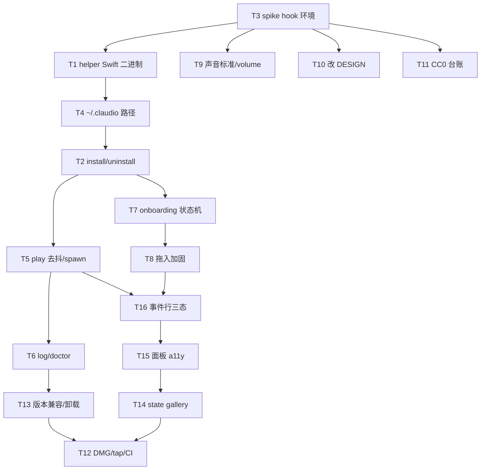

# Plan-Orchestrate Result

**Plan**: `ENGINEERING.md`
**Lang**: `swift`（menubar app + helper 均为 Swift；无 py_sub）
**Steps**: 16（T1–T16，步骤 id 即 T 编号）
**Scope**: all
**Generated by**: `/plan-orchestrate ENGINEERING.md`

---

## Steps overview

| # | Title | Tags | Chain |
|---|---|---|---|
| T1 | helper — Swift 编译二进制骨架（flock(2)/O_EXLOCK + Foundation JSON） | impl | `tdd-guide → swift-reviewer` |
| T2 | helper — install/uninstall 幂等/精确卸载/原子写/读容错（先写 fixture 测试） | impl(test-first) | `tdd-guide → swift-reviewer` |
| T3 | spike — hook 执行环境 + 真实 settings.json schema + StopFailure 语义 | spike/docs | `doc-updater` |
| T4 | helper — 全部落 `~/.claudio/`（无空格路径） | impl | `tdd-guide → swift-reviewer` |
| T5 | helper — play 跳过式去抖（LOCK_NB）+ 后台 spawn afplay + 立即 exit0 + 逐事件 enabled | impl(并发) | `tdd-guide → swift-reviewer` |
| T6 | helper — 带上限 claudio.log + doctor 读尾部 | impl | `tdd-guide → swift-reviewer` |
| T7 | gui — 完整 onboarding 六状态机 | impl | `tdd-guide → swift-reviewer` |
| T8 | gui — 拖入音频加固（复制/白名单/上限/拒路径遍历） | impl, security | `tdd-guide → swift-reviewer → security-reviewer` |
| T9 | audio — 客观声音标准 + volume→afplay -v 映射 | impl(+docs) | `tdd-guide → swift-reviewer` |
| T10 | docs — 改 DESIGN（三态/去「零摩擦」/night_dim 移 v2/schema_version） | docs | `doc-updater` |
| T11 | compliance — CC0 台账加哈希+快照+下架策略 | docs/compliance | `doc-updater` |
| T12 | dist — 未签名 universal DMG + Homebrew tap + macOS 26 绕过指引 | build, docs | `swift-build-resolver → doc-updater` |
| T13 | helper — 版本兼容记录 + uninstall 识别历史命令格式 | impl | `tdd-guide → swift-reviewer` |
| T14 | gui — 仓库内 state gallery（SwiftUI Preview，与状态测试共用 fixtures） | impl | `tdd-guide → swift-reviewer` |
| T15 | gui — 面板无障碍（先落 popover 焦点 owner） | impl, a11y | `tdd-guide → a11y-architect → swift-reviewer` |
| T16 | gui — 事件行三态 CoverageState + 逐事件导入绑定 | impl | `tdd-guide → swift-reviewer` |

## Parallel execution graph



**Parallel waves** — 每个 wave 内的步骤可在各自独立的 Claude 会话/worktree 并发；等本 wave 全部完成再起下一 wave：

| Wave | Steps | Notes |
|---|---|---|
| 1 | T3 | spike 先行，「阻塞全部」，唯一根 |
| 2 | T1, T9, T10, T11 | T1=Lane A 头；T9/T10/T11=Lane C 全部（互不依赖），仅等 T3 |
| 3 | T4 | Lane A 串行（共享 helper/） |
| 4 | T2 | Lane A 串行 —— settings.json 接管，最高破坏面 |
| 5 | T5, T7 | T5=Lane A play；T7=Lane B 头（等 T1/T2 API 稳定） |
| 6 | T6, T8 | T6=Lane A 日志；T8=Lane B 拖入 |
| 7 | T13, T16 | T13=Lane A 尾；T16=事件行三态（等 T5 resolver + T8） |
| 8 | T15 | 面板 a11y（先落 popover owner，再写 label/键盘/对比度） |
| 9 | T14 | 仓库内 state gallery（等 T15/T16 状态枚举定稿） |
| 10 | T12 | Lane D 分发，最后（等代码 lane 全绿 + app 可构建） |

> 关键路径长（10 wave）是**忠实反映计划本身**：Lane A（helper）与 Lane B（GUI）都被作者显式声明为**内部串行**（共享 `helper/` / `gui/` 目录避冲突），且 Lane B 链在 Lane A 之后。真正的并发红利在 Wave 2（4 路齐发，Lane C 三个文档/合规任务早早出清）、Wave 5/6/7（各 2 路）。若你愿意为 helper 引入 worktree 隔离，Lane A 的 T4/T5/T6 之间其实有并行空间，但那会偏离计划的「串行」声明——需你显式授权我才改。

**Dependency sources** — 每个非根步骤的 `deps` 及来源（`explicit:"<原文>"` 或 `heuristic:<规则>`）：

- T1 → deps: [T3]（explicit: "T3 spike 先行（阻塞全部）" + Lane A 序 "T3 → T1"）
- T4 → deps: [T1]（explicit: Lane A 串行序 "T1 → T4"）
- T2 → deps: [T4]（explicit: Lane A 串行序 "T4 → T2"）
- T5 → deps: [T2]（explicit: Lane A 串行序 "T2 → T5"）
- T6 → deps: [T5]（explicit: Lane A 串行序 "T5 → T6"）
- T13 → deps: [T6]（explicit: Lane A 串行序 "T6 → T13"）
- T9 → deps: [T3]（explicit: "T3 阻塞全部"；Lane C 独立于 A，故仅等 T3）
- T10 → deps: [T3]（explicit: "T3 阻塞全部"）
- T11 → deps: [T3]（explicit: "T3 阻塞全部"）
- T7 → deps: [T1, T2]，渲染精简为 [T2]（explicit: "待 A 的 T1/T2 API 稳定后起 Lane B"；T1 经 T2←T4←T1 传递）
- T8 → deps: [T7]（explicit: Lane B 内部序 "T7 → T8"）
- T16 → deps: [T5, T8]（explicit: Lane B 序 "T8 → T16" + heuristic: 共享实体 "PackManifest" 与 T5 运行时 resolver 同源，"需协调抽取，勿造第二份"）
- T15 → deps: [T16]（explicit: Lane B 序 "T16 → T15"）
- T14 → deps: [T15, T16]，渲染精简为 [T15]（explicit: "Depends on: T15/T16 的 per-feature 状态枚举先定"；T16 经 T15→T16 传递）
- T12 → deps: [T13, T14]（heuristic: build/dist 在所有代码 lane 之后，经传递归约收敛到两条 lane 尾 T13/T14；explicit 佐证: "依赖 T1 可构建二进制 + app"、"最后"）

> 无环（拓扑排序通过）。

---

## T1 — helper：Swift 编译二进制骨架

**Intent**: 建 `helper/` 的 Swift 编译二进制地基，并发锁用 `flock(2)`/`open(O_EXLOCK)` 系统调用（非 shell `flock(1)`，macOS 不自带），JSON 全走 Foundation `Codable`/`JSONSerialization`。
**Tags**: impl
**Chain rationale**: 新建代码 → `tdd-guide` 先测后码（doctor + 单测）；`swift-reviewer` 收尾把关 Swift 惯用法（值语义、并发、系统调用封装）。

### Agents（顺序执行；把前一 agent 的 HANDOFF 串进下一个）

1.
```
Agent(
  subagent_type="tdd-guide",
  prompt="[Plan: ENGINEERING.md#T1] 建 helper/ 的 Swift 编译二进制骨架与 claudio CLI 入口。并发锁必须用 flock(2)/open(O_EXLOCK) 系统调用，绝不用 shell flock(1)（macOS 无此命令）；所有 config/manifest JSON 读写走 Foundation Codable/JSONSerialization。Acceptance: (1) claudio doctor 子命令跑通并自检 settings.json 可写、包完整、afplay 在位；(2) flock(2)/O_EXLOCK 封装有单测覆盖；(3) 单测全绿。先写测试再实现。End with a literal <handoff>{...}</handoff> block — a single JSON object with keys scope, risks (array of strings), test-plan, next-agent-input. The <handoff></handoff> tags are mandatory; do NOT use markdown headings or a pipe list."
)
```

2.
```
Agent(
  subagent_type="swift-reviewer",
  prompt="[Plan: ENGINEERING.md#T1] [Prior HANDOFF from tdd-guide: <pass through>] 审 helper 骨架的 Swift 惯用法：值语义、错误处理、O_EXLOCK/flock(2) 系统调用封装是否安全、Codable 建模是否稳。Acceptance: (1) 无强制解包/隐式崩溃点；(2) 锁封装 RAII/defer 释放正确、异常路径不泄锁；(3) doctor 输出对不可写/缺 afplay 给人话。End with a final <handoff>{...}</handoff> block (same JSON keys; literal tags mandatory)."
)
```

---

## T2 — helper：install/uninstall（幂等 / 精确卸载 / 原子写 / 读容错）

**Intent**: 写「接管」逻辑——`claudio install/uninstall`：读容错、首次备份、幂等追加、原子写、精准摘除。settings.json 是最大破坏面，**先写 fixture 测试**。
**Tags**: impl（test-first）
**Chain rationale**: 最高风险、最易错的一步 → `tdd-guide` 强制 fixture 先行（幂等/保留他人 hook/精确匹配/解析失败中止）；`swift-reviewer` 收尾审原子写与读-改-写正确性。

### Agents（顺序执行；把前一 agent 的 HANDOFF 串进下一个）

1.
```
Agent(
  subagent_type="tdd-guide",
  prompt="[Plan: ENGINEERING.md#T2] 实现 claudio install/uninstall 对 ~/.claude/settings.json 的接管，先写 fixture 测试再实现。要求：追加不覆盖；首次接管前一次性备份 settings.json.claudio.bak；解析失败→中止不覆盖并回报；幂等（已存在 claudio 条目不重复挂）；卸载按命令精确等值匹配摘除、保留用户其它 hook；原子写=临时文件与 settings.json 同目录 + rename；读-改-写走非阻塞文件锁。Acceptance: (1) 幂等/精确卸载/保留他人 hook 三类 fixture 测试通过；(2) 损坏 JSON 输入下绝不写坏原文件；(3) install/uninstall 往返后用户既有 hook 完好。End with a literal <handoff>{...}</handoff> block — a single JSON object with keys scope, risks (array of strings), test-plan, next-agent-input. The <handoff></handoff> tags are mandatory; do NOT use markdown headings or a pipe list."
)
```

2.
```
Agent(
  subagent_type="swift-reviewer",
  prompt="[Plan: ENGINEERING.md#T2] [Prior HANDOFF from tdd-guide: <pass through>] 审接管逻辑：原子写是否真原子（同目录临时文件+rename、跨卷会失原子性）、读-改-写是否在同一把锁内、精确匹配是否用等值而非子串、备份与幂等边界。Acceptance: (1) 无 TOCTOU/丢更新窗口；(2) 卸载不误删用户 hook、也不漏删 claudio 僵尸条目；(3) 事件名映射（Stop↔stop）作为 install/play/uninstall 共用单一真相源。End with a final <handoff>{...}</handoff> block (same JSON keys; literal tags mandatory)."
)
```

---

## T3 — spike：hook 执行环境 + settings.json schema + StopFailure 语义

**Intent**: 写 install 逻辑前的实测 spike，落 `docs/spike-hooks.md`。大部分已于 2026-07-06 核实，剩余：cwd / PATH / stderr 去向 / 默认超时 / 是否并发调用（实现 T1 时用 scratch hook 补验）。
**Tags**: spike / docs
**Chain rationale**: 无既有代码可审、产物是实测文档；`doc-updater`（具 Bash + Write）能跑 scratch hook 探测并写档，是目录内唯一合适单体。此为投研/存证性质，非代码实现，故单 agent。

### Agents（顺序执行；把前一 agent 的 HANDOFF 串进下一个）

1.
```
Agent(
  subagent_type="doc-updater",
  prompt="[Plan: ENGINEERING.md#T3] 用 scratch hook 实测并写 docs/spike-hooks.md 记录 Claude Code hook 执行环境。已验部分照录：hook 经 /bin/sh -c 走 shell、settings.json hooks.<Event> 真实 schema 形状、共存 hook 真实存在、StopFailure=因 API/基础设施错误(限流/欠费/过载/认证)而停(非任务失败)、本机 Claude Code 2.1.201。剩余需实测：cwd、PATH、stderr 去向、默认超时、是否并发调用。Acceptance: (1) 五项剩余环境事实各有实测结论并注明命令/输出；(2) 确认 StopFailure 在 v1 目标 macOS/Claude Code 版本稳定存在、缺失时靠 manifest fallback 静默兜底；(3) 结论明确指向命令写法/日志策略/并发处理决策。End with a literal <handoff>{...}</handoff> block — a single JSON object with keys scope, risks (array of strings), test-plan, next-agent-input. The <handoff></handoff> tags are mandatory; do NOT use markdown headings or a pipe list."
)
```

---

## T4 — helper：全部落 `~/.claudio/`（无空格路径）

**Intent**: config / packs / bin / log / lock 全部集中到 `~/.claudio/`（无空格专属 dotfolder），仅 `settings.json` 碰 `~/.claude/`。路径带空格会被写进 hook command 字符串后被 shell 拆坏。
**Tags**: impl
**Chain rationale**: 小而关键的路径常量单一真相源 → `tdd-guide` 保证解析正确 + 无空格断言；`swift-reviewer` 收尾。

### Agents（顺序执行；把前一 agent 的 HANDOFF 串进下一个）

1.
```
Agent(
  subagent_type="tdd-guide",
  prompt="[Plan: ENGINEERING.md#T4] 实现 helper/paths 单一真相源：config/packs/bin/log/lock 全部解析到 ~/.claudio/（无空格），仅 settings.json 落 ~/.claude/。命令路径须在 shell 与 argv 两种执行模型下都安全。Acceptance: (1) 各资源路径解析单测通过、断言无空格；(2) 全 helper 无硬编码散落路径、均引此模块；(3) 展开 ~ 与缺目录时行为有测试。End with a literal <handoff>{...}</handoff> block — a single JSON object with keys scope, risks (array of strings), test-plan, next-agent-input. The <handoff></handoff> tags are mandatory; do NOT use markdown headings or a pipe list."
)
```

2.
```
Agent(
  subagent_type="swift-reviewer",
  prompt="[Plan: ENGINEERING.md#T4] [Prior HANDOFF from tdd-guide: <pass through>] 审路径模块：~ 展开、目录创建时机与权限、常量集中度、是否有任何仍指向 ~/.claude/claudio/ 的旧路径残留（正文旧写法须全改 ~/.claudio/）。Acceptance: (1) 无旧 ~/.claude/claudio 残留；(2) 路径拼接不受用户名/空格影响；(3) 与 install 写入 hook 的绝对命令路径一致。End with a final <handoff>{...}</handoff> block (same JSON keys; literal tags mandatory)."
)
```

---

## T5 — helper：play 跳过式去抖 + 后台 spawn + 立即 exit0 + 逐事件 enabled

**Intent**: `claudio play <event>`：单锁 + 共享时间戳的**跳过式**去抖（`LOCK_NB` 非阻塞，拿不到锁=有人正在响=跳过），后台 spawn afplay 后立即 `exit 0`，逐事件 `enabled` 位先查。
**Tags**: impl（并发/时延敏感）
**Chain rationale**: 并发正确性 + 「绝不阻断」是核心风险 → `tdd-guide` 覆盖去抖/enabled/fallback；`swift-reviewer`（Swift 并发、进程 spawn、非阻塞锁）收尾。
**Out of scope**（继承决议5/T2）: kill-上一个-afplay、`last.pid`、pid 命令行校验、UI 独立 pid 槽（均删除）；`night_dim`（移 v2）。

### Agents（顺序执行；把前一 agent 的 HANDOFF 串进下一个）

1.
```
Agent(
  subagent_type="tdd-guide",
  prompt="[Plan: ENGINEERING.md#T5] 实现 claudio play <event>：跳过式去抖=一把非阻塞锁 LOCK_NB + 一个共享时间戳，距上次播放 < N ms 就跳过（拿不到锁即跳过，绝不阻塞 hook 同步路径）；后台 spawn afplay 后立即 exit 0；逐事件 config.enabled=false 时不播；缺失 event → 静默不报错（manifest fallback）。事件名走共享映射表（Stop↔stop，禁 lowercase）。Out of scope: kill 上一个 afplay、last.pid、pid 校验、UI 独立 pid 槽（决议5 删）、night_dim（v2）。Acceptance: (1) 去抖串行整合测试证明高频 subagent_stop 不叠不炸；(2) enabled=false 与缺音 event 均不播且不报错；(3) play 立即返回、不为 afplay 阻塞数秒。End with a literal <handoff>{...}</handoff> block — a single JSON object with keys scope, risks (array of strings), test-plan, next-agent-input. The <handoff></handoff> tags are mandatory; do NOT use markdown headings or a pipe list."
)
```

2.
```
Agent(
  subagent_type="swift-reviewer",
  prompt="[Plan: ENGINEERING.md#T5] [Prior HANDOFF from tdd-guide: <pass through>] 审 play 并发与进程模型：LOCK_NB 是否真非阻塞、共享时间戳读写是否在锁内、afplay 后台 spawn 是否 detach 干净不留僵尸、exit 0 语义（失败仅日志绝不阻断 Claude Code）。Acceptance: (1) 多进程并发下去抖不失效、时间戳无互踩；(2) spawn 后父进程不 wait、无 fd 泄漏；(3) 试听 ▶ 显式动作绕过去抖的分支正确。End with a final <handoff>{...}</handoff> block (same JSON keys; literal tags mandatory)."
)
```

---

## T6 — helper：带上限 claudio.log + doctor 读尾部

**Intent**: `~/.claudio/claudio.log`（带大小上限/滚动），`play` 出错 append 一行（ISO 时间 + 事件 + 原因）；`doctor` 读尾部汇总。给静默失败一条诊断轨迹。
**Tags**: impl
**Chain rationale**: 日志+自检实现 → `tdd-guide`（滚动上限/append/尾读）；`swift-reviewer` 收尾。

### Agents（顺序执行；把前一 agent 的 HANDOFF 串进下一个）

1.
```
Agent(
  subagent_type="tdd-guide",
  prompt="[Plan: ENGINEERING.md#T6] 实现 helper/log 与 doctor 尾读：claudio.log 带大小上限+滚动；play 出错 append 单行（ISO8601 时间 + 事件 + 原因）；doctor 读尾部汇总近期失败。Acceptance: (1) 超上限触发滚动、旧日志不无限增长（有测试）；(2) append 行格式可被 doctor 正确解析；(3) 并发 append 不撕裂行。End with a literal <handoff>{...}</handoff> block — a single JSON object with keys scope, risks (array of strings), test-plan, next-agent-input. The <handoff></handoff> tags are mandatory; do NOT use markdown headings or a pipe list."
)
```

2.
```
Agent(
  subagent_type="swift-reviewer",
  prompt="[Plan: ENGINEERING.md#T6] [Prior HANDOFF from tdd-guide: <pass through>] 审日志滚动与尾读：滚动窗口边界、并发写是否需锁、doctor 尾读性能与容错（日志缺失/损坏）。Acceptance: (1) 滚动无丢日/无竞态损坏；(2) doctor 对空/坏日志给人话不崩；(3) 日志不泄露敏感路径以外信息。End with a final <handoff>{...}</handoff> block (same JSON keys; literal tags mandatory)."
)
```

---

## T7 — gui：完整 onboarding 六状态机

**Intent**: 首次运行六状态各给人话 + 下一步（未装/已装 hook、helper 缺失、settings 不可写、Claude Code 未装、settings 解析失败）。CTA 走**安心叙事**（追加不覆盖/自动备份/一键撤销），非工程口吻。
**Tags**: impl
**Chain rationale**: 状态正确性下沉 view-model → `tdd-guide` 写状态枚举 + state fixture 测（非像素快照）；`swift-reviewer` 收尾 SwiftUI/状态建模。

### Agents（顺序执行；把前一 agent 的 HANDOFF 串进下一个）

1.
```
Agent(
  subagent_type="tdd-guide",
  prompt="[Plan: ENGINEERING.md#T7] 实现 gui/Onboarding 六状态机：未接管、已接管、helper 缺失、settings 不可写、Claude Code 未装、settings 解析失败——每态给安心口吻人话 + 明确下一步行动。先定 per-feature 状态枚举，状态判定与转移下沉 view-model / state fixture 测（断言状态判定与转移，非像素快照）。真红 #FF453A 仅用于 settings 不可写/解析失败这类 app 真错误。Acceptance: (1) 六态枚举与转移有 view-model 单测全覆盖；(2) 已接管态头部 ● 绿点、其余各态文案+CTA 正确；(3) CTA 文案为安心叙事不写「写入 hook 到 settings.json」这类工程语。End with a literal <handoff>{...}</handoff> block — a single JSON object with keys scope, risks (array of strings), test-plan, next-agent-input. The <handoff></handoff> tags are mandatory; do NOT use markdown headings or a pipe list."
)
```

2.
```
Agent(
  subagent_type="swift-reviewer",
  prompt="[Plan: ENGINEERING.md#T7] [Prior HANDOFF from tdd-guide: <pass through>] 审 onboarding 的 SwiftUI 状态建模：状态源单一、转移无非法态、与 helper install/doctor 的检测调用是否异步不卡 UI、颜色语义（真红只给真错误、事件语义色不误用）。Acceptance: (1) 状态机无死角/无不可达态；(2) 检测 I/O 不阻塞主线程；(3) 遵守 DESIGN.md 色彩语义（StopFailure 绝不用红）。End with a final <handoff>{...}</handoff> block (same JSON keys; literal tags mandatory)."
)
```

---

## T8 — gui：拖入音频加固（复制 / 白名单 / 上限 / 拒路径遍历）

**Intent**: 拖入即**复制**进用户包（不引用原路径）+ 格式白名单（wav/mp3/aiff/m4a）+ 大小上限（5MB）+ 时长上限 + 拒路径遍历 / 拒同名覆盖内置。这是「合法皮卡丘」的唯一通道。
**Tags**: impl, security
**Chain rationale**: impl+security（路径遍历/白名单/上限是输入边界安全）→ 规则2：`tdd-guide,swift-reviewer,security-reviewer`，由 `security-reviewer` 收尾把关路径遍历与覆盖攻击。
**Out of scope**（继承约束）: 内置 / 分发 IP（皮卡丘/宝可梦）音效——只提供「用户自带文件」通道。

### Agents（顺序执行；把前一 agent 的 HANDOFF 串进下一个）

1.
```
Agent(
  subagent_type="tdd-guide",
  prompt="[Plan: ENGINEERING.md#T8] 实现 gui/Import 与 helper/packs 拖入加固：拖入即复制进用户包 ~/.claudio/packs/<pack>/（不引用原路径）；格式白名单 wav/mp3/aiff/m4a；大小上限 5MB + 时长上限；拒路径遍历；拒同名覆盖内置包；多文件部分合格→收合格 + 逐条列被拒原因。Out of scope: 内置或分发 IP 音效，仅用户自带通道。Acceptance: (1) 超大/非白名单/路径遍历/超时长各触发对应人话拒绝且有测试；(2) 合法文件复制进用户包后行内文件名更新并自动试听确认；(3) 拒覆盖内置同名包。End with a literal <handoff>{...}</handoff> block — a single JSON object with keys scope, risks (array of strings), test-plan, next-agent-input. The <handoff></handoff> tags are mandatory; do NOT use markdown headings or a pipe list."
)
```

2.
```
Agent(
  subagent_type="swift-reviewer",
  prompt="[Plan: ENGINEERING.md#T8] [Prior HANDOFF from tdd-guide: <pass through>] 审拖入实现的 Swift 侧：文件复制异步/大文件进度、时长探测方式、与 helper/packs 解析同源（勿造第二份 PackManifest）、drop-zone 状态枚举（idle/hover/reject×3/success）。Acceptance: (1) 大文件复制不卡 UI 且有进度；(2) 包解析路径与运行时查找顺序一致；(3) 拖入状态枚举有 fixture 测。End with an updated <handoff>{...}</handoff> block (same JSON keys: scope, risks, test-plan, next-agent-input; literal tags mandatory)."
)
```

3.
```
Agent(
  subagent_type="security-reviewer",
  prompt="[Plan: ENGINEERING.md#T8] [Prior HANDOFF from swift-reviewer: <pass through>] 安全审计拖入通道：路径遍历（../、符号链接、绝对路径逃逸）、拒同名覆盖内置包是否可绕过、白名单是否按内容而非仅扩展名、大小/时长上限是否有 TOCTOU、复制目标是否被限死在用户包根内。Acceptance: (1) 无法通过构造文件名/软链写出用户包根之外；(2) 扩展名伪装无法绕过白名单；(3) 覆盖内置包路径被硬阻断。End with a final <handoff>{...}</handoff> block (same JSON keys; literal tags mandatory)."
)
```

---

## T9 — audio：客观声音标准 + volume→afplay -v 映射

**Intent**: 定 `docs/pack-standard.md`（单音时长上限 ≤~2s、响度归一 峰值 -1 dBFS 或 -16 LUFS、峰值限制、静音头尾裁剪、三事件差异原则）+ `helper/volume` 的 `master_volume`(0.0–1.0)→`afplay -v` 映射（含默认 0.8 与越界钳制）。
**Tags**: impl（+docs 产物）
**Chain rationale**: 主产物含可测代码（volume 映射钳制）→ 主标签 impl；`tdd-guide` 同时产出 pack-standard.md 规范与映射代码+测试（`doc-updater` 专于 codemap/README，不适合起草音质标准，故不入链）；`swift-reviewer` 收尾。

### Agents（顺序执行；把前一 agent 的 HANDOFF 串进下一个）

1.
```
Agent(
  subagent_type="tdd-guide",
  prompt="[Plan: ENGINEERING.md#T9] 产出 docs/pack-standard.md 客观声音标准（单音时长 ≤~2s、响度归一峰值 -1 dBFS 或 -16 LUFS、峰值限制、静音头尾裁剪、三事件音色/音高差异原则）并实现 helper/volume：master_volume 0.0–1.0 → afplay -v 映射，默认 0.8，越界钳制到 [0.0,1.0]。Acceptance: (1) 映射与钳制单测覆盖边界(负值/>1/默认缺省)；(2) pack-standard.md 各项为可核验的数值门槛；(3) 映射与 config master_volume 语义一致。End with a literal <handoff>{...}</handoff> block — a single JSON object with keys scope, risks (array of strings), test-plan, next-agent-input. The <handoff></handoff> tags are mandatory; do NOT use markdown headings or a pipe list."
)
```

2.
```
Agent(
  subagent_type="swift-reviewer",
  prompt="[Plan: ENGINEERING.md#T9] [Prior HANDOFF from tdd-guide: <pass through>] 审 volume 映射实现：钳制无浮点边界漏洞、默认值来源单一、与 play 拼 afplay -v 参数的整合点正确。Acceptance: (1) 无越界/NaN 传入 afplay；(2) 默认 0.8 与 config 缺省一致；(3) 参数拼接不被本地化小数点影响。End with a final <handoff>{...}</handoff> block (same JSON keys; literal tags mandatory)."
)
```

---

## T10 — docs：改 DESIGN（三态 / 去「零摩擦」/ night_dim 移 v2 / schema_version）

**Intent**: 更新 `DESIGN.md`：反映三态 `CoverageState`、去掉「零摩擦安装」措辞（改「技术用户低摩擦」）、`night_dim` 移入 v2、manifest 加 `schema_version`。
**Tags**: docs
**Chain rationale**: 纯文档编辑既有 DESIGN.md → `doc-updater` 单体正合适。

### Agents（顺序执行；把前一 agent 的 HANDOFF 串进下一个）

1.
```
Agent(
  subagent_type="doc-updater",
  prompt="[Plan: ENGINEERING.md#T10] 更新 DESIGN.md 与 spec 一致：(a) 事件行改为三态 CoverageState{present|unmapped|broken} 叙述；(b) 删除「零摩擦安装」措辞，改「技术用户低摩擦」，签名公证设为面向非技术用户前的门槛；(c) 深夜降音量 night_dim 全部移入 v2（删 v1 的行/开关/映射叙述）；(d) manifest 增加 schema_version（承诺兼容读取，非永不变）。Acceptance: (1) DESIGN.md 不再出现 night_dim 作为 v1 特性；(2) 三态与 schema_version 有明确段落；(3) 与 ENGINEERING.md 决议层措辞无冲突。End with a literal <handoff>{...}</handoff> block — a single JSON object with keys scope, risks (array of strings), test-plan, next-agent-input. The <handoff></handoff> tags are mandatory; do NOT use markdown headings or a pipe list."
)
```

---

## T11 — compliance：CC0 台账（哈希 + 快照 + 下架策略）

**Intent**: `packs/LICENSES.md` 逐文件核验 CC0-1.0，记录来源 URL + license 页快照 + 文件哈希 + 来源下架/改证处理策略。这是项目核心价值，不是「顺手精选」。
**Tags**: docs / compliance
**Chain rationale**: 产物是合规台账文件、可用 Bash 算哈希 → `doc-updater`（Read/Write/Bash）单体最合适；`security-reviewer` 面向代码漏洞不适配许可合规，故不入链。

### Agents（顺序执行；把前一 agent 的 HANDOFF 串进下一个）

1.
```
Agent(
  subagent_type="doc-updater",
  prompt="[Plan: ENGINEERING.md#T11] 建/补 packs/LICENSES.md CC0 台账：内置包每个音频文件逐条记录 SPDX 标识(必须 CC0-1.0)、来源 URL、license 页快照引用、文件哈希(如 sha256)、以及来源下架或改证时的处理策略。Acceptance: (1) 首个内置包「极简铃音」每个音频文件均有 CC0-1.0 + 哈希 + 来源条目；(2) 台账可机器核验 SPDX 为可商用/可再分发；(3) 明确列出下架/改证应急步骤。End with a literal <handoff>{...}</handoff> block — a single JSON object with keys scope, risks (array of strings), test-plan, next-agent-input. The <handoff></handoff> tags are mandatory; do NOT use markdown headings or a pipe list."
)
```

---

## T12 — dist：未签名 universal DMG + Homebrew tap + macOS 26 绕过指引

**Intent**: GitHub Actions：push tag → 编 universal 二进制（Intel + Apple Silicon）→ 打未签名 ad-hoc DMG → 传 Release → 更新 tap 的 cask formula；写 macOS 26 绕过指引（系统设置 > 隐私与安全性 > 仍要打开）。
**Tags**: build, docs
**Chain rationale**: 主标签 build（CI/编译/打包）→ `swift-build-resolver`（最懂 SPM/universal 二进制/签名域）作 CI 与打包主力；`doc-updater` 收尾写 macOS 26 绕过指引与 tap 安装 README。build 标签由其 resolver 自证、免 reviewer-class 尾。
**Out of scope**（继承 Outside Voice T3）: 代码签名 / 公证（v1 先发未签名 ad-hoc，面向非技术用户/广泛发布前再上）。

### Agents（顺序执行；把前一 agent 的 HANDOFF 串进下一个）

1.
```
Agent(
  subagent_type="swift-build-resolver",
  prompt="[Plan: ENGINEERING.md#T12] 建 .github/workflows/ 与 Casks/：push tag 触发→ swift build 出 universal 二进制(Intel + Apple Silicon，lipo 合并)→ 打未签名 ad-hoc DMG → 上传 GitHub Release → 更新自建 Homebrew tap 的 cask formula。抄 narlei/claudecodenotify 的成熟 tap 作业。Out of scope: 代码签名/公证(v1 不做)。Acceptance: (1) workflow 能从 tag 产出可 brew install --cask 的 DMG；(2) universal 二进制在两架构均可运行；(3) cask formula 版本/URL/sha 自动更新。End with a literal <handoff>{...}</handoff> block — a single JSON object with keys scope, risks (array of strings), test-plan, next-agent-input. The <handoff></handoff> tags are mandatory; do NOT use markdown headings or a pipe list."
)
```

2.
```
Agent(
  subagent_type="doc-updater",
  prompt="[Plan: ENGINEERING.md#T12] [Prior HANDOFF from swift-build-resolver: <pass through>] 写分发文档：macOS 26 绕过指引(系统设置 > 隐私与安全性 > 下滑找到被拦的 Claudio > 仍要打开；旧系统才用右键打开)、brew install --cask <user>/tap/claudio 安装说明、诚实标注未签名。Acceptance: (1) 绕过指引针对 macOS 26 且不误用已失效的右键打开；(2) tap 安装与 DMG 手动安装两条路径都写清；(3) 明示未签名与后续签名计划。End with a final <handoff>{...}</handoff> block (same JSON keys; literal tags mandatory)."
)
```

---

## T13 — helper：版本兼容记录 + uninstall 识别历史命令格式

**Intent**: 记录最低支持 macOS / Claude Code 版本 + 检测；`uninstall` 识别历史命令格式（为将来路径变更，不漏删旧条目）。
**Tags**: impl
**Chain rationale**: 给 doctor/uninstall 增能 → `tdd-guide`（历史格式 fixture）；`swift-reviewer` 收尾。

### Agents（顺序执行；把前一 agent 的 HANDOFF 串进下一个）

1.
```
Agent(
  subagent_type="tdd-guide",
  prompt="[Plan: ENGINEERING.md#T13] 实现版本兼容与历史命令识别：doctor 记录/检测最低支持 macOS 与 Claude Code 版本(含 StopFailure 存在性降级)；uninstall 除精确匹配当前 ~/.claudio/bin/claudio 命令外，还识别历史命令格式(为将来路径变更)以免漏删僵尸条目。Acceptance: (1) 给定含旧格式命令的 settings.json fixture，uninstall 能识别并摘除、且不误删用户 hook；(2) 版本低于门槛时 doctor 给人话提示；(3) StopFailure 不存在的旧版本走静默 fallback 不报错。End with a literal <handoff>{...}</handoff> block — a single JSON object with keys scope, risks (array of strings), test-plan, next-agent-input. The <handoff></handoff> tags are mandatory; do NOT use markdown headings or a pipe list."
)
```

2.
```
Agent(
  subagent_type="swift-reviewer",
  prompt="[Plan: ENGINEERING.md#T13] [Prior HANDOFF from tdd-guide: <pass through>] 审历史命令匹配策略：识别集是否过宽而误删他人 hook、版本探测是否稳健、与 T2 uninstall 精确匹配逻辑是否共用单一真相源。Acceptance: (1) 历史格式识别有明确边界、不吞非 claudio 条目；(2) 版本检测容错(命令缺失/输出异常)；(3) 无重复实现的第二套匹配逻辑。End with a final <handoff>{...}</handoff> block (same JSON keys; literal tags mandatory)."
)
```

---

## T14 — gui：仓库内 state gallery（SwiftUI Preview，与状态测试共用 fixtures）

**Intent**: `gui/` SwiftUI Preview gallery，从状态测试同一批 `gui/Fixtures` 渲染所有状态，作**仓库内视觉真相源**（外部 DESIGN.md 展柜 artifact 降为可选快照）。
**Tags**: impl
**Chain rationale**: 依赖 T15/T16 的 per-feature 状态枚举先定 → `tdd-guide`（复用状态 fixtures 渲染全状态）；`swift-reviewer` 收尾 Preview/gallery 结构。

### Agents（顺序执行；把前一 agent 的 HANDOFF 串进下一个）

1.
```
Agent(
  subagent_type="tdd-guide",
  prompt="[Plan: ENGINEERING.md#T14] 建 gui/ 仓库内 state gallery（SwiftUI Preview 目录），从与状态测试同一批 gui/Fixtures 渲染所有状态：事件行三态(present/unmapped/broken)+enabled、onboarding 六态、拖入 idle/hover/reject×3/success、切包画廊选中/损坏/部分。作仓库内视觉真相源；外部 artifact 降为可选快照。Acceptance: (1) 每个 per-feature 状态枚举值都有一帧 Preview 且复用测试 fixtures；(2) gallery 可在 Xcode Canvas 一屏浏览全状态；(3) 与状态测试同源，改枚举即同时反映到测试与 gallery。End with a literal <handoff>{...}</handoff> block — a single JSON object with keys scope, risks (array of strings), test-plan, next-agent-input. The <handoff></handoff> tags are mandatory; do NOT use markdown headings or a pipe list."
)
```

2.
```
Agent(
  subagent_type="swift-reviewer",
  prompt="[Plan: ENGINEERING.md#T14] [Prior HANDOFF from tdd-guide: <pass through>] 审 gallery 与 fixtures 复用：Preview 是否真复用 state fixtures(而非另造数据)、覆盖是否完整、是否遵守 DESIGN.md token(事件语义色、近实心暖表面+1px 描边、StopFailure 不用红)。Acceptance: (1) 无遗漏状态枚举帧；(2) fixtures 单一来源、测试与 Preview 不分叉；(3) 视觉符合 DESIGN.md。End with a final <handoff>{...}</handoff> block (same JSON keys; literal tags mandatory)."
)
```

---

## T15 — gui：面板无障碍（先落 popover 焦点 owner）

**Intent**: 先定 NSPopover 焦点 owner + 桥接（首焦点 / Tab / Shift+Tab / 空格·回车 / Esc 关闭 / 关后焦点回 status item / VoiceOver 进入播报面板标题+当前包）→ 再 VoiceOver 逐控件 label、不靠颜色（字形形状）、Dynamic Type 降级、禁用态显式样式（非整行 opacity）。
**Tags**: impl, a11y
**Chain rationale**: 无障碍为主导关切 → `a11y-architect` 作领域专家落 WCAG 2.2/VoiceOver/对比度；但 rule 10 要求 impl 以 reviewer-class 收尾，故 `tdd-guide`(焦点/键盘 E2E 烟测)先行、`a11y-architect` 实现 a11y 层、`swift-reviewer`(AppKit 焦点桥接)收尾。
**Out of scope**（继承 NOT-in-scope）: 听障视觉通知兜底（菜单栏字形闪烁/横幅，v2）。

### Agents（顺序执行；把前一 agent 的 HANDOFF 串进下一个）

1.
```
Agent(
  subagent_type="tdd-guide",
  prompt="[Plan: ENGINEERING.md#T15] 为面板无障碍先立测试骨架与状态：定义 NSPopover 焦点 owner + first responder 桥接的可测契约，写键盘全流程 E2E 烟测(打开落首个可操作项、Tab/Shift+Tab 遍历、空格/回车触发、Esc 关闭、关后焦点回菜单栏 status item)与对比度 token/数学断言(图形≥3:1、文字≥4.5:1、亮/暗双验)。Out of scope: 听障视觉通知兜底(v2)。Acceptance: (1) 键盘导航烟测覆盖开→遍历→触发→Esc→回 status item 全链；(2) 对比度以 token 数学断言(不截图测抗锯齿 SF Symbols)；(3) VoiceOver label 存在性=accessibility 树断言。End with a literal <handoff>{...}</handoff> block — a single JSON object with keys scope, risks (array of strings), test-plan, next-agent-input. The <handoff></handoff> tags are mandatory; do NOT use markdown headings or a pipe list."
)
```

2.
```
Agent(
  subagent_type="a11y-architect",
  prompt="[Plan: ENGINEERING.md#T15] [Prior HANDOFF from tdd-guide: <pass through>] 实现面板无障碍(WCAG 2.2 AA)：落 NSPopover 焦点 owner+桥接使 tdd-guide 的键盘/VoiceOver 烟测通过；逐控件 VoiceOver label(事件行=名+文件+启用/静音、试听键、静音钮 on/off、切包 pill、drop-zone)；四事件除语义色外以字形形状区分(实心勾/暂停/铃/空心勾)；Dynamic Type 降级(较大隐波形→更大转两行→极大加宽 popover)；禁用/静音态用显式禁用样式(控件置灰+图标降饱和)不整行降 opacity，行内文字始终≥4.5:1。Acceptance: (1) 键盘+VoiceOver 烟测全绿；(2) 单色模板图标下四事件仍可辨(不靠颜色)；(3) 各 Dynamic Type 档不裁切不溢出。End with an updated <handoff>{...}</handoff> block (same JSON keys: scope, risks, test-plan, next-agent-input; literal tags mandatory)."
)
```

3.
```
Agent(
  subagent_type="swift-reviewer",
  prompt="[Plan: ENGINEERING.md#T15] [Prior HANDOFF from a11y-architect: <pass through>] 审 AppKit 焦点桥接与 SwiftUI/NSPopover 集成：first responder 归属、焦点环保留(勿去除)、关闭后焦点回 status item 的实现是否稳、Dynamic Type 布局分支的 Swift 实现质量。Acceptance: (1) 焦点 owner 无竞态/无焦点丢失；(2) 系统焦点环可见未被样式覆盖；(3) 降级布局分支无强制解包/无约束冲突。End with a final <handoff>{...}</handoff> block (same JSON keys; literal tags mandatory)."
)
```

---

## T16 — gui：事件行三态 CoverageState + 逐事件导入绑定

**Intent**: GUI-only `CoverageState = present | unmapped | broken`——`unmapped`(manifest 没配)显「未配置」、`broken`(配了但文件丢/坏)显「文件丢失」入 doctor，两态试听禁用；行尾提供逐事件导入绑定。共享 `PackManifest`（GUI 读，与运行时查找顺序同源，helper 不改行为）。
**Tags**: impl
**Chain rationale**: 状态判定下沉 view-model → `tdd-guide`（三态判定/转移 fixture 测）；`swift-reviewer` 收尾并守住「共享 PackManifest 单一真相源、勿造第二份 resolver」。

### Agents（顺序执行；把前一 agent 的 HANDOFF 串进下一个）

1.
```
Agent(
  subagent_type="tdd-guide",
  prompt="[Plan: ENGINEERING.md#T16] 实现事件行三态与逐事件导入：GUI 从共享 PackManifest+文件存在性算 CoverageState{present|unmapped|broken}——unmapped(manifest 未配此 event)行显「未配置」、broken(配了但文件丢/坏)显「文件丢失」并入 doctor，两态试听 ▶ 禁用；行尾提供逐事件导入绑定(拖入/选文件→绑到该 event)。PackManifest 与运行时查找顺序(用户包→bundle)同源，helper 不改行为。状态判定下沉 view-model fixture 测。Acceptance: (1) unmapped 包→「未配置」、broken 包→「文件丢失」入 doctor、两态试听禁用，均有 view-model 测；(2) 行尾导入后正确绑定到该 event 并刷新行；(3) 与 helper 运行时 resolver 用同一 PackManifest、无第二份实现。End with a literal <handoff>{...}</handoff> block — a single JSON object with keys scope, risks (array of strings), test-plan, next-agent-input. The <handoff></handoff> tags are mandatory; do NOT use markdown headings or a pipe list."
)
```

2.
```
Agent(
  subagent_type="swift-reviewer",
  prompt="[Plan: ENGINEERING.md#T16] [Prior HANDOFF from tdd-guide: <pass through>] 审三态与共享 PackManifest：GUI 状态推导是否纯函数可测、是否与 helper 运行时查找顺序真正同源(勿双 resolver)、broken 入 doctor 的衔接、逐事件导入与 T8 拖入加固复用。Acceptance: (1) CoverageState 推导无副作用、与 manifest+文件存在性一致；(2) 单一 PackManifest 模块被 GUI 与 helper 共用；(3) 导入绑定复用 T8 的复制/白名单/拒遍历，不另起炉灶。End with a final <handoff>{...}</handoff> block (same JSON keys; literal tags mandatory)."
)
```

---

> **How to execute this step**: paste the entire step block (header + all N Agent calls) into one Claude session. That session runs the Agent calls in the listed order. For each non-first call, parse the previous agent's HANDOFF block from its tool result and substitute it into the `<pass through>` slot of the next agent's prompt before invoking. Do not parallelize — the chain is sequential by design.

---

### 补充说明（非计划产物，供决策参考）

1. **T3 的 agent 选型有妥协**：`doc-updater` 是目录内唯一能「跑 scratch hook（Bash）+ 写 `docs/spike-hooks.md`（Write）」的单体，但它的定位偏 codemap/README。若更看重投研深度，也可把 T3 当纯人工步骤直接跑。
2. **10 个 wave 偏长**，根源是计划把 Lane A / Lane B **显式声明为内部串行**（避目录冲突）。若允许对 `helper/` 用 worktree 隔离，T4/T5/T6 之间、以及 Lane C 与 Lane A 头部能压出更多并发——但这需显式授权偏离计划的「串行」声明。
3. **步骤锚点**用了计划原生的 `#T1…#T16`（而非合成的 `#step-1`），因为计划自身即以 T 编号，可追溯性更强。
