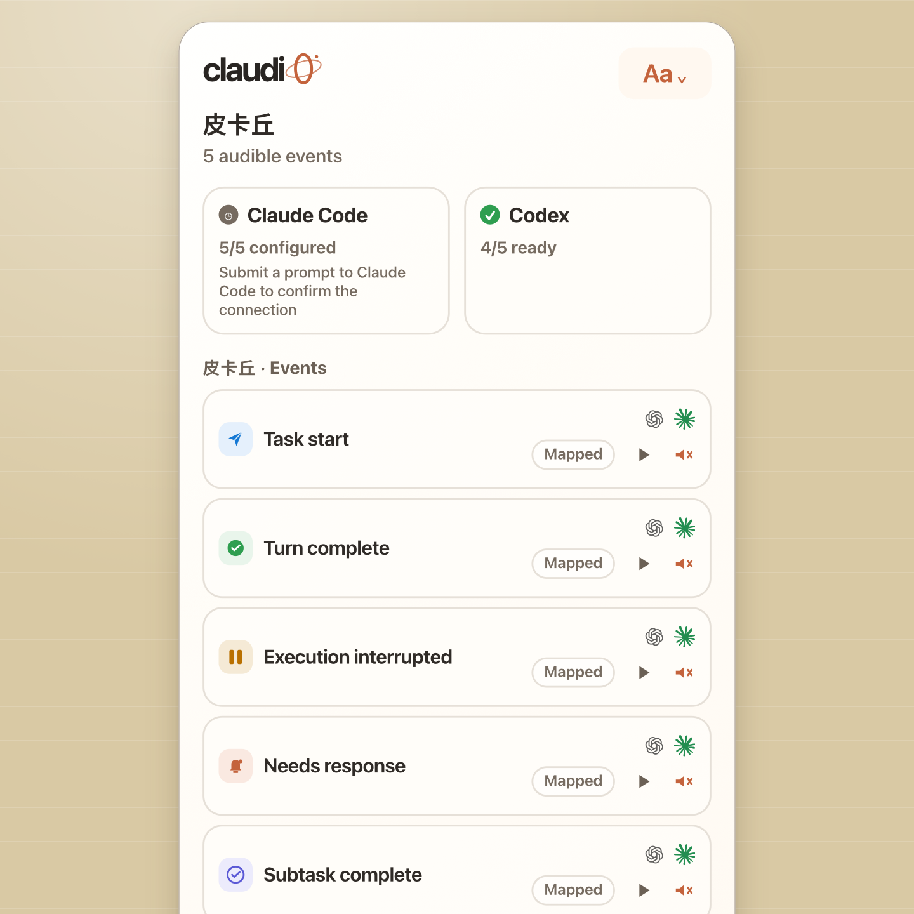

# Claudio

[English](README.md) | [简体中文](README.zh-CN.md)

Claudio is a local-first macOS sound center for Claude Code and Codex. It turns host lifecycle events into distinct, controllable sound cues, while keeping host configuration, sound packs, diagnostics, and activation evidence visible to you.



_Interface preview. The native app follows your selected Claudio language and macOS appearance._

## Highlights

- One menu bar app for Claude Code and Codex.
- Five semantic events: task start, turn complete, execution interrupted, response needed, and subtask complete.
- Per-event mute controls, master volume, previews, favorites, and user-imported sound packs.
- Explicit host connect/disconnect flows that preserve third-party hooks and create one-time configuration backups.
- Minimal local receipts that distinguish “configuration written” from a real host callback.
- Built-in diagnostics through the UI and `claudi0 doctor`.
- English and Simplified Chinese interfaces, keyboard navigation, Dynamic Type-aware layouts, and VoiceOver semantics.

## Requirements

- macOS 12 Monterey or later.
- Apple Silicon (`arm64`) or Intel (`x86_64`). Release DMGs contain universal binaries.
- Claude Code or Codex is optional; connect either host independently.
- Claude Code 2.1.201 and later is the verified compatibility range. Older versions may not emit `StopFailure`; Claudio reports that as a warning rather than blocking the other events.
- Codex must expose composable hooks through `~/.codex/hooks.json`. Activation also requires confirming the hooks with `/hooks`.

## Install

### GitHub Release DMG

1. Download `claudi0-<version>.dmg` and `SHA256SUMS.txt` from [GitHub Releases](https://github.com/d0m999/Claudio/releases).
2. Keep both files in the same directory and verify the download:

   ```bash
   shasum -a 256 -c SHA256SUMS.txt
   ```

3. Open the DMG and drag `claudi0.app` to `/Applications`.
4. Launch `claudi0` from Applications. It is a menu bar app, so no Dock window is expected.

Release builds are Developer ID signed, hardened, and notarized. A release fails instead of publishing an ad-hoc build when Apple signing or notarization credentials are unavailable.

### Homebrew (optional channel)

When the Homebrew tap is enabled for a release:

```bash
brew install --cask d0m999/tap/claudi0
```

The GitHub Release DMG remains the primary installation method. Homebrew is deliberately optional and its uninstall does not delete `~/.claudio/`.

## First connection

Opening Claudio prepares the shared helper and bundled sound packs under `~/.claudio/`. It does not silently connect either host.

### Claude Code

1. Open the Claudio menu bar panel.
2. Open the Claude Code source details and choose **Connect**.
3. Submit a real prompt in Claude Code.
4. Return to Claudio and re-detect if needed. `5/5 ready` is shown only after a callback from the current connection has produced a real receipt.

Claudio adds only its own command hooks to `~/.claude/settings.json`. Existing hooks, matchers, array order, and unknown fields are preserved. Before the first write it creates `~/.claude/settings.json.claudio.bak`.

### Codex

1. Open the Codex source details and choose **Connect**.
2. In Codex, run `/hooks` and confirm the Claudio hooks.
3. Submit a real prompt, then choose **Re-detect** in Claudio if the view has not refreshed yet.
4. `4/5 ready` is the expected healthy state: Codex currently has no native event corresponding to Claudio's execution-interrupted (`StopFailure`) cue.

Claudio manages only its command entries in `~/.codex/hooks.json`; it does not take over the single-command `notify` setting or private trust data. The first write creates `~/.codex/hooks.json.claudio.bak`.

The same operations are available from Terminal:

```bash
~/.claudio/bin/claudi0 integrations status
~/.claudio/bin/claudi0 integrations connect claude-code
~/.claudio/bin/claudi0 integrations connect codex
```

`claudi0 setup`, `install`, and `uninstall` remain compatibility commands for the legacy Claude Code flow. They do not activate Codex.

## Files, backups, and privacy

| Path | Purpose |
|---|---|
| `~/.claudio/config.json` | Selected pack, master volume, per-event mute state, and favorites |
| `~/.claudio/packs/` | Bundled copies and user sound packs |
| `~/.claudio/bin/` | Shared helper used by host hooks |
| `~/.claudio/claudio.log` | Small rolling diagnostic log |
| `~/.claudio/integrations/receipts/` | Mode `0600` activation receipts for real callbacks |
| `~/.claude/settings.json` | Claude Code configuration; Claudio edits only owned hook entries |
| `~/.claude/settings.json.claudio.bak` | One-time pre-Claudio backup, when the source file existed |
| `~/.codex/hooks.json` | Codex composable hooks; Claudio edits only owned entries |
| `~/.codex/hooks.json.claudio.bak` | One-time pre-Claudio backup, when the source file existed |

Claudio's runtime has no network client, telemetry, analytics, or cloud upload path. Sounds, configuration, receipts, and logs stay on the Mac. Receipts contain an installation ID, host/event identifiers, timestamp, and redacted playback result. They do not contain prompts, responses, project paths, session content, or absolute audio paths.

Bundled audio licensing is recorded separately in [packs/LICENSES.md](packs/LICENSES.md).

## Troubleshooting

### Gatekeeper rejects the app

An official release should open without **Open Anyway** or quarantine-removal commands. If it does not:

1. Delete the suspect DMG and download both assets again from the project Releases page.
2. Verify `SHA256SUMS.txt` as shown above.
3. Check the downloaded container and installed app:

   ```bash
   spctl --assess --type open --context context:primary-signature -vv claudi0-<version>.dmg
   codesign --verify --deep --strict --verbose=2 /Applications/claudi0.app
   ```

Do not use `xattr` to bypass Gatekeeper. A failed assessment is a release-integrity problem to report, not an installation step.

### The menu bar icon is missing

Claudio is menu-bar-only. Check the macOS menu bar overflow area, then run:

```bash
open /Applications/claudi0.app
```

### Hooks were written but are not active

- Claude Code: submit a new prompt after connecting; a configuration-only state is not yet a real receipt.
- Codex: run `/hooks`, confirm Claudio's hooks, submit a new prompt, then re-detect.
- Inspect both hosts without changing them:

  ```bash
  ~/.claudio/bin/claudi0 integrations status
  ```

### No sound plays

1. Preview the mapped sound in Claudio. This separates playback problems from host activation problems.
2. Check macOS output volume, Claudio master volume, and the event's mute state.
3. Run the read-only diagnostic:

   ```bash
   ~/.claudio/bin/claudi0 doctor
   tail -20 ~/.claudio/claudio.log
   ```

4. If bundled runtime files are missing, repair from the installed app bundle:

   ```bash
   /Applications/claudi0.app/Contents/Resources/bin/claudi0 setup
   ```

Run that repair from the app bundle, not from `~/.claudio/bin/`, because only the app contains the factory sound packs.

More detail is available in [docs/distribution.md](docs/distribution.md).

## Update, disconnect, and uninstall

Disconnect hosts before removing the app so Claudio can remove only its own hook entries:

```bash
~/.claudio/bin/claudi0 integrations disconnect claude-code
~/.claudio/bin/claudi0 integrations disconnect codex
```

Then either run:

```bash
brew uninstall --cask claudi0
```

or move `/Applications/claudi0.app` to Trash.

Neither path deletes `~/.claudio/`, sound packs, receipts, logs, or the one-time host backups. To remove Claudio-owned data, first keep any sound packs you want, then open `~/.claudio/` in Finder and move it to Trash yourself:

```bash
open ~/.claudio
```

Backups are snapshots from before Claudio's first write. Do not blindly overwrite a current host configuration with a backup: compare them first, because the host or another tool may have added settings since then.

## Build and test

Xcode Command Line Tools with Swift 6 are sufficient:

```bash
swift run --package-path helper claudio-tests
swift run --package-path gui claudio-gui-tests

swift build -c debug --package-path gui --product ClaudioGUI
swift build -c release --package-path gui --product ClaudioGUI

jq empty gui/Sources/ClaudioLocalization/Resources/Localizable.xcstrings
bash scripts/dev-bundle.sh
bash scripts/check-release-size.sh dist/claudi0.app
git diff --check
```

Local CLI/app builds report `0.0.0-dev`. A release workflow accepts only a strict `vMAJOR.MINOR.PATCH` tag and injects the same unprefixed version into the CLI, app `Info.plist`, DMG filename, checksum file, Release title, and optional cask.

See [CONTRIBUTING.md](CONTRIBUTING.md) before opening a pull request. Native macOS, VoiceOver, keyboard/focus, Apple Silicon/Intel, and real-host receipt checks remain manual release gates even when CI passes.

## Security and license

Please report vulnerabilities privately as described in [SECURITY.md](SECURITY.md). Community participation follows [CODE_OF_CONDUCT.md](CODE_OF_CONDUCT.md).

Claudio source code is released under the [MIT License](LICENSE), copyright © 2026 d0m999. Bundled sound assets keep their own licenses as listed in [packs/LICENSES.md](packs/LICENSES.md).
