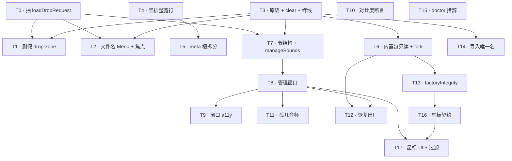

# Plan-Orchestrate Result —— 声音包管理（Sound Pack Manager）

> **来源**：`/plan-orchestrate plan/PLAN-SOUND-MANAGER.md`（2026-07-17 生成，本地 bare-vendored fork）。
> **这是编排产物，不是实时状态。** 随实现推进会过期 —— 落地后请回读 [PLAN-SOUND-MANAGER.md](./PLAN-SOUND-MANAGER.md) 与源码校正，
> 不要把本文件当作真相源。视觉真相源是 [DESIGN.md](../DESIGN.md)；产品 + 工程 spec 是 [ENGINEERING.md](../ENGINEERING.md)。

**Plan**: `plan/PLAN-SOUND-MANAGER.md`
**Lang**: `swift`（`helper/Package.swift` + `gui/Package.swift`；126 Swift 文件、0 py/ts/rs；无 py_sub）
**Steps**: 18（T0–T17）
**Scope**: all
**基线**: `3dc7b2e`（= 生成时的 `main` HEAD，「WIP: PLAN-SOUND-MANAGER 工程二审——13+10 条发现折入」）。从此拉分支即可。

---

> ⚠️ 两点非机械提示，先读：
>
> 1. **`a11y` 不是本 skill tag 表里的行** —— `a11y-architect` 是目录里的「特殊角度」agent。T2 / T7 / T9 因带**一等 WCAG/VoiceOver 交付物**（§2.5 第 7 条的三态 Menu VO 契约、`.manageSounds` label、新窗口焦点序）而显式挂它，非 tag 触发。视觉层的 mockup 符合度审计仍走 gstack `/design-review`（不在本目录内）。
> 2. **本 skill 的波表是「依赖最优并行」**；而**计划作者另有一道更粗的两阶段闸**（阶段 1 = T0–T7, T10, T13, T14, T16 全绿后才开阶段 2 = T8, T9, T11, T12, T17）。若严格守阶段闸，把波表里落在阶段 2 的步骤推迟到阶段 1 整体完成 —— 见波表下的注。

## Steps overview

| # | Title | Tags | Chain |
|---|---|---|---|
| T0 | 抽 `loadDropRequest` 到 `AudioDropRequest.swift`（解删除前的红编译） | refactor | `refactor-cleaner → swift-reviewer` |
| T1 | 删除面板级假 drop-zone `AudioDropZoneView`（孤儿制造机） | refactor | `refactor-cleaner → swift-reviewer` |
| T2 | 文件名升格为原生 `Menu`（三态共用）+ §2.5 焦点模型改造 | impl, a11y | `tdd-guide → a11y-architect → swift-reviewer` |
| T3 | `mutateManifestJSON` 顶层原语 + `clearEventBinding` + 并发源码绊线 | impl, debug | `tdd-guide → silent-failure-hunter → swift-reviewer` |
| T4 | 卡片画廊 → 竖排整宽行 + 覆盖轨恒显（渲染全部包，不过滤） | impl | `tdd-guide → swift-reviewer` |
| T5 | 包行 meta 槽：`CC0` 与「缺 N 个」拆两槽位 | impl | `tdd-guide → swift-reviewer` |
| T6 | 内置包只读：`factoryPacksDirectory` + `forkPack` + 删死函数 | impl, debug | `tdd-guide → silent-failure-hunter → swift-reviewer` |
| T13 | `factoryIntegrity` 逐字节校验（③ 的真修法 · CC0 诚实） | impl | `tdd-guide → swift-reviewer` |
| T14 | 导入同名文件生成唯一名，绝不覆盖（消灭静默改声） | impl, debug | `tdd-guide → silent-failure-hunter → swift-reviewer` |
| T7 | 面板节结构 + `.manageSounds` 焦点目标 + 空态文案/label | impl, a11y | `tdd-guide → a11y-architect → swift-reviewer` |
| T10 | `ContrastSuite` 覆盖轨 4 条对比度断言（+ 变异实测） | test | `tdd-guide → swift-reviewer` |
| T8 | `SoundPacksWindow` 管理窗口（时序/状态同步须设计） | design, impl | `code-architect → tdd-guide → swift-reviewer` |
| T9 | 管理窗口 a11y：焦点序 / Dynamic Type / VoiceOver | a11y | `a11y-architect → swift-reviewer` |
| T11 | 孤儿音频枚举 + 未被引用判定 + 分配/删除 | impl | `tdd-guide → swift-reviewer` |
| T12 | `restoreFactoryPack`（恢复出厂 + salvage 搬走不删） | impl, debug | `tdd-guide → silent-failure-hunter → swift-reviewer` |
| T16 | `starred_packs` 星标契约（parse 校验/读模型/写者，不激活过滤） | impl, debug | `tdd-guide → silent-failure-hunter → swift-reviewer` |
| T17 | 星标 UI + 激活面板 ≤4 过滤（刷新路由须指定） | impl | `tdd-guide → swift-reviewer` |
| T15 | `doctor` 空包措辞（语义不改，仅措辞） | impl | `tdd-guide → swift-reviewer` |

## Parallel execution graph



**Parallel waves** —— each wave runs concurrently in separate Claude sessions; wait for the wave to finish before launching the next:

| Wave | Steps | Notes |
|---|---|---|
| 1 | T0, T3, T4, T10, T15 | 无上游依赖，可同时开工（T0/T3 是两条根干；T4/T10/T15 各自独立） |
| 2 | T1, T2, T7, T5, T6, T14 | T1/T2/T7 依赖 T0+T3；T5 依赖 T4；T6/T14 依赖 T3 |
| 3 | T8, T13 | T8 依赖 T7；T13 依赖 T6 |
| 4 | T9, T11, T12, T16 | T9/T11 依赖 T8；T12 依赖 T6+T8；T16 依赖 T13（经 T13→T6） |
| 5 | T17 | 依赖 T8+T16（§2.6 排期硬约束：过滤激活不得早于管理窗口） |

> **阶段闸叠加（计划作者的粗粒度约束，优先级高于纯依赖并行）**：作者把 T8/T9/T11/T12/T17 钉死在**阶段 2**，要求**阶段 1（T0–T7, T10, T13, T14, T16）整体落地后**才开阶段 2。上表 Wave 3–5 里的 T8 在依赖上只等 T7，但按阶段闸应等到 T13/T16 等全部阶段 1 步骤绿了再启。**执行取舍**：想最大并行 → 按 Wave 表；想守作者的发布切分 → 先跑完 Wave 1–2 的全部阶段 1 步骤 + T13(Wave3)/T16(Wave4) 这两个阶段 1 尾巴，再启 T8/T9/T11/T12/T17。§2.6 的 T17-not-before-T8 硬约束两种走法都满足。

**Dependency sources** —— 每个非根步骤的 `deps` 与来源：

- T1 → deps: [T0, T3]（explicit: §4d「T1 + T2 + T7 … 依赖 T0, T3」）
- T2 → deps: [T0, T3]（explicit: §4d 同行）
- T7 → deps: [T0, T3]（explicit: §4d 同行）
- T5 → deps: [T4]（heuristic: 同文件 `PackGalleryView.swift`；T5 拆的是 T4 引入的行的 meta 槽）
- T6 → deps: [T3]（explicit: §4d「T6 + T13 + T14 … 依赖 T3（共用原语）」）
- T14 → deps: [T3]（explicit: §4d 同行）
- T13 → deps: [T6]（heuristic: `factoryIntegrity` 用 T6 的 `factoryPacksDirectory` + `builtinPackIDs`；且与 T16 同改 `PackGallery.swift` 须先行）
- T16 → deps: [T13, T6]（explicit T6: §4d「T16 … 依赖 T6（builtinPackIDs）」；heuristic T13: §4d 冲突旗标 2「T13 与 T16 都改 PackGallery.swift，须顺序进行」。渲染图按传递归约省去 T16→T6 边，经 T16→T13→T6 达成）
- T8 → deps: [T7]（heuristic: T7 建立 `.manageSounds` 入口，T8 是它打开的窗口；§2.5 第 5 条 + T7 阶段 1 中间态在 T8 落地时改绑真窗口）
- T9 → deps: [T8]（heuristic: 窗口 a11y 在窗口落地之后）
- T11 → deps: [T8]（heuristic: 孤儿列表住管理窗口）
- T12 → deps: [T6, T8]（heuristic T6: `restoreFactoryPack` 需 `factoryPacksDirectory`（经 T6→T3 拿到原语）；heuristic T8: 「恢复出厂」按钮住管理窗口）
- T17 → deps: [T8, T16]（explicit: §2.6「≤4 过滤的激活不得早于星标 UI（管理窗口）落地」+ T16 星标契约）
- 根节点（deps = ∅）：T0, T3, T4, T10, T15

无环。

---

## Step T0 —— 抽 `loadDropRequest` 到 `AudioDropRequest.swift`

**Intent**: `loadDropRequest` 是 module-internal，住在 `AudioDropZoneView.swift` 里且被 `EventRowView:439` 复用；T1 要删整个 `AudioDropZoneView`，不先抽出来就是一个红编译。纯搬移，零行为变化。
**Tags**: refactor
**Chain rationale**: 机械抽取，无架构决策 → `code-architect` 剪掉；`refactor-cleaner` 搬移，`swift-reviewer` 收口（确认零语义漂移 + 访问级别未放宽）。

### Agents（run sequentially; thread HANDOFF context from prior agent into next）

1.
```
Agent(
  subagent_type="refactor-cleaner",
  prompt="[Plan: plan/PLAN-SOUND-MANAGER.md#step-T0] 把 module-internal 的 loadDropRequest 从 AudioDropZoneView.swift 抽到新文件 AudioDropRequest.swift；它被 EventRowView.swift:439 复用，必须先抽再删，否则 T1 删 AudioDropZoneView 会红编译。纯搬移，不改签名不改行为。Acceptance: swift build 与 swift run claudio-tests 绿；loadDropRequest 现居 AudioDropRequest.swift；EventRowView 与原调用点仍编译。Out of scope: 删除 AudioDropZoneView（那是 T1）。End with a literal <handoff>{...}</handoff> block — a single JSON object with keys scope, risks (array of strings), test-plan, next-agent-input. The <handoff></handoff> tags are mandatory; do NOT use markdown headings or a pipe list."
)
```

2.
```
Agent(
  subagent_type="swift-reviewer",
  prompt="[Plan: plan/PLAN-SOUND-MANAGER.md#step-T0] [Prior HANDOFF from refactor-cleaner: <pass through>] 审这次纯抽取：零行为漂移、访问控制仍为 module-internal（未意外放宽为 public）、无遗漏调用点、文件组织与命名符合 Swift 惯例。Acceptance: 无语义变化；访问级别未放宽；build 绿。End with a final <handoff>{...}</handoff> block (same JSON keys; literal tags mandatory)."
)
```

---

## Step T1 —— 删除面板级假 drop-zone `AudioDropZoneView`

**Intent**: 面板底部「+ 拖入你自己的声音」从不写 manifest，是孤儿制造机（发现 ①）。删掉它。⚠️ 它是 `onImportSucceeded` 在生产代码里唯一的赋值点 —— 删了它就删掉了产品里唯一的「导入后自动试听」，由 T2 补回。
**Tags**: refactor
**Chain rationale**: 删除死/假功能 → `refactor-cleaner` 主刀；`swift-reviewer` 确认 `PanelView` 引用点清理干净、无悬挂符号。自动试听的补回属 T2，不在本步。

### Agents（run sequentially; thread HANDOFF context from prior agent into next）

1.
```
Agent(
  subagent_type="refactor-cleaner",
  prompt="[Plan: plan/PLAN-SOUND-MANAGER.md#step-T1] 删除面板级假 drop-zone：AudioDropZoneView.swift 整个文件 + PanelView.swift:574-580 的挂载点。它从不写 manifest.json（发现 ①，孤儿制造机）。⚠️ 它是 onImportSucceeded 在生产代码里唯一的赋值点。Acceptance: swift build 绿；PanelView 不再渲染面板级 drop-zone；无悬挂引用。Out of scope: 补回导入后自动试听（T2 接到行 previewPlayer 上）。End with a literal <handoff>{...}</handoff> block — a single JSON object with keys scope, risks (array of strings), test-plan, next-agent-input. The <handoff></handoff> tags are mandatory; do NOT use markdown headings or a pipe list."
)
```

2.
```
Agent(
  subagent_type="swift-reviewer",
  prompt="[Plan: plan/PLAN-SOUND-MANAGER.md#step-T1] [Prior HANDOFF from refactor-cleaner: <pass through>] 审删除的完整性：无残留 import、无死符号、PanelView 焦点/布局未被意外破坏，并明确记录 onImportSucceeded 自动试听已失去唯一实现（交给 T2 补）。Acceptance: 编译无告警级悬挂；HANDOFF 明列 T2 必须补回的自动试听契约。End with a final <handoff>{...}</handoff> block (same JSON keys; literal tags mandatory)."
)
```

---

## Step T2 —— 文件名升格为原生 `Menu` + §2.5 焦点模型改造

**Intent**: 事件行文件名升格为三态共用的原生 `Menu`（阶段 1 菜单只有：选文件… / 清除绑定 / 在访达中显示）；每行焦点槽从 1 个变 3 个（`eventSound → eventAction → eventMute`）；作废并删除 `previewClaimsActionFocus`；新增 `.eventSound` 焦点目标；补回 T1 删掉的自动试听（接到行 previewPlayer）。
**Tags**: impl, a11y
**Chain rationale**: `tdd-guide` 建控件 + 焦点序 + 重写 8 条 `CoverageStateSuite`；`a11y-architect` 钉三态 Menu 的 VoiceOver 契约（§2.5 第 7 条：不重复播报、禁用试听不抢播、unmapped 行听得出「这里能修」）；`swift-reviewer` 收 Swift/SwiftUI 焦点解析。

### Agents（run sequentially; thread HANDOFF context from prior agent into next）

1.
```
Agent(
  subagent_type="tdd-guide",
  prompt="[Plan: plan/PLAN-SOUND-MANAGER.md#step-T2] 事件行文件名 → 原生 Menu（三态共用，阶段 1 项：选文件…/清除绑定/在访达中显示）；焦点序按视觉序改三槽 eventSound→eventAction→eventMute；新增 PanelFocusTarget.eventSound(Event)；.eventAction 恒等于试听▶，删除 previewClaimsActionFocus；eventActionOperable 改为 previewEnabled && enabled；把 onImportSucceeded 接到行 previewPlayer 补回自动试听。先写/重写测试：CoverageStateSuite 8 条按新语义重写，PanelFocusOrderSuite:302 前提更新。Acceptance: unmapped 行首焦点落在 eventSound；三槽焦点序断言绿；导入成功后自动试听仍响的回归绿；previewClaimsActionFocus 已删且无**活代码**引用（符号无声明、无调用点，由编译器把关；注释 / doc / spec / 台账里记述「它已删」的历史文字**不算引用**，且按性质必须命名它 —— 本 Acceptance 自己就命名了它，要求「全仓零命中」是个自指悖论）。Out of scope: 阶段 1 下拉不列包内已有音频（需 T11 孤儿数据）。End with a literal <handoff>{...}</handoff> block — a single JSON object with keys scope, risks (array of strings), test-plan, next-agent-input. The <handoff></handoff> tags are mandatory; do NOT use markdown headings or a pipe list."
)
```

2.
```
Agent(
  subagent_type="a11y-architect",
  prompt="[Plan: plan/PLAN-SOUND-MANAGER.md#step-T2] [Prior HANDOFF from tdd-guide: <pass through>] 把三态 Menu 的 VoiceOver 输出做成契约（§2.5 第 7 条）：① 行身份与菜单 label 不重复播报「声音 xxx」两遍；② 禁用的试听▶不抢播；③ unmapped 行 Menu label 让 VO 用户听得出可操作（「未配置，选文件」级别）。落进 PanelAnnouncement / 行 accessibilityLabel 的单测。Acceptance: 三条 VO 断言有单测；WCAG 2.1.1 键盘可达（无右键依赖）。End with an updated <handoff>{...}</handoff> block (same JSON keys: scope, risks, test-plan, next-agent-input; literal tags mandatory)."
)
```

3.
```
Agent(
  subagent_type="swift-reviewer",
  prompt="[Plan: plan/PLAN-SOUND-MANAGER.md#step-T2] [Prior HANDOFF from a11y-architect: <pass through>] 审 SwiftUI 焦点解析（三槽不再有两控件抢一槽的未定义行为——那正是 previewClaimsActionFocus 当年的 bug）、Menu 的值语义/Sendable、onImportSucceeded 闭包捕获无循环引用。Acceptance: 无焦点二义；无保留环；CoverageStateSuite/PanelFocusOrderSuite 全绿。End with a final <handoff>{...}</handoff> block (same JSON keys; literal tags mandatory)."
)
```

---

## Step T3 —— `mutateManifestJSON` 顶层原语 + `clearEventBinding` + 并发绊线

**Intent**: 抽出唯一 read-modify-write 顶层原语 `mutateManifestJSON`（bind/clear/fork 共用，保 3 道 fail-closed 校验 + `encodeJSONObjectForWriting` + 未知顶层键保真）；新增 `clearEventBinding`（清除 → `unmapped`，绝非 `broken`，文件不删）；给 `SourceScannerSuite` 加源码绊线：manifest 写函数带 `async`/`Task`/`DispatchQueue` → 测试红。
**Tags**: impl, debug
**Chain rationale**: `tdd-guide` 建原语 + clear + 逐条继承 3 道 fail-closed 的 GAP 测试；`silent-failure-hunter` 守本计划**唯一的 critical gap**——无锁 RMW 的静默丢更新（并发不变式无运行时防护）；`swift-reviewer` 收口。debug tag 触发 `silent-failure-hunter`（tag 表默认链）。

### Agents（run sequentially; thread HANDOFF context from prior agent into next）

1.
```
Agent(
  subagent_type="tdd-guide",
  prompt="[Plan: plan/PLAN-SOUND-MANAGER.md#step-T3] 抽 mutateManifestJSON(at:_:) 顶层原语（inout [String:Any] transform），bind/clear/fork 共用；同步、绝不 async。保住 bindEventToManifest 全部 3 道 fail-closed（events 是 object / values 全 String / 顶层 id 非空）+ encodeJSONObjectForWriting（数字规范化 + 防 -inf 硬崩）+ 未知顶层键原样保住。新增 clearEventBinding(event:packID:environment:)：从 events 删 key → CoverageState.unmapped（绝非 broken），磁盘文件不删；幂等。给 SourceScannerSuite 加绊线：ManifestBinding.swift/PackFork.swift 里任何导出 manifest 写函数带 async/Task/DispatchQueue → 红。ManifestBindingSuite 1108 行是回归基线，必须仍全绿。Acceptance: clear 后 doctor 不报缺陷且文件仍在；重构后 ManifestBindingSuite 全绿；原语 3 道 guard 与未知键保真各有 GAP 测试；绊线对一个 async 变体实测红。Out of scope: manifest.json 不加锁（保「全同步 + 全在 MainActor」结构性不变式）；不在 clear 里删文件。End with a literal <handoff>{...}</handoff> block — a single JSON object with keys scope, risks (array of strings), test-plan, next-agent-input. The <handoff></handoff> tags are mandatory; do NOT use markdown headings or a pipe list."
)
```

2.
```
Agent(
  subagent_type="silent-failure-hunter",
  prompt="[Plan: plan/PLAN-SOUND-MANAGER.md#step-T3] [Prior HANDOFF from tdd-guide: <pass through>] 猎静默失败：确认 mutateManifestJSON 每条错误路径都 fail-closed 且向上传播（不吞、不静默回落）；确认 clear 的清除语义是刻意静默的 unmapped 而不被伪装成 broken 打包错误；重点审并发不变式——本计划唯一的 critical gap（无锁 RMW，善意的 async 重构会静默丢 manifest 更新且无运行时报错），核对 SourceScannerSuite 绊线确是这个洞唯一的守卫。Acceptance: 无被吞的错误；绊线覆盖全部导出写函数；clear 的 unmapped/broken 二分有断言背书。End with an updated <handoff>{...}</handoff> block (same JSON keys: scope, risks, test-plan, next-agent-input; literal tags mandatory)."
)
```

3.
```
Agent(
  subagent_type="swift-reviewer",
  prompt="[Plan: plan/PLAN-SOUND-MANAGER.md#step-T3] [Prior HANDOFF from silent-failure-hunter: <pass through>] 审原语的 Swift 契约：同步签名（无 async）、Result<Void, ManifestBindError> 错误枚举不改名、[String:Any] 顶层手术不破坏 schema/version/未来键、文件预检（safePackFileURL + regularFileExists）仍留在 bind 一侧。Acceptance: 原语结构上不产生 .unsafeFileName/.fileNotFound；ManifestBindError 未改名；build + claudio-tests 绿。End with a final <handoff>{...}</handoff> block (same JSON keys; literal tags mandatory)."
)
```

---

## Step T4 —— 卡片画廊 → 竖排整宽行 + 覆盖轨恒显

**Intent**: 包行从横向卡片画廊改为竖排整宽行（`[包名] [meta 槽] … [覆盖轨]`）；缺失格 = 空槽+斜杠；`broken` 行以状态行替代轨（同槽位高度，布局不跳）。⚠「恒显」精确含义 = manifest 可读（`complete`/`partial`）的行必有轨，`broken` 二分。阶段 1 渲染**全部**包（可滚动），≤4 过滤留给 T17。模型名 `PackCard` / 焦点槽 `packCard(id:)` 沿用不改名。
**Tags**: impl
**Chain rationale**: `tdd-guide` 建竖排行渲染 + 覆盖轨恒显/broken 二分的模型测试；`swift-reviewer` 收 SwiftUI 布局与 `PackCard`/焦点槽名沿用。视觉 mockup 符合度审计走 gstack `/design-review`（不在本链）。

### Agents（run sequentially; thread HANDOFF context from prior agent into next）

1.
```
Agent(
  subagent_type="tdd-guide",
  prompt="[Plan: plan/PLAN-SOUND-MANAGER.md#step-T4] PackGalleryView：卡片画廊 → 竖排整宽行 [包名][meta 槽]…[覆盖轨]。缺失格 = 空槽+斜杠；覆盖轨恒显的精确义 = manifest 可读（complete/partial）的行必有轨；broken 行 = 真红✕ + text-2 文案，以状态行替代轨但保留同槽位高度（布局不跳）——a11y 模型按 present/missing vs broken 二分。阶段 1 渲染全部包（照旧可滚动），不过滤。模型 PackCard / 焦点槽 packCard(id:) 名字沿用（改名要动 PanelFocusOrder + 全部测试，不值）。Acceptance: complete/partial 行必渲染轨、broken 行渲染状态行且高度不跳的断言绿；渲染全部包不截断；PackCard/packCard(id:) 符号名未变。Out of scope: ≤4 星标过滤（T17）；CC0/缺N槽拆分（T5）。End with a literal <handoff>{...}</handoff> block — a single JSON object with keys scope, risks (array of strings), test-plan, next-agent-input. The <handoff></handoff> tags are mandatory; do NOT use markdown headings or a pipe list."
)
```

2.
```
Agent(
  subagent_type="swift-reviewer",
  prompt="[Plan: plan/PLAN-SOUND-MANAGER.md#step-T4] [Prior HANDOFF from tdd-guide: <pass through>] 审竖排行的 SwiftUI 布局（槽位高度稳定不跳）、覆盖轨恒显/broken 二分的实现与 DESIGN.md「包行四态」一致、PackCard 值语义、焦点槽 packCard(id:) 契约未被拓宽。Acceptance: broken 与 present/missing 的渲染分支符合 §T4 二分；无布局跳动；无焦点槽契约漂移。End with a final <handoff>{...}</handoff> block (same JSON keys; literal tags mandatory)."
)
```

---

## Step T5 —— 包行 meta 槽：`CC0` 与「缺 N 个」拆两槽位

**Intent**: 今天 `statusLine` 的 `switch` 让残包丢 `CC0` 标。把 `CC0`（含 T13 的 `⚠ 已修改`）与「缺 N 个」拆到两个独立槽位——meta 槽与覆盖轨分居。mockup 没画 meta 标是**省略不是推翻**（DESIGN.md「包行四态」澄清条）。
**Tags**: impl
**Chain rationale**: `tdd-guide` 拆 `statusLine` 为两槽 + 残包同时可见 `CC0` 与「缺 N」的断言；`swift-reviewer` 收口。为 T13 的 `⚠ 已修改` 预留 meta 槽位。

### Agents（run sequentially; thread HANDOFF context from prior agent into next）

1.
```
Agent(
  subagent_type="tdd-guide",
  prompt="[Plan: plan/PLAN-SOUND-MANAGER.md#step-T5] PackGalleryView：把 CC0 标与「缺 N 个」从单一 statusLine switch 拆到两个独立槽位——meta 槽（承 CC0，并为 T13 的 ⚠ 已修改 预留）与覆盖轨分居。今天残包（缺 1 个事件）会在 switch 里丢掉 CC0 标，拆分后二者须同时可见。Acceptance: 一个 CC0-1.0 残包（缺 1 个）的行上 CC0 标与「⚠ 缺 1 个」同时可见的断言绿；meta 槽与覆盖轨互不吞。Out of scope: factoryIntegrity 的 ⚠ 已修改 逻辑本身（T13，本步只留槽位）。End with a literal <handoff>{...}</handoff> block — a single JSON object with keys scope, risks (array of strings), test-plan, next-agent-input. The <handoff></handoff> tags are mandatory; do NOT use markdown headings or a pipe list."
)
```

2.
```
Agent(
  subagent_type="swift-reviewer",
  prompt="[Plan: plan/PLAN-SOUND-MANAGER.md#step-T5] [Prior HANDOFF from tdd-guide: <pass through>] 审两槽拆分与 DESIGN.md「包行四态」一致、meta 槽为 T13 的 ⚠ 已修改 留的接口干净、PackCard.isCC0 的 positive-only 语义未被破坏。Acceptance: 残包 CC0 + 缺N 同显；meta 槽扩展点清晰。End with a final <handoff>{...}</handoff> block (same JSON keys; literal tags mandatory)."
)
```

---

## Step T6 —— 内置包只读：`factoryPacksDirectory` + `forkPack` + 删死函数

**Intent**: 新增 `factoryPacksDirectory`（拷贝源，**绝不**传给 `resolvePackDirectory`）+ 派生 `builtinPackIDs`；删死函数 `isBuiltinOnlyPackID`；`.overwritesBuiltin` → `.builtinReadOnly` + 新文案；`forkPack`（temp-dir + `rename(2)`，**必须改写 manifest 顶层 `id`**，删 `license`/`author`，`name` → 副本，走 `mutateManifestJSON`）。同批改写 `availablePacks` 的假 doc。
**Tags**: impl, debug
**Chain rationale**: `tdd-guide` 建字段 + fork（目录级原子性）+ 删死函数；`silent-failure-hunter` 守「绝不静默覆盖」「半个包被枚举」「manifest id 脏但 doctor 不报错=不会报错的错误」；`swift-reviewer` 收口。debug tag 触发 `silent-failure-hunter`。依赖 T3 的 `mutateManifestJSON`。

### Agents（run sequentially; thread HANDOFF context from prior agent into next）

1.
```
Agent(
  subagent_type="tdd-guide",
  prompt="[Plan: plan/PLAN-SOUND-MANAGER.md#step-T6] [Prior HANDOFF from T3 chain: <pass through T3 的 mutateManifestJSON 契约>] 新增 AudioImportEnvironment.factoryPacksDirectory: URL?（拷贝源，来源 Bundle.main.resourceURL/packs，GUI 恒真、测试 fixture 恒 nil）+ 派生 builtinPackIDs（子目录名）；判据 builtinPackIDs.contains(packID) → 只读。删死函数 isBuiltinOnlyPackID（AudioImport.swift:376-389，出厂 GUI 恒 false）。.overwritesBuiltin → .builtinReadOnly + 新文案「『极简铃音』是内置声音包，不能直接改。先『复制为我的包』，再改副本。」新 PackFork.swift：forkPack(fromID:newID:environment:) 先写 .{id}.tmp-{pid}/ 再 rename(2) 整目录进位；新 id = <原id>-copy 冲突则 -copy-2…须过 isSafePackID 绝不覆盖；经 mutateManifestJSON 改写顶层 id=新目录名、删 license/author、name→「<原name> 的副本」、保 schema/events。同批改写 PackGallery.swift:82-108 availablePacks 的假 doc（说清 factory 不是查找根）。Acceptance: 副本 manifest id == 新目录名（非 minimal-chime）且无 license/author；中途 kill 只留 .{id}.tmp-{pid}/ 不进 availablePacks；一条测试断言 resolvePackDirectory 从未被喂 factoryPacksDirectory（GUI availablePacks 集合与 helper play 可解析集合逐字相同）。Out of scope: manifest 不加锁（内置包只读顺带买到互斥）；factoryIntegrity 判定（T13）。End with a literal <handoff>{...}</handoff> block — a single JSON object with keys scope, risks (array of strings), test-plan, next-agent-input. The <handoff></handoff> tags are mandatory; do NOT use markdown headings or a pipe list."
)
```

2.
```
Agent(
  subagent_type="silent-failure-hunter",
  prompt="[Plan: plan/PLAN-SOUND-MANAGER.md#step-T6] [Prior HANDOFF from tdd-guide: <pass through>] 猎静默失败：① forkPack 目录级原子性——逐文件拷到位中途被 kill 会留半个包而 availablePacks 照常枚举（须 temp-dir + rename 兜住）；② 新 id 冲突绝不静默覆盖已存在的包；③ 副本 manifest 顶层 id 若仍写原 id = 包身份脏，而 doctor 不校验 id==目录名（Doctor.swift:139）→ 一个不会报错的错误，必须被 fork 主动修正而非放过。Acceptance: 三条失败路径都有测试或运行时拒绝；无静默覆盖；无残包可见。End with an updated <handoff>{...}</handoff> block (same JSON keys: scope, risks, test-plan, next-agent-input; literal tags mandatory)."
)
```

3.
```
Agent(
  subagent_type="swift-reviewer",
  prompt="[Plan: plan/PLAN-SOUND-MANAGER.md#step-T6] [Prior HANDOFF from silent-failure-hunter: <pass through>] 审：factoryPacksDirectory 的 doc 明确正交职责（拷贝源 vs 查找根）、builtinPackIDs 是派生非第二真相源、forkPack 全同步跑在 @MainActor（无 async，SourceScannerSuite 绊线钉着）、删 license 而非塞新枚举值（零新词汇）、availablePacks 改后的 doc 不再帮「顺手复用」背书。Acceptance: 无 async 写者；nil 降级诚实；死函数已删无引用。End with a final <handoff>{...}</handoff> block (same JSON keys; literal tags mandatory)."
)
```

---

## Step T13 —— `factoryIntegrity` 逐字节校验（CC0 诚实）

**Intent**: `factoryIntegrity(packID:)`：manifest.json 字节完全一致 + 每个声明文件与出厂副本**逐字节**一致（2026-07-17 从只比 size 升级——等长替换否则漏检）。只对 `builtinPackIDs` 里的包算，随 `packCards` 在 `reload()` 里算一次。不一致 → 包行 meta 槽显示 `⚠ 已修改` 而非 `CC0`。这是 ③ 的真修法：CC0 标由 bundle 背书，不由用户可写字段背书。
**Tags**: impl
**Chain rationale**: `tdd-guide` 建逐字节校验 + 「等长替换必失败」的关键断言（钉住「措辞比覆盖范围大」）；`swift-reviewer` 收口 + 确认 `factoryPacksDirectory == nil`（dev build）→ 不参与判定的诚实降级。依赖 T6 的 `factoryPacksDirectory`/`builtinPackIDs`；与 T16 同改 `PackGallery.swift`，先行。

### Agents（run sequentially; thread HANDOFF context from prior agent into next）

1.
```
Agent(
  subagent_type="tdd-guide",
  prompt="[Plan: plan/PLAN-SOUND-MANAGER.md#step-T13] [Prior HANDOFF from T6 chain: <pass through T6 的 factoryPacksDirectory/builtinPackIDs>] PackGallery.swift 新增 factoryIntegrity(packID:)：与 factoryPacksDirectory 里的出厂副本比——manifest.json 字节完全一致 + 每个声明文件逐字节一致（不是比 stat/size）。只对 builtinPackIDs 里的包算，随 packCards 在 reload() 里算一次。不一致 → 包行 meta 槽显示 ⚠ 已修改 而非 CC0。Acceptance: 往 fixture 的 minimal-chime/stop.mp3 写几字节 → 判定失败 → 行显 ⚠ 已修改；等长替换（同 size、不同字节）→ 也必须失败（判据逐字节，钉住 headline 说 bundle 背书却放过同 size 污染那半个洞）；干净内置包 → 通过 → 行显 CC0；非内置包不参与判定不显示 ⚠。Out of scope: 波形包指纹（已被 codex 否决，不做）。End with a literal <handoff>{...}</handoff> block — a single JSON object with keys scope, risks (array of strings), test-plan, next-agent-input. The <handoff></handoff> tags are mandatory; do NOT use markdown headings or a pipe list."
)
```

2.
```
Agent(
  subagent_type="swift-reviewer",
  prompt="[Plan: plan/PLAN-SOUND-MANAGER.md#step-T13] [Prior HANDOFF from tdd-guide: <pass through>] 审：判据确为逐字节（非 stat）；只对 builtinPackIDs 计算的成本论证成立；factoryPacksDirectory == nil（dev build / 全部 fixture）→ 不参与判定、不显示 ⚠（诚实降级，与 §2.4 一致）；meta 槽的 ⚠ 已修改 与 CC0 互斥。Acceptance: 无同 size 漏检；nil 降级不误报；判定不阻塞主线程 reload 到可感知。End with a final <handoff>{...}</handoff> block (same JSON keys; literal tags mandatory)."
)
```

---

## Step T14 —— 导入同名文件生成唯一名，绝不覆盖

**Intent**: `importAudioFile` 今天对目标文件名直接 `.atomic` 覆盖。T2 给每行装上「选文件…」后，这会静默改掉引用同名文件的**其他事件**的声音。拍板：目标名已存在 → 生成唯一名（`stop-2.mp3`），不覆盖。⚠️ 现有测试把旧行为钉成断言（`AudioImportSuite:519`/`:553`），T14 落地两条必红，须**重写语义而非删除**。
**Tags**: impl, debug
**Chain rationale**: `tdd-guide` 改唯一名逻辑 + 重写（不删）两条旧契约断言；`silent-failure-hunter` 守本步的立身之本——消灭「一次导入静默改动另一个事件的声音」；`swift-reviewer` 收口。debug tag 触发 `silent-failure-hunter`。依赖 T3。

### Agents（run sequentially; thread HANDOFF context from prior agent into next）

1.
```
Agent(
  subagent_type="tdd-guide",
  prompt="[Plan: plan/PLAN-SOUND-MANAGER.md#step-T14] importAudioFile（AudioImport.swift:216-231）：目标文件名已存在 → 生成唯一名 stop-2.mp3，绝不 .atomic 覆盖。今天的覆盖行为在 T2 让每行都能「选文件…」后会静默改掉引用同名文件的其他事件的声音。⚠️ 现有测试把旧覆盖行为钉成断言：AudioImportSuite:519「re-drop 同名 = replaces」与 :553「symlink 替换」——两条落地必红，须重写语义不许删（唯一名路径根本不触碰既有目录项；symlink 那条守的『绝不写穿链接』要换一个成立的表述）。Acceptance: 包里已有 a.mp3 且被「中断了」引用 → 给「干完了」导入另一个 a.mp3 → 生成 a-2.mp3，「中断了」的声音一个字节没变；:519/:553 已重写为新契约且全绿。Out of scope: a.mp3/a-2.mp3 无限增长的上限/复用检测（记 P3，阶段 2 孤儿视图清理）。End with a literal <handoff>{...}</handoff> block — a single JSON object with keys scope, risks (array of strings), test-plan, next-agent-input. The <handoff></handoff> tags are mandatory; do NOT use markdown headings or a pipe list."
)
```

2.
```
Agent(
  subagent_type="silent-failure-hunter",
  prompt="[Plan: plan/PLAN-SOUND-MANAGER.md#step-T14] [Prior HANDOFF from tdd-guide: <pass through>] 猎静默失败：确认新唯一名路径下不存在任何一次导入会静默改动另一个事件已绑定声音的路径（这是 T14 的立身之本，与『绝不静默吞错』同一条铁律）；确认 :519/:553 是被刻意推翻的旧契约、重写后表述真实成立而非照抄保绿。Acceptance: 无静默旁改；重写的两条断言表述与新行为一致。End with an updated <handoff>{...}</handoff> block (same JSON keys: scope, risks, test-plan, next-agent-input; literal tags mandatory)."
)
```

3.
```
Agent(
  subagent_type="swift-reviewer",
  prompt="[Plan: plan/PLAN-SOUND-MANAGER.md#step-T14] [Prior HANDOFF from silent-failure-hunter: <pass through>] 审唯一名生成的边界（-2/-3… 冲突循环、扩展名保持、路径安全 safePackFileURL）、与 re-drop 到同一行重新绑定的旧预期流程如何并存、AudioImportSuite 回归。Acceptance: 唯一名不越界不撞 unsafe filename；AudioImportSuite 全绿（含重写两条）。End with a final <handoff>{...}</handoff> block (same JSON keys; literal tags mandatory)."
)
```

---

## Step T7 —— 面板节结构 + `.manageSounds` 焦点目标 + 空态文案

**Intent**: 「声音包」节标题 + 列表下方「管理声音包…」全宽虚线 ghost + 事件区标题「{当前包名} · 事件」（**负重**：当前包未加星不显示时它是唯一读数）；标题包名来源须独立于显示集（落 `selectedPackMetadata`）。⚠️「管理…」必须是焦点目标 `.manageSounds`，排在 `.disconnect` 之前（否则零行面板首焦点落在卸载键上）；须过 `.masterVolume` 先例的诚实性双向钉。阶段 1 中间态：点击 = 在访达中显示 `~/.claudio/packs/`。
**Tags**: impl, a11y
**Chain rationale**: `tdd-guide` 建节结构 + `.manageSounds` 焦点目标（四 configState 无条件渲染 + append）+ 重写 `PanelFocusOrderSuite:329`（零行首焦点 dropZone → manageSounds，必红不删）+ `selectedPackMetadata`；`a11y-architect` 钉 `headerAccessibilityLabel` 同源 + needsPack 空态 label；`swift-reviewer` 收口。依赖 T0、T3。

> ⚠️ **2026-07-17 追记 —— 下面的 Agent 提示词部分已过期（P1#1 提前落地，非 T7）**。cc59d52（T1）
> 后 `/codex review` 逮到 `.dropZone` 焦点位在生产可达态（`.needsPack`/`.malformed`/`.unwritable`）
> 已是**开屏焦点目标 = 已删控件**，是可达真回归，于是**这一刀在 T7 之前单独落了**。因此提示词里这些
> 指令**已完成、勿重做**：删 `PanelFocusTarget.dropZone`、`panelFocusOrder` 无条件 append、operable arm；
> 改写 `panelFirstFocusTarget` 非空论证(:163-166) 与 `panelFocusOrder` 头注释(:87-96) 两段 doc；消灭
> TODOS.md「.dropZone…」台账。**T7 现在只做「新增 `.manageSounds`」**：四 configState 无条件渲染 +
> `panelFocusOrder` 无条件 append（排 packCards 之后、`.disconnect` 之前）+ operability arm 恒 true（含
> in-flight）+ `ViewWiringSuite` 双向钉。测试迁移的**当前**形状（`:329` 行号已移，按 suite 意图找）：无卡
> `[.disconnect]`→`[.manageSounds,.disconnect]`（首焦点 `.disconnect`→`.manageSounds`）；有卡首张包卡断言
> 不变；**且 `runPanelFocusInFlightSuites` 新增了一条 `panelOpeningFocus(…,ctaOperable:false)==nil` 的钉子
> ——须主动改写为 `==.manageSounds`**（原提示词清单没点名它）。剩余 doc 只有 `PanelFocusTarget.eventAction`
> 「A SINGLE slot per row」(:24-28)。详见 `PLAN-SOUND-MANAGER.md` 第 5 条 2026-07-17 追记。

### Agents（run sequentially; thread HANDOFF context from prior agent into next）

1.
```
Agent(
  subagent_type="tdd-guide",
  prompt="[Plan: plan/PLAN-SOUND-MANAGER.md#step-T7] [Prior HANDOFF from T0/T3 chains: <pass through>] PanelView:601-623：加「声音包」节标题 + 列表下方「管理声音包…」全宽虚线 ghost + 事件区标题「{当前包名} · 事件」。⚠️ 标题包名来源须独立于显示集（今天 PanelView:500 从 packCards.first(where:\\.isSelected)?.name 取名，当前包被星标过滤出列表后会退化）→ 落 selectedPackMetadata（对选中包一次 manifest 读，走既有 loadPackManifestData）。⚠️「管理…」= 焦点目标 .manageSounds，排在 packCards 之后、.disconnect 之前；在 operationalPanel 全部四个 configState 无条件渲染 + panelFocusOrder 无条件 append；operability arm 恒 true（含 in-flight），是 .dropZone 死后『operational scope 永不返回 nil』唯一继承者。阶段 1 中间态：点击 = 在访达中显示 ~/.claudio/packs/（既有词汇、真动作）。重写 PanelFocusOrderSuite:329 整条（零行首焦点 dropZone → manageSounds，必红不删）；同批更新 needsPack 空态卡文案（「点一张卡片」→「点一个声音包」，零行时主行动指向「管理声音包…」）。并改写三段将失效的 doc：panelFirstFocusTarget 非空论证:163-166、panelFocusOrder 头注释:87-96、PanelFocusTarget.eventAction「A SINGLE slot per row」:24-28；消灭 TODOS.md「.dropZone 是焦点位但无视图绑定」那条。Acceptance: panelOpeningFocus(rows:[], packCardIDs:[], …) != .disconnect（= .manageSounds）；ViewWiringSuite 双向钉（渲染无条件 + append 无条件，漂移任一半都红）；in-flight（ctaOperable==false）下 operational 首焦点仍非 nil；「{当前包名} · 事件」在当前包未加星时仍取到真名。Out of scope: 真管理窗口（T8，本步中间态先绑访达 reveal）；面板上放星标控件（星标住管理窗口）。End with a literal <handoff>{...}</handoff> block — a single JSON object with keys scope, risks (array of strings), test-plan, next-agent-input. The <handoff></handoff> tags are mandatory; do NOT use markdown headings or a pipe list."
)
```

2.
```
Agent(
  subagent_type="a11y-architect",
  prompt="[Plan: plan/PLAN-SOUND-MANAGER.md#step-T7] [Prior HANDOFF from tdd-guide: <pass through>] 审/补 a11y：headerAccessibilityLabel 与「{当前包名} · 事件」同源同修（不依赖显示集）；needsPack × 零行同屏时空态卡主行动指向「管理声音包…」且无「 · 事件」半截标题被渲染；.manageSounds 作为空面板首焦点对 VoiceOver 是「安全且有用」的落点。Acceptance: 零行 + needsPack 的 accessibilityLabel 有单测；首焦点 VO 播报为「管理声音包」而非卸载。End with an updated <handoff>{...}</handoff> block (same JSON keys: scope, risks, test-plan, next-agent-input; literal tags mandatory)."
)
```

3.
```
Agent(
  subagent_type="swift-reviewer",
  prompt="[Plan: plan/PLAN-SOUND-MANAGER.md#step-T7] [Prior HANDOFF from a11y-architect: <pass through>] 审 .manageSounds 的诚实性（无条件渲染 vs 条件渲染绝不漂移，PanelFocusOrder.swift:113-116 同型 P1 的先例）、selectedPackMetadata 的一次 manifest 读不引第二读路径、三段失效 doc 已同批改写、全宽虚线 ghost 专属「通往管理窗口」不与实线撞脸。Acceptance: 无留在原地的失效断言/doc；PanelFocusOrderSuite 全绿（含重写:329）。End with a final <handoff>{...}</handoff> block (same JSON keys; literal tags mandatory)."
)
```

---

## Step T10 —— `ContrastSuite` 覆盖轨 4 条对比度断言

**Intent**: `ContrastSuite` 补 4 条断言：覆盖轨 `present`/`missing` × 亮/暗 vs `surface-2`（值见 DESIGN.md）。并要求**变异实测**：把覆盖轨 `missing` 的描边改回 `muted`，断言必须红（防「措辞比覆盖范围大」）。
**Tags**: test
**Chain rationale**: `test` tag → `tdd-guide` 主刀（纯 hex 数学断言 + 变异实测）；`swift-reviewer` 复核对照 DESIGN.md 的具体色值。独立步（无上游）。

### Agents（run sequentially; thread HANDOFF context from prior agent into next）

1.
```
Agent(
  subagent_type="tdd-guide",
  prompt="[Plan: plan/PLAN-SOUND-MANAGER.md#step-T10] ContrastSuite.swift 补 4 条断言：覆盖轨 present/missing × 亮/暗 各对 surface-2 的对比度（阈值与色值以 DESIGN.md 为准，先读 DESIGN.md 的『包行四态』/覆盖轨小节取真值）。同批做变异实测：把覆盖轨 missing 的描边改回 muted → 断言必须红（钉住『措辞比覆盖范围大』这个仓库的老病）。Acceptance: 4 条新断言绿；变异（missing 描边→muted）实测下断言红；色值逐一对上 DESIGN.md。Out of scope: .tint(clay) 在 Menu 上是否生效（结构上测不到，走真机走查）。End with a literal <handoff>{...}</handoff> block — a single JSON object with keys scope, risks (array of strings), test-plan, next-agent-input. The <handoff></handoff> tags are mandatory; do NOT use markdown headings or a pipe list."
)
```

2.
```
Agent(
  subagent_type="swift-reviewer",
  prompt="[Plan: plan/PLAN-SOUND-MANAGER.md#step-T10] [Prior HANDOFF from tdd-guide: <pass through>] 复核 4 条断言的色值/阈值逐字对上 DESIGN.md、变异实测确实覆盖 missing 描边这条路径（而非旁路恒真）、ContrastSuite 纯 hex 数学不误 link SwiftUI。Acceptance: 无恒真断言；DESIGN.md 一致；claudio-tests 绿。End with a final <handoff>{...}</handoff> block (same JSON keys; literal tags mandatory)."
)
```

---

## Step T8 —— `SoundPacksWindow` 管理窗口

**Intent**: 新 `SoundPacksWindow`（新 target），规范见 DESIGN.md「Sound Packs Window」。⚠️ 时序/状态同步必须设计：谁持 `NSWindow`、「管理…」怎么开、窗口写完怎么刷 popover、popover 切包怎么刷窗口。
**Tags**: design, impl
**Chain rationale**: 这是唯一带真「架构决策」的步——窗口所有权 + 刷新路由是先设计后建的（§4d/T8 ⚠）。`code-architect` 出所有权/刷新路由/build order 蓝图（不与 `planner` 配对，避 token 浪费）；`tdd-guide` 按蓝图建 + 测试同步逻辑；`swift-reviewer` 收 Swift/AppKit 惯例。窗口 a11y 独立由 T9 承接。依赖 T7 的 `.manageSounds` 入口。

### Agents（run sequentially; thread HANDOFF context from prior agent into next）

1.
```
Agent(
  subagent_type="code-architect",
  prompt="[Plan: plan/PLAN-SOUND-MANAGER.md#step-T8] [Prior HANDOFF from T7 chain: <pass through .manageSounds 入口契约>] 为新 SoundPacksWindow（新 target）出架构蓝图，先读 DESIGN.md「Sound Packs Window」节 + 现有 PanelConfigController/PanelView 装配。必须回答四问：① 谁持 NSWindow（生命周期/单例 vs 每次新建）；② 「管理…」.manageSounds 怎么打开它；③ 窗口写完 config/manifest 后怎么刷 popover（注意 reloadConfigOnly() 不重算 packCards）；④ popover 切包怎么刷窗口。给出具体文件、接口、数据流、build order。不写实现代码。Acceptance: 蓝图含窗口所有权决策 + 双向刷新路由（含哪条路由会重算 packCards）+ 与面板 @MainActor 同线程的约束（窗口不得把 manifest/config 写丢后台队列）。Out of scope: 在窗口里重做面板（两个使用时刻不互相抄）；星标控件（T17）；孤儿视图（T11）。End with a literal <handoff>{...}</handoff> block — a single JSON object with keys scope, risks (array of strings), test-plan, next-agent-input. The <handoff></handoff> tags are mandatory; do NOT use markdown headings or a pipe list."
)
```

2.
```
Agent(
  subagent_type="tdd-guide",
  prompt="[Plan: plan/PLAN-SOUND-MANAGER.md#step-T8] [Prior HANDOFF from code-architect: <pass through 蓝图>] 按蓝图建 SoundPacksWindow 新 target 骨架 + 时序/状态同步：.manageSounds 打开窗口；窗口写后刷 popover、popover 切包刷窗口；全程 @MainActor，写操作不丢后台队列。为可测的同步逻辑（刷新路由选择、窗口/面板状态一致性）写测试。Acceptance: 窗口能从 .manageSounds 打开；一次窗口内写后 popover 的 packCards 得到重算（非 stale）；切包后窗口状态跟随；同步逻辑单测绿。Out of scope: 窗口 a11y（T9）；星标 UI/过滤（T17）；恢复出厂按钮行为（T12）。End with an updated <handoff>{...}</handoff> block (same JSON keys: scope, risks, test-plan, next-agent-input; literal tags mandatory)."
)
```

3.
```
Agent(
  subagent_type="swift-reviewer",
  prompt="[Plan: plan/PLAN-SOUND-MANAGER.md#step-T8] [Prior HANDOFF from tdd-guide: <pass through>] 审 AppKit/SwiftUI 窗口生命周期（无泄漏、NSWindow 所有权清晰）、@MainActor 隔离（无后台写 manifest/config）、刷新路由确实走会重算 packCards 的那条（避免面板列表 stale）、新 target 的模块边界。Acceptance: 无 NSWindow 泄漏；无跨 actor 数据竞争；刷新非 stale。End with a final <handoff>{...}</handoff> block (same JSON keys; literal tags mandatory)."
)
```

---

## Step T9 —— 管理窗口 a11y：焦点序 / Dynamic Type / VoiceOver

**Intent**: 新窗口的焦点序 / Dynamic Type / VoiceOver。⚠️ `PanelFocusTarget` / `PanelLayoutAdaptation` / `PanelAnnouncement` 全是面板专用，套不上——须为窗口新建 a11y 设施。
**Tags**: a11y
**Chain rationale**: 纯 a11y 交付物、无 tag 行 → 目录「特殊角度」`a11y-architect` 主刀（WCAG 2.2 焦点序/Dynamic Type/VO，为窗口新建而非复用面板设施）；`swift-reviewer` 收 Swift a11y API 惯例。依赖 T8。

### Agents（run sequentially; thread HANDOFF context from prior agent into next）

1.
```
Agent(
  subagent_type="a11y-architect",
  prompt="[Plan: plan/PLAN-SOUND-MANAGER.md#step-T9] [Prior HANDOFF from T8 chain: <pass through 窗口结构>] 为 SoundPacksWindow 实现 a11y：焦点序、Dynamic Type、VoiceOver。⚠️ PanelFocusTarget/PanelLayoutAdaptation/PanelAnnouncement 全是面板专用，套不上——为窗口新建对应设施（新文件）。对齐 DESIGN.md「Sound Packs Window」的 a11y 规范。Acceptance: 窗口 Tab 焦点序完整且无死焦点；Dynamic Type 放大不截断关键控件；VO 播报可辨（按钮/状态/失败行）；WCAG 2.2 AA。Out of scope: 星标钮的具体状态（T17，本步只搭 a11y 骨架）。End with a literal <handoff>{...}</handoff> block — a single JSON object with keys scope, risks (array of strings), test-plan, next-agent-input. The <handoff></handoff> tags are mandatory; do NOT use markdown headings or a pipe list."
)
```

2.
```
Agent(
  subagent_type="swift-reviewer",
  prompt="[Plan: plan/PLAN-SOUND-MANAGER.md#step-T9] [Prior HANDOFF from a11y-architect: <pass through>] 审新 a11y 设施的 Swift 实现（accessibility API 用法、与窗口 target 的模块边界、无与面板设施耦合）、可测部分是否有单测。Acceptance: a11y 设施独立于面板专用类型；无编译耦合；测试绿。End with a final <handoff>{...}</handoff> block (same JSON keys; literal tags mandatory)."
)
```

---

## Step T11 —— 孤儿音频枚举 + 未被引用判定 + 分配/删除

**Intent**: 包内音频枚举 + 「未被任何事件引用」判定；管理窗口列出 + 分配/删除。事件行下拉的「复用包内已有音频」也在这一批（阶段 1 刻意不做）。⚠️ 删除是不可逆动作，不许藏在可逆动作里（§2.1）。
**Tags**: impl
**Chain rationale**: `tdd-guide` 建枚举 + 未引用判定 + 分配/删除；`swift-reviewer` 收口（重点：不可逆删除的确认语义）。依赖 T8（列表住窗口）。

### Agents（run sequentially; thread HANDOFF context from prior agent into next）

1.
```
Agent(
  subagent_type="tdd-guide",
  prompt="[Plan: plan/PLAN-SOUND-MANAGER.md#step-T11] [Prior HANDOFF from T8 chain: <pass through 窗口结构>] PackGallery.swift + 管理窗口：包内音频枚举（readdir 包内容）+「未被任何事件引用」判定（对比 manifest events 值集）；窗口列出孤儿 + 分配到某事件（走 T3 的 clearEventBinding 对偶/绑定）或删除。补上事件行下拉的「复用包内已有音频」（依赖本步的孤儿数据，阶段 1 刻意没做）。⚠️ 删除是不可逆动作，不许藏在听起来温和的按钮后（§2.1）——须显式确认 + 告知。Acceptance: 未被引用判定正确（被引用的不列为孤儿）；分配后 manifest 更新且行状态转 present；删除有显式确认；孤儿列表随 manifest 变化刷新。Out of scope: 音频编辑/裁剪/音量归一（另一个产品）。End with a literal <handoff>{...}</handoff> block — a single JSON object with keys scope, risks (array of strings), test-plan, next-agent-input. The <handoff></handoff> tags are mandatory; do NOT use markdown headings or a pipe list."
)
```

2.
```
Agent(
  subagent_type="swift-reviewer",
  prompt="[Plan: plan/PLAN-SOUND-MANAGER.md#step-T11] [Prior HANDOFF from tdd-guide: <pass through>] 审：未引用判定的正确性（大小写/路径归一）、删除的不可逆确认语义（不把删藏在可逆动作里）、分配走 T3 原语而非第二条 manifest 手术路径、枚举的性能（主线程）。Acceptance: 无误判孤儿；删除确认充分；无旁路 manifest 写。End with a final <handoff>{...}</handoff> block (same JSON keys; literal tags mandatory)."
)
```

---

## Step T12 —— `restoreFactoryPack`（恢复出厂 + salvage）

**Intent**: `restoreFactoryPack(id:environment:)`（内置包专属）——**不复用** `Setup.copyBundledPacks`（它遇已可用包会 skip），只复用其 staging + rename 机械部分；来源 `factoryPacksDirectory`；⚠️ 绝不静默替换：用户自加的文件须像 `setup` 的 `salvaged` 那样**搬走而非删掉** + 明确告知；不可逆动作不许藏在温和按钮后。
**Tags**: impl, debug
**Chain rationale**: `tdd-guide` 建恢复（temp-dir + rename）+ salvage；`silent-failure-hunter` 守「绝不静默替换/删除用户文件」；`swift-reviewer` 收口。debug tag 触发 `silent-failure-hunter`。依赖 T6（`factoryPacksDirectory`）+ T8（按钮住窗口）。

### Agents（run sequentially; thread HANDOFF context from prior agent into next）

1.
```
Agent(
  subagent_type="tdd-guide",
  prompt="[Plan: plan/PLAN-SOUND-MANAGER.md#step-T12] [Prior HANDOFF from T6/T8 chains: <pass through factoryPacksDirectory + 窗口>] 新 PackRestore.swift：restoreFactoryPack(id:environment:)，仅内置包。不复用 copyBundledPacks 的策略（它在 if !alreadyInstalled 且 isUsablePack 则 continue，遇已可用包 skip），只复用其 staging + rename 机械部分；来源 factoryPacksDirectory（非 bundledPacksDirectory）；即使包已可用也替换。⚠️ 绝不静默替换：目录里用户自加的文件须像 setup 的 salvaged 那样搬走而非删掉 + 明确告知。它不需要锁（只作用内置包、内置包只读、bind/clear 结构上不指向它）。Acceptance: 已存在且可用的包也会被替换（≠ copyBundledPacks 的 skip）；用户自加文件被搬走而非删掉且有告知；恢复后 factoryIntegrity（T13）重新通过、包行回 CC0；中途失败靠 .{id}.tmp-{pid}/ + rename 不留残包。Out of scope: manifest 不加锁。End with a literal <handoff>{...}</handoff> block — a single JSON object with keys scope, risks (array of strings), test-plan, next-agent-input. The <handoff></handoff> tags are mandatory; do NOT use markdown headings or a pipe list."
)
```

2.
```
Agent(
  subagent_type="silent-failure-hunter",
  prompt="[Plan: plan/PLAN-SOUND-MANAGER.md#step-T12] [Prior HANDOFF from tdd-guide: <pass through>] 猎静默失败：确认用户自加文件绝不被静默删掉（须 salvage 搬走 + 明确告知）；确认恢复是显式且告知的、不把不可逆替换藏在温和按钮后；确认没有误复用 copyBundledPacks 的 skip 策略导致「点了恢复但什么都没发生」。Acceptance: 无静默删除；无静默 no-op；salvage 有告知路径。End with an updated <handoff>{...}</handoff> block (same JSON keys: scope, risks, test-plan, next-agent-input; literal tags mandatory)."
)
```

3.
```
Agent(
  subagent_type="swift-reviewer",
  prompt="[Plan: plan/PLAN-SOUND-MANAGER.md#step-T12] [Prior HANDOFF from silent-failure-hunter: <pass through>] 审 staging+rename 的目录级原子性复用是否只取机械不取策略、salvage 的落点与 setup 一致、来源确为 factoryPacksDirectory、全同步无 async（SourceScannerSuite 绊线）。Acceptance: 无残包可见；无 async 写者；salvage 语义与 setup 对齐。End with a final <handoff>{...}</handoff> block (same JSON keys; literal tags mandatory)."
)
```

---

## Step T16 —— `starred_packs` 星标契约（parse/读模型/写者，不激活过滤）

**Intent**: `starred_packs`（§2.6）：`parseRewritableConfig` 形状校验（数组 of 字符串，reason 可执行且 probe/写路径逐字同句）+ 读机制（`ClaudioConfig.starredPacks: [String]?` 宽松可选，缺键→nil / []→[]）+ 读模型（缺键=`builtinPackIDs` / `[]`=零行 / ∩磁盘 / id 层过滤 / `prefix(4)`）+ 新写者 `StarredPacks.swift`（`setStarredPacks`，`.failClosed`、同款锁、去重、>4 distinct 拒绝、陈旧 id 只在写时剪、含 `defaultStarredPackIDs` 展开）。同批改 3 处假 doc。**纯逻辑 + 测试，不激活过滤。**
**Tags**: impl, debug
**Chain rationale**: `tdd-guide` 建契约的全部 GAP 测试（缺键≠空数组防复活、宽松三态、>4 两层、重复 id、陈旧 id、helper 回归逐字一致）；`silent-failure-hunter` 守多条静默失败面（默认星静默消失、静默截断、读路径零写）；`swift-reviewer` 收口。debug tag 触发 `silent-failure-hunter`。依赖 T6（`builtinPackIDs`）+ T13（同改 `PackGallery.swift`，先行）。

### Agents（run sequentially; thread HANDOFF context from prior agent into next）

1.
```
Agent(
  subagent_type="tdd-guide",
  prompt="[Plan: plan/PLAN-SOUND-MANAGER.md#step-T16] [Prior HANDOFF from T6/T13 chains: <pass through builtinPackIDs + PackGallery 现状>] 实现 starred_packs 契约（§2.6，不激活过滤）：① ConfigMutation.swift parseRewritableConfig 多认一个键——starred_packs 非数组或含非字符串 → .unreadable，reason 可执行（哪个键/须是什么/当前是什么/怎么修 + configRebuildHint），probeConfigRewritable 与真写路径逐字同句；id 内容不校验。② ClaudioConfig.swift 加 public var starredPacks: [String]?（(try? decode) ?? nil，缺键→nil / []→[]；doc 注明 try? 把畸形折叠成 nil 仅在 probe 已把畸形拦在 .malformed 的面板路径安全）。③ 读模型：缺键=builtinPackIDs / []=零行 / ∩磁盘 / 在 buildPackCard 之前的 id 层过滤 / 防御性 prefix(4)；纯函数签名（[String]进[String]出，无 URL/FileManager）背书读路径不写盘。④ 新 helper/Sources/ClaudioCore/StarredPacks.swift：public setStarredPacks(_ ids:configFile:lockFile:=configLockFile:userPacksDirectory:defaultStarredPackIDs:)，withNonBlockingLock + .failClosed，去重、剪陈旧 id、按 distinct >4 拒绝、缺键下加星展开为显式全量（含默认星，展开发生在写路径）；错误枚举 description 与 SetEventEnabledError 同款。⑤ 具名常量 maxStarredPacks=4 住 ClaudioCore。同批改假 doc：ConfigMutation.swift:7-8「仅两个调用方」（今天已假，MasterVolume 是第三个）、ENGINEERING「写入者三个」→四、ClaudioConfig.swift:7「v1 fields only」。Acceptance: 缺键→builtinPackIDs 与 []→零行 两个 fixture 分开断言（防复活）；宽松三态；缺键下加非内置包星 → 写盘显式全量（默认星不静默消失）；非数组→.unreadable 且 probe/写逐字同句；>4 distinct 写拒绝 + 读 prefix(4) 两层分开；[\"a\",\"a\",\"b\"] 显示集={a,b} 且写为去重显式数组；陈旧 id 读跳过零写、写时剪；helper 回归——带合法/畸形/5星 starred_packs 的 config，play/doctor 播放判定与加字段前逐字一致，use/静音/主音量写后该键幸存。Out of scope: 激活面板 ≤4 过滤（T17，§2.6 排期硬约束）；星标 UI；不存 UserDefaults/独立 plist；读路径绝不剪陈旧星标。End with a literal <handoff>{...}</handoff> block — a single JSON object with keys scope, risks (array of strings), test-plan, next-agent-input. The <handoff></handoff> tags are mandatory; do NOT use markdown headings or a pipe list."
)
```

2.
```
Agent(
  subagent_type="silent-failure-hunter",
  prompt="[Plan: plan/PLAN-SOUND-MANAGER.md#step-T16] [Prior HANDOFF from tdd-guide: <pass through>] 猎静默失败：① 缺键下加星必须展开为含默认星的显式全量，只写 [新包] 会让默认星静默消失（不会报错的错误）——展开须在写路径而非 UI 层，否则那条验收绊线守不到产地；② >4 时窗口/写路径绝不静默截断（管理窗口状态源 = 原始数组非 prefix(4) 显示集）；③ 读路径绝不写盘剪陈旧 id（打开面板即副作用 = drop-zone 老坑）；④ 存量畸形 starred_packs 加校验后让所有写 fail closed，reason 须可执行、doctor 说人话。Acceptance: 无静默默认星丢失；无静默截断；读路径零写有纯函数签名背书；畸形 fail-closed 可执行。End with an updated <handoff>{...}</handoff> block (same JSON keys: scope, risks, test-plan, next-agent-input; literal tags mandatory)."
)
```

3.
```
Agent(
  subagent_type="swift-reviewer",
  prompt="[Plan: plan/PLAN-SOUND-MANAGER.md#step-T16] [Prior HANDOFF from silent-failure-hunter: <pass through>] 审：setStarredPacks 遵「每写者一个 public 包装、自带锁与错误枚举」既有模式（对齐 Use.swift/EventEnabled.swift/MasterVolume.swift）；写路径仍只有一条（config 写者从三个变四个，写路径不增）；maxStarredPacks 读写两侧共用同一个 ClaudioCore 定义（不各养一个 4）；3 处假 doc 已同批改成实话；不复用 loadClaudioConfig 之外的第二条 config 读路径。Acceptance: 写者模式一致；单一写路径；单一常量来源；无遗留假 doc；ConfigMutationSuite 仍全绿。End with a final <handoff>{...}</handoff> block (same JSON keys; literal tags mandatory)."
)
```

---

## Step T17 —— 星标 UI + 激活面板 ≤4 过滤

**Intent**: 管理窗口侧栏 `★/☆` 星标钮（满 4 → 其余 `☆` 显式禁用 + 原因）+ **激活面板 ≤4 过滤**。⚠️ 窗口星标状态源 = 原始数组 ∩ 磁盘，**不是** `prefix(4)` 显示集；⚠️ 过滤真实激活点是 `PanelConfigController.reloadConfigReadModel` 的 `availablePacks` 调用（:225-232），非 `PanelView`；⚠️ 刷新路径须指定：`reloadConfigOnly()` 不重算 `packCards`，星标写后须走会重算 `packCards` 的路由。§2.6 硬约束：不得早于 T8。
**Tags**: impl
**Chain rationale**: `tdd-guide` 建星标钮 + 在正确激活点（id 层）打开过滤 + 指定重算 `packCards` 的刷新路由 + 窗口状态源=原始数组的两面分开断言；`swift-reviewer` 收 controller/刷新路由的正确性（Codex 逮到的最薄一层）。依赖 T8（窗口）+ T16（契约）。

### Agents（run sequentially; thread HANDOFF context from prior agent into next）

1.
```
Agent(
  subagent_type="tdd-guide",
  prompt="[Plan: plan/PLAN-SOUND-MANAGER.md#step-T17] [Prior HANDOFF from T8/T16 chains: <pass through 窗口 + starred_packs 契约>] 管理窗口侧栏 ★/☆ 星标钮：满 4 → 其余 ☆ 显式禁用 + 原因；写走 T16 的 setStarredPacks。⚠️ 窗口星标状态源 = 原始 starred_packs ∩ 磁盘，不是 prefix(4) 显示集（否则第 5 颗星不可见不可解除、下一次写静默截断）。激活面板 ≤4 过滤：真实激活点是 PanelConfigController.reloadConfigReadModel 的 availablePacks 调用（:225-232）在 id 层过滤，不是 PanelView（视图层过滤=先读完全部 manifest 再丢弃，违背 §2.6 id 层过滤）。⚠️ 刷新路径：reloadConfigOnly()（:210-217）不重算 packCards，星标写只改 config.json 却改变包列表 → 窗口写星后必须走会重算 packCards 的路由（全量 reload() 或新路由），走轻刷新=面板列表 stale。星标写失败（malformed/lock busy/>4 拒绝）→ 窗口内 FailureRow + VoiceOver 播报，reason 与 probeConfigRewritable 逐字同句。Acceptance: 5 星 config → 窗口显示 5 颗可解除的星 + 超上限提示（新星禁用），面板只显 prefix(4)（两面分开断言）；加第 4 颗后第 5 颗禁用给原因、取消一颗后恢复；星标写后面板列表非 stale（走重算 packCards 路由）；写失败有可见 FailureRow + VO + 逐字同句 reason。Out of scope: 面板上放星标控件（星标住窗口）；当前包特赦恒显/切换自动加星（四个被否方案不做）。End with a literal <handoff>{...}</handoff> block — a single JSON object with keys scope, risks (array of strings), test-plan, next-agent-input. The <handoff></handoff> tags are mandatory; do NOT use markdown headings or a pipe list."
)
```

2.
```
Agent(
  subagent_type="swift-reviewer",
  prompt="[Plan: plan/PLAN-SOUND-MANAGER.md#step-T17] [Prior HANDOFF from tdd-guide: <pass through>] 审装配层（Codex 逮到的最薄一层）：过滤确在 PanelConfigController.reloadConfigReadModel 的 availablePacks（id 层，非 PanelView 视图层）；星标写后确走会重算 packCards 的刷新路由（非 reloadConfigOnly）；窗口状态源确为原始数组 ∩ 磁盘（非 prefix(4)）；FailureRow/token 复用 DESIGN.md「窗口的失败呈现」；§2.6 硬约束（不早于 T8）已满足。Acceptance: 无 stale 面板列表；无视图层过滤浪费 manifest IO；第 5 颗星可见可解除不被静默截断。End with a final <handoff>{...}</handoff> block (same JSON keys; literal tags mandatory)."
)
```

---

## Step T15 —— `doctor` 空包措辞（语义不改，仅措辞）

**Intent**: `doctor` 对 `events: {}` 的空包措辞（今天报 `.complete`，与画廊的 `0/4` 读起来矛盾）。**语义不改**（§2.1b：三个子系统回答三个不同的问题，分歧被理解过并由验收同时钉死），只改措辞。P3。
**Tags**: impl
**Chain rationale**: `tdd-guide` 改 `Doctor.swift` 措辞 + 一条「语义不变」的守护测试（空包仍判 `.complete`，仅文案更友好）；`swift-reviewer` 收口。独立步（无上游）。

### Agents（run sequentially; thread HANDOFF context from prior agent into next）

1.
```
Agent(
  subagent_type="tdd-guide",
  prompt="[Plan: plan/PLAN-SOUND-MANAGER.md#step-T15] Doctor.swift：把 doctor 对 events:{} 空包的措辞改得更友好（今天报 .complete，与画廊读数 0/4 读起来矛盾）。⚠️ 语义绝不改（§2.1b）：doctor 对空包仍返回 .complete，play 仍全静默，包行仍 partial(0/4)——三者回答三个不同问题，这条分歧是被理解过的、由验收同时钉死。本步只改人类可读文案。Acceptance: 空包 doctor 仍判 .complete（语义不变的守护测试绿）；仅输出措辞更清晰；无播放判定改动。Out of scope: 改 doctor/play/包行对空包的语义（三方分歧钉死不修）。End with a literal <handoff>{...}</handoff> block — a single JSON object with keys scope, risks (array of strings), test-plan, next-agent-input. The <handoff></handoff> tags are mandatory; do NOT use markdown headings or a pipe list."
)
```

2.
```
Agent(
  subagent_type="swift-reviewer",
  prompt="[Plan: plan/PLAN-SOUND-MANAGER.md#step-T15] [Prior HANDOFF from tdd-guide: <pass through>] 审：改动确实只触碰措辞、.complete 判定路径未变、无跨子系统语义漂移、helper 回归绿。Acceptance: 语义零变化；仅文案；claudio-tests 绿。End with a final <handoff>{...}</handoff> block (same JSON keys; literal tags mandatory)."
)
```

---

## 如何执行每个 step

> **How to execute this step**: paste the entire step block (header + all N Agent calls) into one Claude session. That session runs the Agent calls in the listed order. For each non-first call, parse the previous agent's HANDOFF block from its tool result and substitute it into the `<pass through>` slot of the next agent's prompt before invoking. Do not parallelize — the chain is sequential by design.

每个 step 块（标题 + 全部 N 个 Agent 调用）是**一个粘贴单元**：整块贴进一个 Claude 会话，由它按序跑那 N 个 Agent 调用，并把上一个 agent 的 HANDOFF 逐个线程进下一个 prompt 的 `<pass through>` 槽。跨 step 的并发走**波表**（每波 = 一轮并发会话），不是跨 step 批量 Agent 调用。

---

## 附注（编排之外，供执行决策）

- **真机走查不进链**：§4/§4b 里 6 条 `[→真机]`（换掉「干完了」的声音、导入后自动试听仍响、`.tint(clay)` 在 `Menu` 上生效且正向对照先自证、三态 Menu 的 VoiceOver、加星第 4/5 颗禁用、内置包引导复制）测试结构上兜不住。落地后走 gstack `/qa`（或 macOS 场景下人肉走查），不由本链的 agent 覆盖。
- **两处同文件冲突旗标**已在依赖里显式串成顺序：T13→T16 同改 `PackGalleryView`/`PackGallery.swift`（Wave 3→4 天然顺序）；Lane A 与 Lane C 同 target `ClaudioGUICore/` 但文件不重叠（`ManifestBinding` vs `PanelFocusOrder/CoverageState`），合并时留意。
- **唯一 critical gap**（manifest 并发不变式无运行时防护，无锁）维持已知且被接受，守卫是 **T3 的源码绊线**（`SourceScannerSuite`）。任何把 `mutateManifestJSON`/`forkPack`/`clearEventBinding` 改成 `async` 的善意重构都会静默破坏它且无运行时报错——绊线是这个洞唯一的守卫。
- 想只跑某一步或某一波：`--scope=step:T3` / `--scope=range:...`，或按波表逐波执行。
